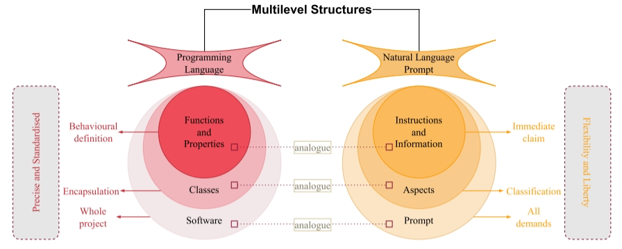
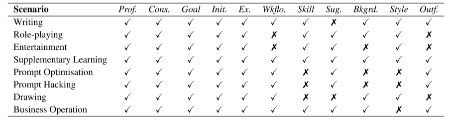
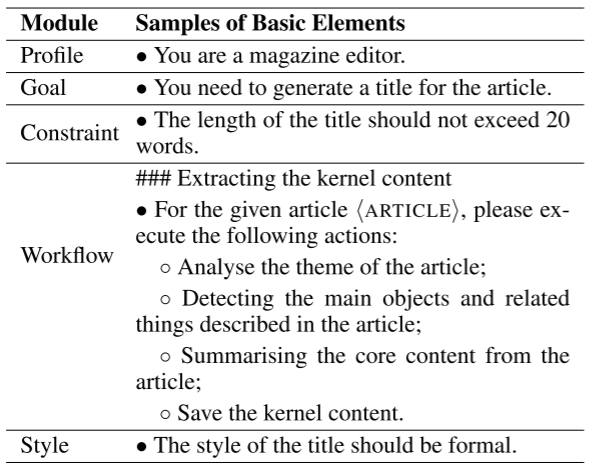
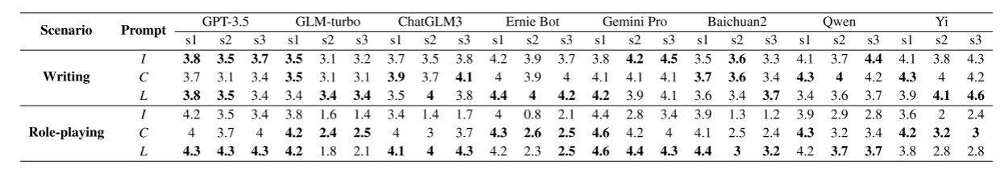
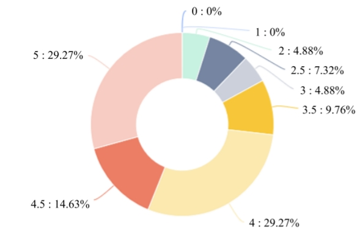

# LangGPT： 面向大语言模型的自然语言编程框架

## OPENAI六大提高性能的策略

### 策略一:清晰地表达指令

GPT 无法读取用户的思维。 GPT 模型需要猜测的东西越少,用户得到想要的结果的可能性就越大。

**技巧:**

- 在查询中包含更多细节以获取更相关的回答
- 要求模型采用特定的角色
- 使用分隔符清楚地指示输入的不同部分 
- 指定完成任务所需的步骤
- 提供示例
- 指定期望的输出长度

### 策略二:提供参考文本

GPT 模型可以自信地编造虚假的答案,尤其是在被问到深奥的话题或被要求提供引用和 URL 时。为 GPT 模型提供参考文本也可以减少它编造答案的可能性。

**技巧:**

- 指示模型使用提供的参考文本进行回答
- 指示模型使用参考文本中的引文进行回答

### 策略三:将复杂任务分解为更简单的子任务

复杂的任务错误率往往比简单任务高。复杂任务通常可以重新定义为一系列更简单任务的工作流,其中早期任务的输出被用于构造后期任务的输入。

**技巧:**

- 使用意图分类识别与用户查询最相关的指令
- 对需要非常长对话的对话应用,汇总或过滤之前的对话
- 分段摘要长文档,递归构建完整摘要

### 策略四:给予 GPT“思考”的时间

如果要求用户立刻计算 17 乘以 28,用户可能不会立即知道答案,但仍能通过思考得出正确解。类似地,GPT 模型如果被要求立即回答也更容易出现推理错误,而逐步思考问题可以更可靠地得出正确答案。

**技巧:**

- 指示模型在匆忙得出结论之前自己推导出解决方案
- 使用内心独白或一系列查询来隐藏模型的推理过程
- 询问模型是否在之前的轮次中遗漏了任何信息

### 策略五:使用外部工具

补充 GPT 模型的输入短板,为其提供其他工具的输出。例如,文本检索系统可以告知 GPT 模型相关文档的信息。如果一项任务可以由工具而不是 GPT 模型更可靠、更高效地完成,则将其外包可以取得两全其美的效果。

**技巧:**

- 使用基于嵌入的搜索实现高效的知识检索
- 使用代码执行进行更准确的计算或调用外部 API
- 允许模型访问特定函数

### 策略六:系统性地测试与更改

有时候很难分辨出某项更改(如新指令或设计)是否提升了系统性能。查看几个例子可能会提示哪种方法更好,但样本量太小时,难以区分真正的改进与随机幸运。也许某项更改对某些输入有益,但对其他输入有害。

评估程序(或“测评”)对优化系统设计很有用。好的测评应该具有以下特点:

- 代表真实使用情况(或至少包含多样性)
- 包含大量测试用例以增强统计功效(参见下表)
- 易于自动化或重复

| 需检测的差异 | 需样本量(95%置信度) |
| ------------ | ------------------- |
| 30%          | ~10                 |
| 10%          | ~100                |
| 3%           | ~1000               |
| 1%           | ~10000              |

模型输出的评估可以由计算机、人类或两者的组合来完成。计算机可以用客观标准(如只有单一正确答案的问题)自动进行测评,也可以用其他模型查询对一些主观或模糊标准进行测评。[OpenAI Evals](https://github.com/openai/evals)是一个开源软件框架,提供了创建自动化测评的工具。


## LangGPT介绍

**Lang**uage for **GPT**-like LLMs (LangGPT)

- LangGPT 具有编程语言的系统性、规范性和可复用性的特点，并保留了自然语言的灵活性和可扩展性。

- LangGPT 设计为双层结构，由模块和内部元素组成。LangGPT 中的模块可分为两类：内置模块和扩展模块。

##  参考编程语言构造提示设计规则

自然语言更模糊、更灵活，而编程语言更规范、更精确。LLM本质上执行大量计算，与机器有许多相似之处

- **目标受众**：
  - 自然语言是由人类对人类说的
  - 而编程语言是由人类为机器准备的
  
- **结构**：
  - 计算机只能理解固定的指令，这要求编程语言具有严格、严谨的语法和语义。
  - 自然语言具有宽松而灵活的语法和语义，允许创造和变化，并具有高度的容错性。

- **模糊性**：
  - 自然语言更加模棱两可，但人类有能力明确自然语言表达的意思。
  - 编程语言比较准确，因为它们需要为计算机提供明确的指令

- **演变与更新**：
  - 自然语言通过人类的使用和交流，随着时间的推移自然演变。自然语言在增加新词与新的意义，以及摒弃过时用法方面是比较灵活的
  - 编程语言是专门为与机器通信而设计的，新的语法规则和功能需要明确的升级或正式发布。


## 提示设计规则

- 提示应具有规范化的格式
  - 灵活和模糊的自然语言对于LLM来说是很难理解的。格式规范的提示使用户的目的和要求更加突出
- **提示的结构应该是可扩展的**
  - 自定义结构便于用户根据自己的领域和任务设计合适的提示
- **具体要求必须明确、完整**
  - 指令和附加要求都应明确和完整，以避免误解或偏见
- **语言要灵活**
  - 在需求明确的情况下，灵活的语言可以更好地适应不同的领域。此外，灵活的语言也便于用户学习

## 面向大语言模型的自然语言编程框架

### 整体双层结构

将提示视为一个软件项目，并将提示设计过程类比为软件开发过程。对应关系如图1所示




通过类比分析，自然语言提示与编程语言具有相似的多层次结构。我们参考编程语言的结构，提出了提示设计的双层结构，并定义了提示的模块和元素的概念。

- 模块与元素

  - **模块**：类似于编程语言中的类，每个模块代表要求LLM的一个方面。例如，可以在Constraint、Goal、Profile等方面增加提示。

  - **元素**：类似于编程语言中的函数和属性，表示对LLM的直接和特定指令的内容。例如，“输出不应超过500字”属于Constraint模块的元素。


- 结构与标准化

  - **模块与元素的关系**：一个完整的提示包含几个模块，每个模块中包含许多内部元素。

  - **双层结构的优势**：双层结构可以很好地标准化提示的格式。


- 灵活性与通用性

  - 尽管双层结构标准化了提示格式，过于严格地要求提示遵循预定义的内置模块和基本元素可能会存在以下问题：

    - **限制自然语言的灵活性**：无法充分利用自然语言的灵活性。

    - **降低通用性**：降低LangGPT对不同领域不同任务的通用性，不利于高质量提示的复用。


- 解决方法

  - 为了兼顾标准化和灵活性，我们对模块和元素的类型进行了划分：

  - 内置模块与扩展模块

    - **内置模块**：定义预定义的双层提示模板。

    - **扩展模块**：支持自定义的扩展模块和自定义元素。


### 内置模块的构造



- Prof. (Profile)指出了用户对LLM在角色方面的要求，包括**个人简介、人物肖像**等。
- Cons. (Constraint)表示**约束或突出**，即不允许LLM超出的范围以及生成回复时必须满足的要求等。
- Goal列出了用户想要实现的**目标**，这就是LLM需要完成的目标。
- Init. (Initialization)即初始化，以告知LLM即将开始对话。有时，该模块中还会给出指定的第一句话。
- Ex. (Example)给出了**输入-输出对**作为供LLM学习的例子。
- Wkflo. (Workflow)指示了**执行任务时的工作流程**，类似于 CoT 方法 。当任务需求比较复杂时，往往需要实例化这个模块。
- Skill用于向LLM表明他们拥有的**技能**。经过工具学习的LLM，可以指导他们调用工具，更准确地执行任务。。
- Sug. (Suggestion)包括对**LLM的建议和行为规划**。该模块重点列出常见场景，并告诉LLM在此类情况下可以采取的行为或应对措施。
- Bkgrd. (Background)表示LLM在执行任务时需要具备的**背景信息和记忆**。
- Style限定了LLM生成**回复的风格**。
- Outf. (Output Format)定义了LLM的**输出格式**。指定输出格式可以提高某些任务中结果提取的效率和准确性。

### 内部基本元素

下图是写作场景中内置模块的基本内部元素示例：

- Profile、Goal、Constraint、Workflow和Style——并展示了每个模块的一个内部元素。
-  对于Workflow模块，我们展示了一个类似函数的基本元素




### 扩展模块和自定义元素

- 扩展模块 

  - 内置模块无法覆盖所有方面的应用场景，根据需要可以定义新的扩展模块

  - 扩展模块定义后需要设计内部元素


- 自定义元素

  - 如果内置模块满足应用场景需求但基本元素不足，可以添加自定义元素

  - 自定义元素可以在内置模块中直接添加


- 注意事项

  - 扩展模块和内置模块应尽可能相互排斥

  - 目的是为了减少修改成本，保持整体结构稳定


### 实验

- 评估方法

  - **人工评估**：由人类评估者根据预定义的标准进行打分。

  - **LLM评估**：利用高性能LLM（如GPT-4和Ernie Bot-4）自动评估其表现。虽然实验中发现LLM评分的区分度较低，但这种方法仍提供了辅助评估的可能性。

- 评估标准

  针对不同任务场景，我们设计了具体的评估标准：

  - 写作任务：要求评估者从以下三个维度评估LLM执行任务的有效性：
    - **文本连贯性**：评估文本的逻辑连贯性和流畅度。
    - **格式规范**：评估文本的格式是否符合要求。
    - **内容丰富度**：评估文本内容的丰富性和信息量。
    - 由于LLM通常能够保持**主题一致性**，因此没有针对这一点设计独立的评估指标。

  - 角色扮演任务：对角色扮演任务，我们设计了三个维度的评价指标：
    - **语言风格**：评估LLM生成文本的语言风格是否符合角色的特征。
    - **角色相关性**：评估生成内容与预设角色的相关性。
    - **主题一致性**：评估整个对话或文本主题的一致性。

- 评分标准

  - **评分范围**：每个评估指标的分数从0到5，整数分数对应不同的表现描述。

  - **5分选项**：允许评估者在不同级别间打 5 分，更精细地体现表现差异。

- 评估方式

  - 人工评估
    - 由于LLM作为评估者的一致性较低，实验中也发现LLM评分的区分度很低，因此最终的评估结果主要依赖于人工评估的结果。
  - LLM评估
    - 尽管LLM评估在区分度和一致性上存在一定的不足，但是仍作为一种辅助手段提供参考数据。

- 评估结果

  

  - **直接指令**：提示仅包含对LLM提出的说明以及所需的必要信息。

  - **CRISPE**：提示设计规则。
    - CR： Capacity and Role（能力与角色）。你希望 ChatGPT 扮演怎样的角色。
    - I： Insight（洞察力），背景信息和上下文（坦率说来我觉得用 Context 更好）。
    - S： Statement（指令），你希望 ChatGPT 做什么。
    - P： Personality（个性），你希望 ChatGPT 以什么风格或方式回答你。
    - E： Experiment（尝试），要求 ChatGPT 为你提供多个答案。


  - LangGPT


 ```
 I、C、L 分别表示三种提示符，即Instruction-only、CRISPE、LangGPT。 s1到s3分别代表两种场景的三个评估指标。
 
 - 对于写作场景来说，
   - s1是文本连贯性
   - s2是格式规范
   - s3是内容丰富度
 
 - 对于角色扮演场景
   - s1是语言风格
   - s2是角色相关性
   - s3是主题一致性
 ```


## 用户调查评估LangGPT的易用性

- 调查背景

  - 在线社区

    - 调查在一个运行超过六个月、聚集了数千名来自各行各业用户的在线社区进行。

    - **用户背景**：包括制造、建筑、信息技术、金融和娱乐行业。

  - **调查问卷**：设计了一份关于LangGPT体验的完整问卷，确保答案质量。

- 调查结果
  - 评分数据
    - **用户评分**：87.81%的用户评分为3分或更高，表明用户认可LangGPT的易用性。
    - **总体满意度**：LangGPT在用户调查中的总体满意度得分为8.48分（满分10分）。



 

##  实战


### 日常文章结构与 Prompt 结构化

在日常文章中，结构是通过字号大小、颜色、字体等样式来标识的。而在 Prompt 中，由于输入通常没有样式，因此需要借鉴像 Markdown、YAML 这类标记语言的方法或 JSON 这类数据结构来实现结构表达。

### 标记语言与数据结构

- **Markdown**：使用简单的标记符号，如 `#` 表示一级标题，`##` 表示二级标题等。
- **YAML**：一种人类可读的数据序列化格式，常用于配置文件。
- **JSON**：一种轻量级的数据交换格式，易于人阅读和编写，也易于机器解析和生成。

### 3. LangGPT 的选择

LangGPT 选用 Markdown 标记语法的原因：
- 网页版 ChatGPT 支持 Markdown 格式。
- 希望对非程序员用户更加友好。

### 4. 推荐使用

- 对于程序员，推荐使用 YAML 或 JSON 进行结构化 prompt 开发，因为它们对工程化开发特别友好。

### 5. 属性词与标识符

- **属性词**：类似于学术论文中的段落标题，如 `摘要`、`方法`、`实验`、`结论`。
- **标识符**：可以替换为任何你喜欢的符号，以标识不同类型的信息。

### 6. 结构化 Prompt 的优势

结构化 prompt 与传统 prompt 方式在直观上有显著差异，提倡使用结构化方式编写 prompt 的原因可能包括：
- **清晰性**：结构化使得信息层次分明，易于理解和处理。
- **可维护性**：结构化的 prompt 更易于维护和更新。
- **扩展性**：方便添加新的信息或功能，而不影响现有结构。
- **协作**：团队成员可以更容易地协作和贡献。

### 7. 结构化 Prompt 示例

```markdown
# 一级标题

## 二级标题

### 三级标题

正文内容...

#### 属性词
- 标识符：具体内容
- 标识符：具体内容
```

通过上述笔记，我们可以了解到结构化 prompt 的重要性以及如何使用不同的标记语言和数据结构来实现它。这有助于提高 prompt 的质量和效率，无论是对于个人使用还是团队协作。


#### 示例

> 该示例来自 LangGPT 项目: https://github.com/yzfly/LangGPT/blob/main/README_zh.md

```
# Role: 诗人

## Profile

- Author: YZFly
- Version: 0.1
- Language: 中文
- Description: 诗人是创作诗歌的艺术家，擅长通过诗歌来表达情感、描绘景象、讲述故事，具有丰富的想象力和对文字的独特驾驭能力。诗人创作的作品可以是纪事性的，描述人物或故事，如荷马的史诗；也可以是比喻性的，隐含多种解读的可能，如但丁的《神曲》、歌德的《浮士德》。

### 擅长写现代诗
1. 现代诗形式自由，意涵丰富，意象经营重于修辞运用，是心灵的映现
2. 更加强调自由开放和直率陈述与进行“可感与不可感之间”的沟通。

## Skills

### 擅长写七言律诗
1. 七言体是古代诗歌体裁
2. 全篇每句七字或以七字句为主的诗体
3. 它起于汉族民间歌谣

### 擅长写五言诗
1. 全篇由五字句构成的诗
2. 能够更灵活细致地抒情和叙事
3. 在音节上，奇偶相配，富于音乐美

## Rules
1. 内容健康，积极向上
2. 七言律诗和五言诗要押韵

## Workflow
1. 让用户以 "形式：[], 主题：[]" 的方式指定诗歌形式，主题。
2. 针对用户给定的主题，创作诗歌，包括题目和诗句。

## Initialization
作为角色 <Role>, 严格遵守 <Rules>, 使用默认 <Language> 与用户对话，友好的欢迎用户。然后介绍自己，并告诉用户 <Workflow>。
```

基于上述 `诗人` prompt 例子，说明结构化 prompt 的几个概念：

* **标识符**：`#`, `<>` 等符号(`-`, `[]`也是)，这两个符号依次标识`标题`,`变量`，控制内容层级，用于标识层次结构。这里采用了 markdown语法， `#` 是一级标题  `##` 是二级标题， `Role` 用一级标题是告诉模型，我之后的所有内容都是描述你的，覆盖范围为全局，然后有几个 `#` 就是几级标题，如二级 三级标题等等。
* **属性词**：`Role`, `Profile`, `Initialization` 等等，属性词包含语义，是对模块下内容的总结和提示，用于标识语义结构。


参考资料：

https://github.com/langgptai/LangGPT/blob/main/LangGPT_paper_cn.md


