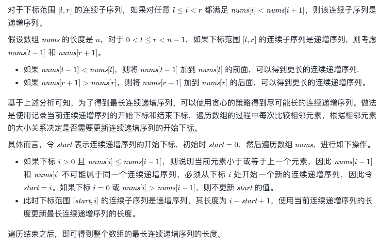

#### [128. 最长连续序列](https://leetcode-cn.com/problems/longest-consecutive-sequence/)

- 代码

    ```python
    class Solution:
        def longestConsecutive(self, nums: List[int]) -> int:
            res = 0
            hash_dict = dict()
            for num in nums:
                # 新进来哈希表一个数
                if num not in hash_dict:
                    # 获取当前数的最左边连续长度,没有的话就更新为0
                    left = hash_dict.get(num-1,0)
                    # 同理获取右边的数
                    right = hash_dict.get(num+1,0)
                    """不用担心左边和右边没有的情况
                    因为没有的话就是left或者right0
                    并不改变什么
                    """
                    # 把当前数加入哈希表，代表当前数字出现过
                    hash_dict[num] = 1
                    # 更新长度
                    length = left+1+right
                    res = max(res,length)
                    # 更新最左端点的值，如果left=n存在，那么证明当前数的前n个都存在哈希表中
                    hash_dict[num-left] = length
                    # 更新最右端点的值，如果right=n存在，那么证明当前数的后n个都存在哈希表中
                    hash_dict[num+right] = length
                    # 此时 【num-left，num-right】范围的值都连续存在哈希表中了
                    # 即使left或者right=0都不影响结果
            return res
    ```

#### [674. 最长连续递增子序列](https://leetcode-cn.com/problems/longest-continuous-increasing-subsequence/)

- 代码

  ```Python
  class Solution:
      def findLengthOfLCIS(self, nums: List[int]) -> int:
          ans = 0
          n = len(nums)
          start = 0
  
          for i in range(n):
              if i > 0 and nums[i] <= nums[i - 1]:
                  start = i
              ans = max(ans, i - start + 1)
          
          return ans
  ```

- 题解

  

  

#### [72. 编辑距离](https://leetcode-cn.com/problems/edit-distance/)

- 代码

  ```python
  class Solution(object):
      def minDistance(self, word1, word2):
          """
          :type word1: str
          :type word2: str
          :rtype: int
          """
          n1 = len(word1) # 行
          n2 = len(word2) # 列
          memo =[ [0] * (n2+1) for i in range(n1+1)]
          for i in range(1,n2+1):
              memo[0][i] = memo[0][i-1]+1
          for j in range(1,n1+1):
              memo[j][0] = memo[j-1][0] +1
          for i in range(1,n1+1):
              for j in range(1,n2+1):
                  if word1[i-1] == word2[j-1]:
                      memo[i][j] = memo[i-1][j-1]
                  else:
                      memo[i][j] = min(memo[i][j-1],memo[i-1][j],memo[i-1][j-1]) +1
          return memo[-1][-1]
  # dp[i-1][j-1] 表示替换操作，dp[i-1][j] 表示删除操作，dp[i][j-1] 表示插入操作
  ```


#### [121. 买卖股票的最佳时机](https://leetcode-cn.com/problems/best-time-to-buy-and-sell-stock/)

- 代码

  ```
  class Solution(object):
      def maxProfit(self, prices):
          size = len(prices)
          if size ==0:
              return 0
          min_price = prices[0]
          memo = [0]*size
          for i in range(1,size):
              min_price = min(min_price,prices[i])
              memo[i] = max(memo[i-1],
                  prices[i] - min_price)
          return memo[-1]
  ```

#### [122. 买卖股票的最佳时机 II](https://leetcode-cn.com/problems/best-time-to-buy-and-sell-stock-ii/)

- 代码

  ```python
  class Solution(object):
      def maxProfit(self, prices):
          """
          :type prices: List[int]
          :rtype: int
          """
          profit= 0 
          for i in range(1,len(prices)):
              tmp = prices[i] - prices[i-1]
              if tmp>0:
                  profit+=tmp 
          return profit
  ```

  

#### [188. 买卖股票的最佳时机 IV](https://leetcode-cn.com/problems/best-time-to-buy-and-sell-stock-iv/)

- 代码

  ```
  class Solution:
      def maxProfit(self, k: int, prices: List[int]) -> int:
          if not prices:
              return 0
  
          n = len(prices)
          k = min(k, n // 2)
          buy = [0] * (k + 1)
          sell = [0] * (k + 1)
  
          buy[0], sell[0] = -prices[0], 0
          for i in range(1, k + 1):
              buy[i] = sell[i] = float("-inf")
  
          for i in range(1, n):
              buy[0] = max(buy[0], sell[0] - prices[i])
              for j in range(1, k + 1):
                  buy[j] = max(buy[j], sell[j] - prices[i])
                  sell[j] = max(sell[j], buy[j - 1] + prices[i]); 
  
          return max(sell)
   
  ```

  

#### [309. 最佳买卖股票时机含冷冻期](https://leetcode-cn.com/problems/best-time-to-buy-and-sell-stock-with-cooldown/)

- 代码

  ```python
  class Solution(object):
      def maxProfit(self, prices):
          """
          :type prices: List[int]
          :rtype: int
          """
          if not prices:
              return 0
          # 三种状态
          # f[i][0]:手上持有股票的累计最大收益
          # f[i][1]:手上不持有股票，并且处于冷冻期的累计最大收益
          # f[i][2]:手上不持有股票，并且不处于冷冻期的累计最大收益
          size = len(prices)
          memo = [[-prices[0],0,0] ] + [[0]*3 for i in range(size -1)]
          for i in range(1,size):
              #  前一天持有股票,今天不操作  或者 前一天不持有股票  今天买进
              memo[i][0] = max(memo[i-1][0],memo[i-1][2]-prices[i])
              # 前一天持有股票  今天卖出
              memo[i][1] = memo[i-1][0]+prices[i] 
              # 前一天不持有股票 且处于冷冻期 或者前一天不持有股票 不处于冷冻期
              memo[i][2] = max(memo[i-1][1],memo[i-1][2])
          return max(memo[size-1][1],memo[size-1][2])
  
  
  ```

  

#### [2029. 石子游戏 IX](https://leetcode-cn.com/problems/stone-game-ix/)

- 代码

  ```python
  class Solution:
      def stoneGameIX(self, stones: List[int]) -> bool:
          """
          题目要求：Alice先手，每回合，玩家从stones中移除任一石子，玩家移除后所有已移除石子价值总和被3整除，对手获胜；
                  若石子移除完后，仍总和没有被3整除，则Bob获胜。(假设两位玩家均采用最佳决策，足够聪明每次都会选择对自己最有利的，博弈论思想)
          :param stones: 石子的价值列表
          :return: 返回哪个获胜:Alice为True,Bob为False
          """
          # 解题思路：不难发现，在规则下Alice获胜情况更少，故从其能获胜的情况出发分析，其余情况均为Bob获胜。
          # 根据规则，Alice想获胜，必须是让Bob移除后总和被3整除(即使Bob刚好将石子移除完，也是Alice获胜，条件1优先级更高)
          # 我们将石子的价值对3取余进行分类，有s=0,s=1,s=2三类，记当前总和对3取余后为x。
          # 进一步分析，除了第一次移除时(若第一次移除的话不就直接输了，两人足够聪明！)，移除s=0的石子不影响结果，移除后仅仅是换手而已，所以s=0的石子数量只用考虑其是偶数还是奇数
          # 偶数情况就相当于没有s=0的石子，奇数相当于只有一个s=0石子咯(偶数时交替移除直到没有s=0的石子，又回到开始移除s=0石子之前的情形了，对结果没有影响。不难理解吧，品一品)。
          # 下面就分情况讨论Alice如何获胜：
          # 1. 当s=0石子为偶数时，若Alice先移除s=1石子，则Bob肯定对应移除s=1石子(移除s=2他就输了),所以此时Alice想获胜移除序列应该为1,(1,2,1,2,...,1,2,),2(Bob)
          # 解释一下该序列的意思(后面同理)，Alice移除1，Bob移除1，接着Alice只能移除2，Bob只能移除1,...,就会形成Bob只能移除1，Alice移除2的循环(序列中括号部分)
          # 此时注意括号最后一个是Alice移除。移除后是x=1的，如果此时只有s=2石子了，则Bob没得选，Alice必获胜。
          # 2. 当s=0石子为偶数时，若Alice先移除s=2石子，同理对应的Alice想获胜移除序列为2,(2,1,2,1,...,2,1,),1(Bob)
          # 此时注意括号最后一个是Alice移除。移除后是x=2的，如果此时只有s=1石子了，则Bob没得选，Alice必获胜。
          # 总结一下1，2两种情况就是，Alice只要先手移除s=1和s=2中数量少的那种石子则必获胜(数量一样也可以),必须保证两种石子都要有才行，哪种石子没有的话(111或者222)Alice都必输。
          # ****故将两种情况合并即为：当s=0石子为偶数时，此时Alice想获胜的条件是s=1和s=2的石子都有就行(只要Alice先选少的那种就行)，即cnt[s=1]!=0 and cnt[s=2])!=0
          # 3. 当s=0石子为奇数时，若Alice先移除s=1石子，则Bob肯定对应移除s=1石子，所以此时Alice想获胜移除序列应该为1,(1,2,1,2,...,1,2,),1(Bob),0(Alice),1(Bob)
          # 或者1,(1,2,1,2,...,1,2,),0(Bob),1(Alice),1(Bob)，即只要s=1的数量比s=2的数量多大于两个时，Alice必获胜。
          # 4. 当s=0石子为奇数时，若Alice先移除s=2石子，同理对应的Alice想获胜移除序列为2,(2,1,2,1,...,2,1,),2(Bob),0(Alice),2(Bob)
          # 或者2,(2,1,2,1,...,2,1,),0(Bob),2(Alice),2(Bob)，即只要s=2的数量比s=1的数量多大于两个时，Alice必获胜。
          # ****故将两种情况合并即为：当s=0石子为奇数时，此时Alice想获胜的条件是s=1比s=2的石子数量多大于两个或者s=2比s=1的石子数量多大于两个，
          # 即cnt[1] - cnt[2] > 2 or cnt[2] - cnt[1] > 2(写成绝对值abs(cnt[s=1]-cnt[s=2])>2也行)
          cnt = [0] * 3  # 统计三种石子的数量
          for stone in stones:
              cnt[stone % 3] += 1
          if cnt[0] % 2 == 0:  # 对应1，2情况合并的结果
              return cnt[1] != 0 and cnt[2] != 0
          return cnt[1] - cnt[2] > 2 or cnt[2] - cnt[1] > 2  # 对应3，4情况合并的结果
   
   
  ```

  

#### [322. 零钱兑换](https://leetcode-cn.com/problems/coin-change/)

- 代码

  ```python
  class Solution(object):
      def coinChange(self, coins, amount):
          """
          :type coins: List[int]
          :type amount: int
          :rtype: int
          """
          memo = [float('inf')*(amount +1)]
          memo[0] = 0
          for coin in coins:
              for i in range(coin ,amount+1):
                  memo[i] = min(memo[i],memo[i- coin]+1)
          if memo[amount] != float('inf'):
              return memo[amount]
          else:
              return -1
  ```


#### [518. 零钱兑换 II](https://leetcode-cn.com/problems/coin-change-2/)

- 代码

  ```python
  class Solution(object):
      def change(self, amount, coins):
          """
          :type amount: int
          :type coins: List[int]
          :rtype: int
          """
          memo = [0] * (amount+1)
          memo[0] = 1
          for coin in coins:
              for i in range(coin,amount+1):
                  memo[i] += memo[i-coin]
          return memo[-1]
  
  ```

  

#### [746. 使用最小花费爬楼梯](https://leetcode-cn.com/problems/min-cost-climbing-stairs/)

* 代码

  ```python
  class Solution(object):
      def minCostClimbingStairs(self, cost):
          """
          :type cost: List[int]
          :rtype: int
          """
          size = len(cost)
          memo  = [0]*(size+1)
          memo[1] = min(memo[0],memo[1])
          for i in range(2,size+1):
              memo[i] = min(memo[i-1]+cost[i-1],memo[i-2]+cost[i-2])
          return memo[size ]
  ```

  
