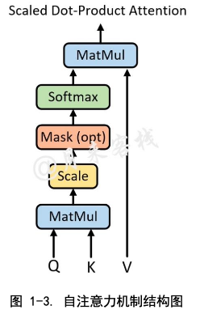
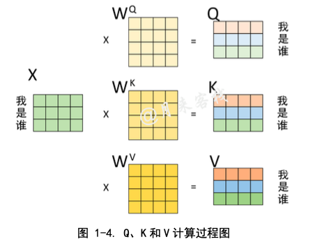
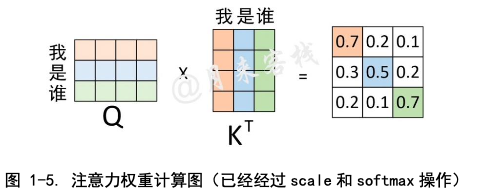
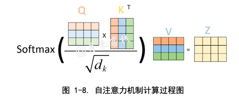
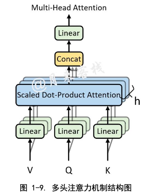
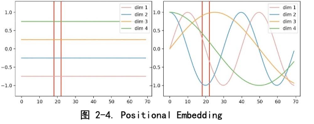
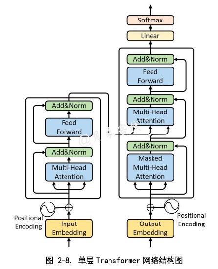
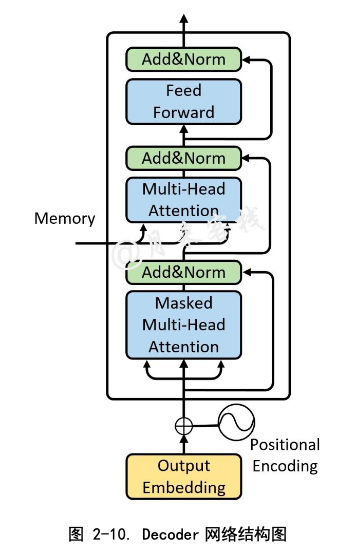
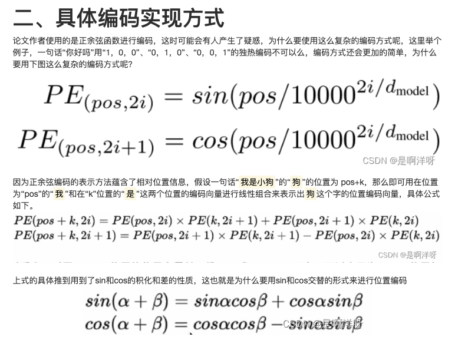
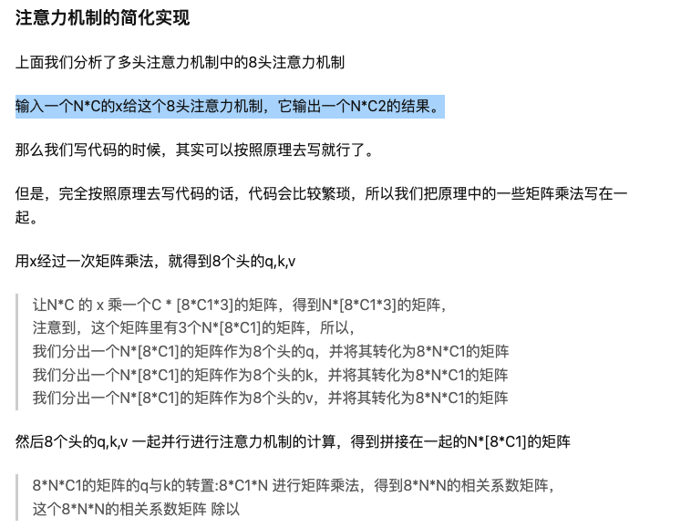

## Transformer主要用来解决什么问题？

由于传统的 Encoder-Decoder 架构在建模过程中，下一个时刻的计算过程会 依赖于上一个时刻的输出，而这种固有的属性就限制了传统的 Encoder-Decoder 模型就不能以并行的方式进行计算

Transformer 架构的优点在于它完全摈弃了传统的循环结构，取而代之的是只通过注意力机制(self-attention)来计算模型输入与输出的隐含表示，

### 什么是 self-Attention？

注意力机制可以描述为将query 和一系列的 key-value 对映射到某个输出的过程，而这个输出的向量就是根据 query 和 key 计算得到的权重作用于 value 上的权重和。

自注意力机制的核心过程就是通过 Q 和 K 计算得到注意力权重;然后再作用于 V 得到整个权重和输出。具体的，对于输入 Q、K 和 V 来 说，其输出向量的计算公式为:
$$
\text { Attention }(Q, K, V)=\operatorname{softmax}\left(\frac{Q K^{T}}{\sqrt{d_{k}}}\right) V
$$
除以 $\sqrt{d_{k}}$ 的过程就是 Scale 过程

### 为什么要除以$\sqrt{d_{k}}$  ？

对于较大的$d_k$ 来说在完 成 $QK^T$后将会得到很大的值，而这将导致在经过 sofrmax 操作后产生非常小的梯度，不利于网络的训练。

### Q、 K 和 V 分别是怎么来的?

**通过这种方式计算得到 Q、K 和 V 的过程仅仅局限于 Encoder 和 Decoder 在各自输入部分利用自注意力机制进行编码时的过程**， Encoder和Decoder交互部分的Q、K和V另有指代。

可以理解为这是对于同一个输入进行 3 次不同的线性变换来表示其不 同的 3 种状态。

### 为什么要 MultiHeadAttention？

自注意力机制的缺陷就是:模型在对当前位置的信息进行编码时，**会过度的将注意力集中于自身的位置**。

使用多头注意力机制还能够给予注意力层的输出包含有不同子空间中的编码表示信息，从而增强模型的表达能力。

所谓的多头注意力机制其实就是将输入序列进行多 组的自注意力处理过程;然后再将每一组自注意力机制计算的结果拼接起来进行 一次线性变换得到最终的输出结果。

$$
\begin{array}{l}
\operatorname{MultiHead}(Q, K, V)=\operatorname{Concat}\left(h e a d_{1}, \ldots, \text { head }_{h}\right) W^{o} \\
\text { where head }_{i}=\operatorname{Attention}\left(Q W_{i}^{Q}, K W_{i}^{K}, V W_{i}^{V}\right)
\end{array}
$$

$$
\text { 其中 } W_{i}^{Q} \in R^{d_{\text {madid }} \times d_{k}}, \quad W_{i}^{K} \in R^{d_{\text {madid }} \times d_{k}}, \quad W_{i}^{V} \in R^{d_{\text {madd }} \times d_{v}}, \quad W^{o} \in R^{h d_{v} \times d_{\text {maded }}}
$$

### Transformer 如何对字符进行 Embedding 处理？

Token Embedding

常见的文本表示方法有 one-hot 编 码、词袋模型以及 TF-IDF，更常见的做法便是将各个词 (或者字)通过一个 Embedding 层映射到低维稠密的向量空间

 Positional Embedding

横坐标表示输入序列中的每一个 Token，每一条曲线或者直 线表示对应 Token 在每个维度上对应的位置信息。在左图中，每个维度所对应的 位置信息都是一个不变的常数;而在右图中，每个维度所对应的位置信息都是基 于某种公式变换所得到。换句话说就是，左图中任意两个 Token 上的向量都可以 进行位置交换而模型却不能捕捉到这一差异，但是加入右图这样的位置信息模型 却能够感知到。

$$
\begin{array}{l}
P E_{p a s, 2 i}=\sin \left(\operatorname{pos} / 10000^{2 i / d_{\text {madid }}}\right) \\
P E_{p a s, 2 i+1}=\cos \left(p o s / 10000^{2 i / d_{\text {mast }}}\right)
\end{array}
$$

### Transformer 网络结构

### Encoder 层

#### Multi-Head Attention

#### Feed Forward

$$
\operatorname{FFN}(x)=\max \left(0, x W_{1}+b_{1}\right) W_{2}+b_{2}
$$

其中输入*x*的维度为$d_{model}=512$，第1层全连接层的输出维度为$d_{ff} =2048$， 第 2 层全连接层的输出为，且$d_{model}=512$同时对于第 1 层网络的输出还运用了 Relu 激活函数。

#### Add&Norm

每个部分来说其输出均为 LayerNorm(x+Sublayer(x))，并且在都加入了 Dropout 操作。

### Decoder 层

**Q** 来自于下面多头注意力机制的输出，**K** 和 **V** 均是 **Encoder** 部分的输出(**Memory**)经过线性变换后得到。

 

## 1. Transformer为何使用[多头注意力机制](https://www.zhihu.com/search?q=多头注意力机制&search_source=Entity&hybrid_search_source=Entity&hybrid_search_extra={"sourceType"%3A"article"%2C"sourceId"%3A363466672})？（为什么不使用一个头）

* 使参数矩阵形成多个子空间，对多方面信息进行学习
* 矩阵整体的size不变，只是改变了每个head对应的维度大小，计算量和单个head差不多。

同维度下单头与多头的区别 

当 *h* 不一样时， $d_k$ 的取值也不一样，进而使得对权重矩阵的 scale 的 程度不一样。例如，如果$d_m$ =768，那么当*h*=12时，则$d_k$=64;当h=1时，则$d_k$ =768。
 所以，当模型的维度$d_m$确定时，一定程度上 *h* 越大，整个模型的表达能力就越强，越能提高模型对于注意力权重的合理分配。

## 2. Transformer为什么Q和K使用不同的权重矩阵生成，为何不能使用同一个值进行自身的点乘？

- K和Q的点乘是为了计算一个句子中每个token相对于句子中其他token的相似度

- 俩个向量越相似，内积越大，当一个向量与自己做内积，再与其他不同词的向量做内积后(行成一个打分向量)，该向量经过softmax后，就会变为一个有一个位置的值特殊的大(自己与自己相乘)，其他位置的值非常非常小的状况出现，

- K和Q使用了不同的$W_K$, $W_Q$来计算，可以理解为是在不同空间上的投影，增加了表达能力，

  

## 3. 为什么在进行softmax之前需要对attention进行scaled（为什么除以dk的平方根），并使用公式推导进行讲解

- Q 和 K 的矩阵乘积的均值本应该为 0，方差本应该为1，这样可以获得更平缓的softmax。
- $QK^T$的方差为$d_k$，除以$\sqrt{d_{k}}$会使整体的方差回到1（随机变量除以常数k，随机变量的方差会除以$k^2$）

 

## 4. 在计算attention score的时候如何对padding做mask操作？

- 使得补全位置上的值成为一个非常大的负数（可以是负无穷），这样的话，经过Softmax层的时候，这些位置上的概率就是0。以此操作就相当于把补全位置的无用信息给MASK掉了

## 5. 为什么在进行多头注意力的时候需要对每个head进行降维？

答：将原有的高维空间转化为多个低维空间并再最后进行拼接，形成同样维度的输出，借此丰富特性信息，降低了计算量

## 6. 大概讲一下Transformer的Encoder模块？

答：输入嵌入-加上位置编码-多个编码器层（每个编码器层包含全连接层，多头注意力层和点式前馈网络层（包含激活函数层））

## 7. 为何在获取输入词向量之后需要对矩阵乘以embedding size的开方？

[embedding matrix](https://www.zhihu.com/search?q=embedding+matrix&search_source=Entity&hybrid_search_source=Entity&hybrid_search_extra={"sourceType"%3A"article"%2C"sourceId"%3A363466672})的初始化方式是xavier init，这种方式的方差是1/embedding size，因此乘以embedding size的开方使得embedding matrix的方差是1，在这个scale下可能更有利于embedding matrix的收敛。

## 8. 简单介绍一下Transformer的位置编码？有什么意义和优缺点？

* transformer的位置编码就是正余弦函数编码，表达的是绝对位置，同时包含相对位置信息，但是经过线性变化，相对位置信息会消失

## 9. 你还了解哪些关于位置编码的技术，各自的优缺点是什么？

* 在计算attention score和weighted value时各加入一个可训练的表示相对位置的参数。
* 在生成多头注意力时，把对key来说将绝对位置转换为相对query的位置
* 复数域函数，已知一个词在某个位置的词向量表示，可以计算出它在任何位置的词向量表示。
* 前两个方法是词向量+位置编码，属于亡羊补牢，复数域是生成词向量的时候即生成对应的位置信息。

## 10. 简单讲一下Transformer中的[残差](https://www.zhihu.com/search?q=残差&search_source=Entity&hybrid_search_source=Entity&hybrid_search_extra={"sourceType"%3A"article"%2C"sourceId"%3A363466672})结构以及意义。

- encoder和decoder的self-attention层和ffn层都有残差连接。反向传播的时候不会造成梯度消失。

## 11. 为什么transformer块使用LayerNorm而不是BatchNorm？LayerNorm 在Transformer的位置是哪里？

* BN是对每个特征在batch_size上求的均值和方差。记住, 是每个特征。比如说身高, 比如说体重等等。这些特征都有明确的含义。
* BN是对每一批的数据在进入激活函数前进行[归一化](https://www.zhihu.com/search?q=归一化&search_source=Entity&hybrid_search_source=Entity&hybrid_search_extra={"sourceType"%3A"article"%2C"sourceId"%3A363466672})，可以提高收敛速度，防止过拟合，防止梯度消失，增加网络对数据的敏感度。
* 文本模型中batch中的长度不 一致，导致有的靠后面的特征的均值和方差不能估算。
* LayerNorm是对每一个样本做特征的缩放，这个特征可以理解为语义信息。

## 12. 简单描述一下Transformer中的[前馈神经网络](https://www.zhihu.com/search?q=前馈神经网络&search_source=Entity&hybrid_search_source=Entity&hybrid_search_extra={"sourceType"%3A"article"%2C"sourceId"%3A363466672})？使用了什么激活函数？相关优缺点？

* 输入嵌入-加上位置编码-多个编码器层（每个编码器层包含全连接层，多头注意力层和点式前馈网络层（包含激活函数层））-多个解码器层（每个编码器层包含全连接层，多头注意力层和点式前馈网络层）-全连接层，使用了relu激活函数

## 13. Decoder阶段的多头自注意力和encoder的多头自注意力有什么区别？

- Decoder有两层mha，encoder有一层mha，Decoder的第二层mha是为了转化输入与输出句长，Decoder的请求q与键k和数值v的倒数第二个维度可以不一样，但是encoder的qkv维度一样。

## 14. Transformer的并行化提现在哪个地方？

- Transformer的并行化主要体现在self-attention模块，在Encoder端Transformer可以并行处理整个序列，并得到整个输入序列经过Encoder端的输出，但是rnn只能从前到后的执行

  

https://zhuanlan.zhihu.com/p/376122835

## 15. Decoder端可以做并行化吗？

- 训练的时候可以，但是交互的时候不可以
