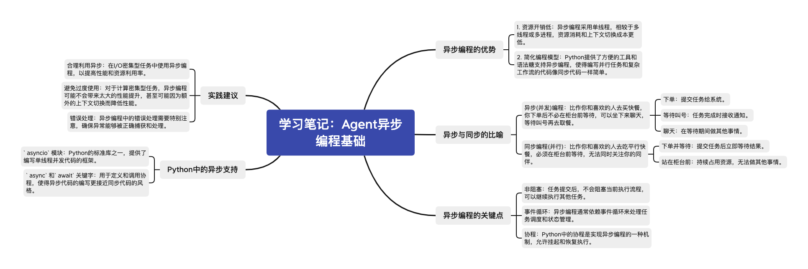

# 学习笔记：Agent异步编程基础

## 异步编程的优势

1. **资源开销低**：异步编程采用单线程，相较于多线程或多进程，资源消耗和上下文切换成本更低。
2. **简化编程模型**：Python提供了方便的工具和语法糖支持异步编程，使得编写并行任务和复杂工作流的代码像同步代码一样简单。

## 异步与同步的比喻

- **异步(并发)编程**：比作你和喜欢的人去买快餐，你下单后不必在柜台前等待，可以坐下来聊天，等待叫号再去取餐。
  - **下单**：提交任务给系统。
  - **等待叫号**：任务完成时接收通知。
  - **聊天**：在等待期间做其他事情。
- **同步编程(并行)**：比作你和喜欢的人去吃平行快餐，必须在柜台前等待，无法同时关注你的同伴。
  - **下单并等待**：提交任务后立即等待结果。
  - **站在柜台前**：持续占用资源，无法做其他事情。

## 异步编程的关键点
- **非阻塞**：任务提交后，不会阻塞当前执行流程，可以继续执行其他任务。
- **事件循环**：异步编程通常依赖事件循环来处理任务调度和状态管理。
- **协程**：Python中的协程是实现异步编程的一种机制，允许挂起和恢复执行。

## Python中的异步支持
- **`asyncio`模块**：Python的标准库之一，提供了编写单线程并发代码的框架。
- **`async`和`await`关键字**：用于定义和调用协程，使得异步代码的编写更接近同步代码的风格。

## 实践建议
- **合理利用异步**：在I/O密集型任务中使用异步编程，以提高性能和资源利用率。
- **避免过度使用**：对于计算密集型任务，异步编程可能不会带来太大的性能提升，甚至可能因为额外的上下文切换而降低性能。
- **错误处理**：异步编程中的错误处理需要特别注意，确保异常能够被正确捕获和处理。

## 总结
异步编程是一种高效的编程范式，特别适合处理I/O密集型任务。通过Python的异步支持，开发者可以以接近同步编程的方式编写高效的并发代码。理解异步编程的原理和合理应用，可以显著提升应用程序的性能和响应能力。