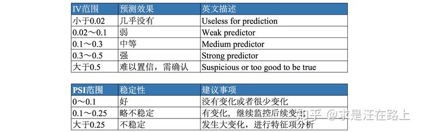

## 1. 标准评分卡建模流程

1. 数据准备：收集并整合在库客户的数据，定义目标变量，排除特定样本。
2. 探索性数据分析：评估每个变量的值分布情况，处理异常值和缺失值。
3. 数据预处理：变量筛选，变量分箱，WOE转换、样本抽样。
4. 模型开发：逻辑回归拟合模型。
5. 模型评估：常见几种评估方法，ROC、KS等。
6. 生成评分卡

## 2. WOE IV值

WOE（Weight of Evidence）叫做证据权重
$$
\begin{aligned} 
W O E_{i}&=\ln \left(\frac{B a d_{i}}{B a d_{T}} / \frac{G o o d_{i}}{G o o d_{T}}\right)\\
		&=\ln \left(\frac{B a d_{i}}{B a d_{T}}\right)-\ln \left(\frac{G o o d_{i}}{G o o d_{T}}\right)\\
		&=\ln \left(\frac{\operatorname{Bad}_{i}}{\operatorname{Bad}_{T}} / \frac{\operatorname{Good}_{i}}{\operatorname{Good}_{T}}\right)\\
		&=\ln \left(\frac{\operatorname{Bad}_{i}}{\operatorname{Good}_{j}}\right)-\ln \left(\frac{\operatorname{Bad}_{T}}{\operatorname{Good}_{T}}\right)
\end{aligned}
$$
**每个分箱里的坏人分布相对于好人分布之间的差异性**。

**每个分箱里的坏好比(Odds)相对于总体的坏好比之间的差异性**。


IV的计算公式定义如下，其可认为是**WOE的加权和**
$$
\begin{aligned} 
I V_{i}&=\left(\frac{Bad_{i}}{B a d_{T}}-\frac{G o o d_{i}}{G o o d_{T}}\right) * W O E_{i} \\
&=\left(\frac{B a d_{i}}{B a d_{T}}-\frac{G o o d_{i}}{G o o d_{T}}\right) * \ln \left(\frac{B a d_{i}}{B a d_{T}} / \frac{G o o d_{i}}{G o o d_{T}}\right) \\
I V&=\sum_{i=1}^{n} I V_{i}
\end{aligned}
$$


具体数据介绍WOE和IV的计算步骤

**step 1**. 对于[连续型变量](https://www.zhihu.com/search?q=连续型变量&search_source=Entity&hybrid_search_source=Entity&hybrid_search_extra={"sourceType"%3A"article"%2C"sourceId"%3A"80134853"})，进行分箱（binning），可以选择等频、[等距](https://www.zhihu.com/search?q=等距&search_source=Entity&hybrid_search_source=Entity&hybrid_search_extra={"sourceType"%3A"article"%2C"sourceId"%3A"80134853"})，或者自定义间隔；对于[离散型变量](https://www.zhihu.com/search?q=离散型变量&search_source=Entity&hybrid_search_source=Entity&hybrid_search_extra={"sourceType"%3A"article"%2C"sourceId"%3A"80134853"})，如果分箱太多，则进行分箱合并。

**step 2**. 统计每个分箱里的好人数(bin_goods)和坏人数(bin_bads)。

**step 3**. 分别除以总的好人数(total_goods)和坏人数(total_bads)，得到每个分箱内的边际好人占比(margin_good_rate)和边际坏人占比(margin_bad_rate)。

 **step 4**. 计算每个分箱里的 WOE $=\ln \left(\frac{ margin_{badrate}}{ { margin_{goodrate} }}\right)$

**step 5**. 检查每个分箱（除null分箱外）里woe值是否满足**单调性**，若不满足，返回step1。注意⚠️：null分箱由于有明确的业务解释，因此不需要考虑满足单调性。

**step 6**. 计算每个分箱里的IV，最终求和，即得到最终的IV。
备注：好人 = 正常用户，坏人 = 逾期用户

注意:

1. 分箱时需要注意样本量充足，保证统计意义。

2. 若相邻分箱的WOE值相同，则将其合并为一个分箱。

3. 我们还需**跨数据集检验WOE分箱的单调性**。如果在训练集上保持单调，但在验证集和测试集上**发生翻转而不单调**，那么说明分箱并不合理，需要再次调整

4. 当一个分箱内只有好人或坏人时，可对WOE公式进行修正如下：
   $$
   W O E_{i}=\ln \left(\left(\frac{B a d_{i}+0.5}{G o o d_{i}+0.5}\right) /\left(\frac{B a d_{T}}{G o o d_{T}}\right)\right)
   $$


## 3. PSI(**群体稳定性指标**)

PSI反映了**验证样本**在各[分数段](https://www.zhihu.com/search?q=分数段&search_source=Entity&hybrid_search_source=Entity&hybrid_search_extra={"sourceType"%3A"article"%2C"sourceId"%3A79682292})的分布与**建模样本**分布的稳定性。在建模中，我们常用来**筛选特征变量、评估模型稳定性**。

**稳定性是有参照的**，因此**需要有两个分布——实际分布**（actual）**和预期分布**（expected）

- **step1**：将**变量预期分布**（excepted）进行**分箱**（binning）离散化，统计各个分箱里的样本占比。
  注意：
  a) 分箱可以是等频、[等距](https://www.zhihu.com/search?q=等距&search_source=Entity&hybrid_search_source=Entity&hybrid_search_extra={"sourceType"%3A"article"%2C"sourceId"%3A79682292})或其他方式，分箱方式不同，将导致计算结果略微有差异；
  b) 对于**连续型**变量（特征变量、模型分数等），分箱数需要设置合理，一般设为10或20；对于离散型变量，如果分箱太多可以提前考虑合并小分箱；分箱数太多，可能会导致每个分箱内的样本量太少而失去统计意义；分箱数太少，又会导致计算结果精度降低。
- **step2**: 按相同分箱区间，对**实际分布（actual）**统计各分箱内的样本占比**。**
- **step3**:计 算各分箱内的**A - E**和**Ln(A / E)**，计算**index = (实际占比 - 预期占比）\* ln(实际占比 / 预期占比) 。**
- **step4**: 将各分箱的**index**进行求和，即得到最终的PSI。

**PSI数值越小，两个分布之间的差异就越小，代表越稳定。**

##  4. 相对熵（KL散度） 

**在信息理论中，相对熵等价于两个概率分布的信息熵（Shannon entropy）的差值。**
$$
\begin{aligned}
K L(P \| Q)=&-\sum_{x \in X} P(x) \log \frac{1}{P(x)}+\sum_{x \in X} P(x) \log \frac{1}{Q(x)} \\[0ex]
=&\sum_{x \in X} P(x) \log \frac{P(x)}{Q(x)}
\end{aligned}
$$
P(x)表示数据的**真实分布**，而Q(x)表示数据的**观察分布**。上式可以理解为：

> **概率分布携带着信息，可以用信息熵来衡量。**
> **若用观察分布Q(x)来描述真实分布P(x)，还需要多少额外的信息量？**

**KL散度是单向描述信息熵差异**。

## **相对熵与PSI之间的关系**

$$
\begin{aligned}
p s i &=\sum_{i=1}^{n}\left(A_{i}-E_{i}\right) * \ln \left(A_{i} / E_{i}\right) \\
p s i &=\sum_{i=1}^{n} A_{i} * \ln \left(A_{i} / E_{i}\right)+\sum_{i=1}^{n} E_{i} * \ln \left(E_{i} / A_{i}\right)
\end{aligned}
$$

第1项：实际分布（A）与预期分布（E）之间的KL散度—— $KL(A||E)$
第2项：预期分布（E）与实际分布（A)之间的KL散度——  $KL(E||A)$

**PSI本质上是实际分布（A）与预期分布（E）的KL散度的一个对称化操作**。其**双向**计算相对熵，并把两部分相对熵相加，从而更为全面地描述两个分布的差异。

## 5. PSI、IV

$$
\begin{array}{l}
I V=\sum_{i=1}^{n}\left(\frac{\operatorname{Bad}_{i}}{\operatorname{Bad}_{T}}-\frac{\operatorname{Good}_{i}}{\operatorname{Good}_{T}}\right) * \ln \left(\frac{\operatorname{Bad}_{i}}{\operatorname{Bad}_{T}} / \frac{\text { Good }_{i}}{\text { Good }_{T}}\right) \\
P S I=\sum_{i=1}^{n}\left(\frac{\text { Actual }_{i}}{\text { Actual }_{T}}-\frac{\text { Expect }_{i}}{\text { Expect }_{T}}\right) * \ln \left(\frac{\text { Actual }_{i}}{\text { Actual }_{T}} / \frac{\text { Expect }_{i}}{\text { Expect }_{T}}\right)
\end{array}
$$

1. PSI衡量预期分布和实际分布之间的**差异性**，IV把这两个分布具体化为好人分布和坏人分布。IV指标是在**从信息熵上比较好人分布和坏人分布之间的差异性**。
2. PSI和IV在取值范围与业务含义的对应上也是**存在统一性**，只是应用场景不同——**PSI用以判断变量稳定性，IV用以判断变量预测能力**
3. **支撑理论都是相对熵**



## 6. PSI指标的业务应用

一般以训练集（INS）的样本分布作为预期分布，进而跨时间窗按月/周来计算PSI

## 7. 评分卡如何转换


$$
O d d s=\frac{p}{1-p}
$$

$$
p=\frac{O d d s}{1+O d d s}
$$

根据逻辑回归原理：
$$
p=\frac{1}{1+e^{-} \theta^{T} x}
$$

$$
\ln \left(\frac{p}{1-p}\right)=\theta^{T} x
$$


评分卡的背后逻辑是Odds的变动与评分变动的映射（把Odds映射为评分），Odds指的是违约概率与正常概率的比值。我们可以设计这个一个公式。
$$
\text { Score }=A-B * \ln (\text { odds })
$$
A与B是常数，B前面取负号的原因，是让违约概率越低，得分越高。因为实际业务里，分数也高风险越低，

计算出A、B的方法如下，首先设定两个假设：

1. 基准分。基准分$\theta_0$为某个比率时的得分$P_0$ 。业界某些风控策略基准分都设置为500/600/650。基准分为$A-B * \theta_{0}$
2. PDO（point of double），比率翻番时分数的变动值。假设我们设置为当odds翻倍时，分值减少30。

$$
P_{0}=A-B * \ln \left(\theta_{0}\right)
$$

$$
P_{0}-P D O=A-B * \ln \left(2 \theta_{0}\right)
$$

我们定义 为1：1(你也可以试试其他值），基准分为650，PDO为50，代入公式，有
$$
\begin{array}{c}
B=50 / \ln (2)=72.13 \\
A=650+72.13 * \ln (1 / 1)=650
\end{array}
$$
**评分卡里每一个变量的每一个分箱有一个对应分值**。前面的$\theta^{T} x$是一个矩阵计算，展开后我们有：
$$
\text { Score }=A-B\left\{\theta_{0}+\theta_{1} x_{1}+\ldots+\theta_{n} x_{n}\right\}
$$

```python
def generate_scorecard(model_coef,binning_df,features,B):
    lst = []
    cols = ['Variable','Binning','Score']
    coef = model_coef[0]
    for i in range(len(features)):
        f = features[i]
        df = binning_df[binning_df['features']==f]
        for index,row in df.iterrows():
            lst.append([f,row['bin'],int(round(-coef[i]*row['woe']*B))])
    data = pd.DataFrame(lst, columns=cols)
    return data
```


## 8. 参考资料

[风控模型—*WOE*与*IV*指标的深入理解应用](https://zhuanlan.zhihu.com/p/80134853)

[金融风控评分卡建模全流程](https://mp.weixin.qq.com/s/HHu2ZCE-a8syy5fCQp1eSQ)

[风控算法工程师面试指南](https://stringsli.github.io/2020/11/23/%E9%A3%8E%E6%8E%A7%E7%AE%97%E6%B3%95%E5%B7%A5%E7%A8%8B%E5%B8%88%E9%9D%A2%E8%AF%95%E6%8C%87%E5%8D%97/)