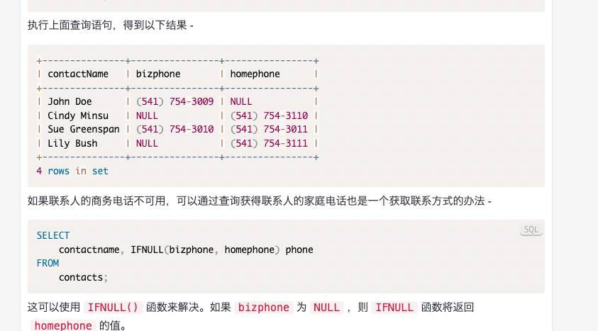
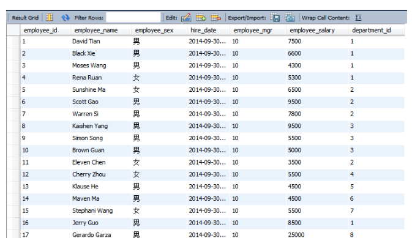
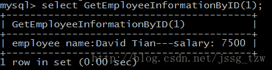
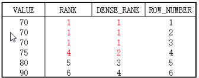
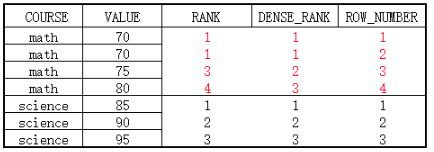
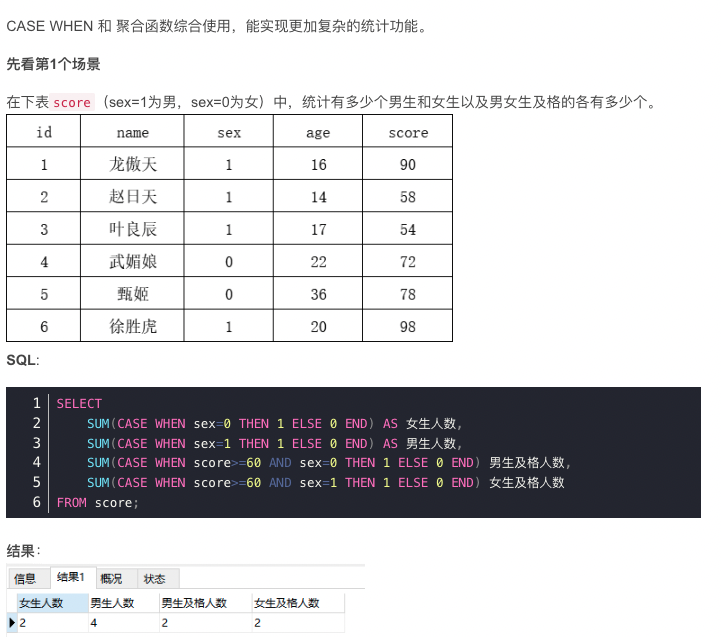
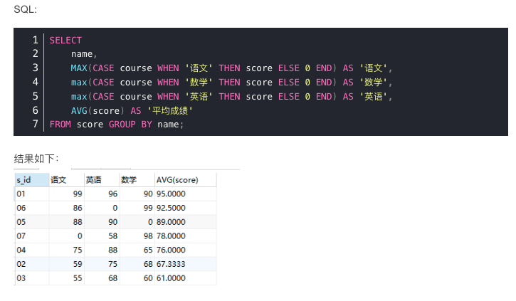

## SQL查询语句中的 limit 与 offset 的区别 

1. limit y 分句表示: 读取 y 条数据
2. limit x, y 分句表示: 跳过 x 条数据，读取 y 条数据
3. limit y offset x 分句表示: 跳过 x 条数据，读取 y 条数据

[mysql查询时，offset过大影响性能的原因与优化方法](https://blog.csdn.net/lufeihh2012/article/details/78595841)

## MySQL IFNULL函数简介

MySQL `IFNULL`函数是MySQL控制流函数之一，它接受两个参数，如果不是`NULL`，则返回第一个参数。 否则，`IFNULL`函数返回第二个参数。

两个参数可以是文字值或表达式。

以下说明了`IFNULL`函数的语法：

```sql
IFNULL(expression_1,expression_2);


SQL
```

如果`expression_1`不为`NULL`，则`IFNULL`函数返回`expression_1`; 否则返回`expression_2`的结果。

`IFNULL`函数根据使用的上下文返回字符串或数字。

如果要返回基于`TRUE`或`FALSE`条件的值，而不是`NULL`，则应使用[IF函数](http://www.yiibai.com/mysql/if-function.html)。



//更多请阅读：https://www.yiibai.com/mysql/ifnull.html 

## CREATE FUNCTION的用法

目标
如何在MySQL数据库中创建函数(Function)

语法

```
CREATE FUNCTION func_name ( [func_parameter] ) //括号是必须的，参数是可选的
RETURNS type
[ characteristic ...] routine_body
```

CREATE FUNCTION 用来创建函数的关键字；
func_name 表示函数的名称；
func_parameters为函数的参数列表，参数列表的形式为：[IN|OUT|INOUT] param_name type

```
IN：表示输入参数；
OUT：表示输出参数；
INOUT：表示既可以输入也可以输出；
param_name：表示参数的名称；
type：表示参数的类型，该类型可以是MySQL数据库中的任意类型；
```

RETURNS type：语句表示函数返回数据的类型；
characteristic: 指定存储函数的特性，取值与存储过程时相同，详细请访问－MySQL存储过程使用;

## 示例

```
create database hr;
use hr;
 
create table employees
(
	employee_id int(11) primary key not null auto_increment,
	employee_name varchar(50) not null,
	employee_sex varchar(10) default '男',
	hire_date datetime not null default current_timestamp,
	employee_mgr int(11),
	employee_salary float default 3000,
	department_id int(11)
);
 
 
insert into employees(employee_name,employee_sex,employee_mgr,employee_salary,department_id) values ('David Tian','男',10,7500,1);
insert into employees(employee_name,employee_sex,employee_mgr,employee_salary,department_id) values ('Black Xie','男',10,6600,1);
insert into employees(employee_name,employee_sex,employee_mgr,employee_salary,department_id) values ('Moses Wang','男',10,4300,1);
insert into employees(employee_name,employee_sex,employee_mgr,employee_salary,department_id) values ('Rena Ruan','女',10,5300,1);
insert into employees(employee_name,employee_sex,employee_mgr,employee_salary,department_id) values ('Sunshine Ma','女',10,6500,2);
insert into employees(employee_name,employee_sex,employee_mgr,employee_salary,department_id) values ('Scott Gao','男',10,9500,2);
insert into employees(employee_name,employee_sex,employee_mgr,employee_salary,department_id) values ('Warren Si','男',10,7800,2);
insert into employees(employee_name,employee_sex,employee_mgr,employee_salary,department_id) values ('Kaishen Yang','男',10,9500,3);
insert into employees(employee_name,employee_sex,employee_mgr,employee_salary,department_id) values ('Simon Song','男',10,5500,3);
insert into employees(employee_name,employee_sex,employee_mgr,employee_salary,department_id) values ('Brown Guan','男',10,5000,3);
insert into employees(employee_name,employee_sex,employee_mgr,employee_salary,department_id) values ('Eleven Chen','女',10,3500,2);
insert into employees(employee_name,employee_sex,employee_mgr,employee_salary,department_id) values ('Cherry Zhou','女',10,5500,4);
insert into employees(employee_name,employee_sex,employee_mgr,employee_salary,department_id) values ('Klause He','男',10,4500,5);
insert into employees(employee_name,employee_sex,employee_mgr,employee_salary,department_id) values ('Maven Ma','男',10,4500,6);
insert into employees(employee_name,employee_sex,employee_mgr,employee_salary,department_id) values ('Stephani Wang','女',10,5500,7);
insert into employees(employee_name,employee_sex,employee_mgr,employee_salary,department_id) values ('Jerry Guo','男',10,8500,1);
insert into employees(employee_name,employee_sex,employee_mgr,employee_salary,department_id) values ('Gerardo Garza','男',10,25000,8);
insert into employees(employee_name,employee_sex,employee_mgr,employee_salary,department_id) values ('Derek Wu','男',10,5500,5);
 
 
select * from employees;
```



 **创建函数－根据ID获取员工姓名与员工工资**

```
CREATE FUNCTION GetEmployeeInformationByID(id INT)
RETURNS VARCHAR(300)
BEGIN
	RETURN(SELECT CONCAT('employee name:',employee_name,'---','salary:',employee_salary) FROM employees WHERE employee_id=id);
END  ;
```

**调用函数**

在MySQL——函数的使用方法与MySQL内部函数的使用方法一样。




原文链接：https://blog.csdn.net/jssg_tzw/article/details/39694489

## MYSQL实现排名函数RANK，DENSE_RANK和ROW_NUMBER

### 1. 排名分类

#### 1.1 区别RANK，[DENSE_RANK](https://so.csdn.net/so/search?q=DENSE_RANK&spm=1001.2101.3001.7020)和ROW_NUMBER

1. RANK并列跳跃排名，并列即相同的值，相同的值保留重复名次，遇到下一个不同值时，跳跃到总共的排名。

2. DENSE_RANK并列连续排序，并列即相同的值，相同的值保留重复名次，遇到下一个不同值时，依然按照连续数字排名。

3. ROW_NUMBER连续排名，即使相同的值，依旧按照连续数字进行排名。

   区别如图：

   

#### 1.2 分组排名

将数据分组后排名，区别如图：




### 2. 不分组排名

#### 2.1 连续排名

1. 使用`ROW_NUMBER`实现：

   ```
   SELECT score,
   ROW_NUMBER() OVER (ORDER BY score DESC) ranking
   FROM score;
   
   ```

   3.2 并列跳跃排名

1. 使用`RANK`实现：

   ```
   SELECT course_id, score, RANK() OVER(ORDER BY score DESC) FROM score;
   ```

   

#### 2.3 并列连续排名

1. 使用`DENSE_RANK`实现：

   ```
   SELECT course_id, score,
   DENSE_RANK() OVER(ORDER BY score DESC) FROM score;
   
   ```

### 3. 分组排名

#### 3.1 分组连续排名

1. 使用`ROW_NUMBER`实现：

   ```
   SELECT course_id, score,
   ROW_NUMBER() OVER (PARTITION BY course_id ORDER BY score DESC) ranking FROM score;
   ```

   

#### 3.2 分组并列跳跃排名

1. 使用`RANK`实现：

   ```
   SELECT course_id, score,
   RANK() OVER(PARTITION BY course_id ORDER BY score DESC)
   FROM score;
   ```

#### 3.3 分组并列连续排名

1. 使用`DENSE_RANK`实现：

   ```
   SELECT course_id, score,
   DENSE_RANK() OVER(PARTITION BY course_id ORDER BY score DESC)
   FROM score;
   ```


https://blog.csdn.net/u011726005/article/details/94592866


## 条件判断函数-CASE WHEN、IF、IFNULL详解

```
CASE 字段 WHEN 预期值 THEN 结果1 ELSE 结果2 END
```






IF函数也能通过判断条件来返回特定值，它的语法如下：

```
IF(expr,result_true,result_false)
```

```
SELECT name,IF(sex=1,'男','女')sex FROM students;
```


[条件判断函数-CASE WHEN、IF、IFNULL详解](https://blog.csdn.net/mu_wind/article/details/93976316?spm=1001.2101.3001.6650.5&utm_medium=distribute.pc_relevant.none-task-blog-2%7Edefault%7ECTRLIST%7ERate-5-93976316-blog-78124138.pc_relevant_recovery_v2&depth_1-utm_source=distribute.pc_relevant.none-task-blog-2%7Edefault%7ECTRLIST%7ERate-5-93976316-blog-78124138.pc_relevant_recovery_v2&utm_relevant_index=10)