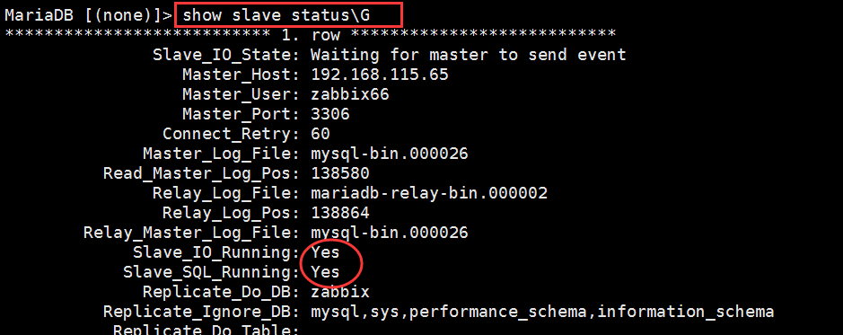

# 安装MySQL

## 获取安装包

下载地址：[https://downloads.mysql.com/arc](https://link.zhihu.com/?target=https%3A//downloads.mysql.com/archives/community/)

## **Centos命令行部署**

### 创建用户

```text
useradd mysql -s /sbin/nologin -M
id mysql
```

### 上传软件到/opt，解压

```text
cd /opt/
tar xf mysql-5.7.38-linux-glibc2.12-x86_64.tar.gz
mv mysql-5.7.38-linux-glibc2.12-x86_64 mysql
```

### 配置配置文件(根据需求添加添加配置项)

```text
mkdir -p /opt/mysql/data
chown -R mysql.mysql /opt/mysql/
cat >/etc/my.cnf<<EOF
[mysqld]
user = mysql
basedir = /opt/mysql/
datadir = /opt/mysql/data
socket = /tmp/mysql.sock
server_id = 1
port = 3306
log_error = /opt/mysql/data/mysql.err
# 默认字符集设置为utf8
character-set-server=utf8
# 时区设置到东八区
default-time-zone='+08:00'
# 忽略英文大小写
lower_case_table_names=1
# sql_mode设置sql_mode=ONLY_FULL_GROUP_BY,STRICT_TRANS_TABLES,ERROR_FOR_DIVISION_BY_ZERO,NO_AUTO_CREATE_USER,NO_ENGINE_SUBSTITUTION
[mysql]
socket = /tmp/mysql.sock
EOF
```

### 初始化数据库

```text
# yum install libaio-devel libncurses* -y
/opt/mysql/bin/mysqld --initialize-insecure --user=mysql --basedir=/opt/mysql/ --datadir=/opt/mysql/data
```

### 配置启动

```text
cat >/etc/systemd/system/mysqld.service<<EOF
[Unit]
After=network.target
After=syslog.target
[Install]
WantedBy=multi-user.target
[Service]
User=mysql
Group=mysql
ExecStart=/opt/mysql/bin/mysqld --defaults-file=/etc/my.cnf
LimitNOFILE = 5000
EOF
systemctl start mysqld
systemctl enable mysqld
```

### 配置环境变量

```text
echo 'export PATH="/opt/mysql/bin:$PATH"' >> /etc/profile
source /etc/profile
mysql
quit
```

### 修改root密码

```text
mysqladmin -u root password '123456'
```

### 登陆测试

```text
mysql -uroot -p123456
quit
```

# Mysql主从部署

## 什么是主从同步

将主服务器的binlog日志复制到从服务器上执行一遍，达到主从数据的一致状态，称之为主从复制。简单概括为，主数据库做什么，从数据库就跟着做什么。

## 主从同步原理

1.从库创建两个进程，一个I/O线程，一个SQL线程，其中I/O线程用于请求主库的binlog，并且把接收到的binlog信息写入relay log日志文件中；SQL线程用于读取relay log日志文件内容，并且在从库中做回放。

2.主库创建一个log dump线程，用于发送binlog到从库；


上述相关名词说明如下:

- bin log:二进制文件

- log dump线程:二进制日志转储线程

- relay log:中继日志

- I/O线程:用于请求主库的binlog，并且把接收到的binlog信息写入relay log日志文件中

- SQL线程:用于读取relay log日志文件内容，并且在从库中做回放


## 为什么做主从同

- 主从同步可以提高数据库的吞吐量；

- 主从同步可以读写分离，通过主从复制方式同步数据，通过读写分离提高数据库并发处理能力；

- 主从同步可以进行数据备份；

- 主从同步具有高可用性。

## Mysql主从部署

### 环境介绍

| 操作系统       | Mysql版本 | 主机IP              |
| -------------- | --------- | ------------------- |
| Centos7-X86_64 | 5.6.34    | 192.168.100.135(主) |
| Centos7-X86_64 | 5.6.34    | 192.168.100.136(备) |

### 操作步骤

### 主库

#### **防火墙开放端口(根据需要选择是否打开防火墙)**

1.执行**firewall-cmd --zone=public --add-port=3306/tcp --permanent**命令开放3306端口

```text
[root@test ~]# firewall-cmd --zone=public --add-port=3306/tcp --permanent
success
```

参数说明如下:

- zone:作用域
- add-port=3306/tcp:添加端口，格式为：端口/通讯协议
- permanent:永久生效，没有此参数重启后失效

2.执行**systemctl restart firewalld.service**命令重启防火墙服务

```text
[root@test ~]# systemctl restart firewalld.service
```

3.执行**firewall-cmd --list-ports**命令查看端口是否开放成功

```text
[root@test ~]# firewall-cmd --list-ports
3306/tcp
```

#### **修改主机名**

```text
[root@test ~]# hostname master
[root@test ~]# hostname 
master
```

#### **修改配置文件**

1.执行**vim /etc/my.cnf**命令修改配置文件，添加以下内容

```text
server-id = 1
log-bin=mysql-bin
```

- server-id = 1:配置服务器的服务号
- log-bin=mysql-bin:指定数据库操作的日志文件

2.其他可选参数

- *max_binlog_size= 500M:设置日志文件得最大值，超过该值则另启文件记录日志*
- binlog_cache_size= 128K:设置日志文件缓存大小
- *replicate-do-db= pos:指定要同步的数据库，如果有多个，请重复该行内容并修改数据库名称为对应数据库*
- replicate-ignore-db= mysql:指定不需要同步的数据库

#### **重启mysql服务**

1.执行**service mysqld restart**命令重启mysql服务

```text
[root@test ~]# service mysqld restart
```

#### **创建用户并授权**

```text
# 创建用户
mysql> grant replication slave on *.* to 'test'@'%' identified by '123456';
Query OK, 0 rows affected (0.00 sec)

# 用户授权
mysql> grant all on *.* to 'test'@'%' identified by '123456';
Query OK, 0 rows affected (0.00 sec)

# 刷新权限
mysql> Flush privileges;
Query OK, 0 rows affected (0.01 sec)
```

#### **查看二进制文件名以及大小**

1.执行**show master status;**语句查看二进制文件名及大小，方便在从库进行绑定

```text
mysql> show master status;
+------------------+----------+--------------+------------------+-------------------+
| File             | Position | Binlog_Do_DB | Binlog_Ignore_DB | Executed_Gtid_Set |
+------------------+----------+--------------+------------------+-------------------+
| mysql-bin.000002 |      592 |              |                  |                   |
+------------------+----------+--------------+------------------+-------------------+
```

### 备库

#### **防火墙开放端口(根据需要选择是否打开防火墙)**

1.执行**firewall-cmd --zone=public --add-port=3306/tcp --permanent**命令开放3306端口

```text
[root@localhost ~]# firewall-cmd --zone=public --add-port=3306/tcp --permanent
success
```

参数说明如下:

- –zone:作用域
- –add-port=3306/tcp:添加端口，格式为：端口/通讯协议
- –permanent:永久生效，没有此参数重启后失效

2.执行**systemctl restart firewalld.service**命令重启防火墙服务

```text
[root@localhost ~]# systemctl restart firewalld.service
```

3.执行**firewall-cmd --list-ports**命令查看端口是否开放成功

```text
[root@localhost ~]# firewall-cmd --list-ports
3306/tcp
```

####  修改主机名 

```text
[root@localhost ~]# hostname slave
[root@localhost ~]# hostname
slave
```

#### **修改配置文件**

1.执行**vim /etc/my.cnf**命令修改配置文件，添加以下内容

```text
server-id = 2
log-bin=mysql-bin
```

- server-id = 2:配置服务器的服务号
- log-bin=mysql-bin:指定数据库操作的日志文件

2.其他可选参数

- *replicate-do-db= pos:指定要同步的数据库，如果有多个，请重复该行内容并修改数据库名称为对应数据库。* replicate-ignore-db= mysql:指定不需要同步的数据库
- *max_binlog_size= 500M:设置日志文件得最大值，超过该值则另启文件记录日志*
- binlog_cache_size= 128K:设置日志文件缓存大小

#### **重启mysql服务**

1.执行**service mysqld restart**命令重启mysql服务

```text
[root@localhost ~]# service mysqld restart
```

#### **配置主数据库信息**

```text
mysql> change master to
master_host='192.168.100.135',master_user='test',master_password='123456',master_log_file='mysql-bin.000002',master_log_pos=592;
Query OK, 0 rows affected, 2 warnings (0.02 sec)
```

#### **开始同步**

```text
mysql> start slave;
```

#### **查看同步**

1.执行show slave status\G;语句查看同步情况，这里观察到Slave_IO_Running和Slave_SQL_Running显示YES。

```text
mysql> show slave status\G;
*************************** 1. row ***************************
               Slave_IO_State: Waiting for master to send event
                  Master_Host: 192.168.100.135
                  Master_User: test
                  Master_Port: 3306
                Connect_Retry: 60
              Master_Log_File: mysql-bin.000002
          Read_Master_Log_Pos: 592
               Relay_Log_File: slave-relay-bin.000002
                Relay_Log_Pos: 283
        Relay_Master_Log_File: mysql-bin.000002
             Slave_IO_Running: Yes
            Slave_SQL_Running: Yes
              Replicate_Do_DB: 
          Replicate_Ignore_DB: 
           Replicate_Do_Table: 
       Replicate_Ignore_Table: 
      Replicate_Wild_Do_Table: 
  Replicate_Wild_Ignore_Table: 
                   Last_Errno: 0
                   Last_Error: 
                 Skip_Counter: 0
          Exec_Master_Log_Pos: 592
              Relay_Log_Space: 456
              Until_Condition: None
               Until_Log_File: 
                Until_Log_Pos: 0
           Master_SSL_Allowed: No
           Master_SSL_CA_File: 
           Master_SSL_CA_Path: 
              Master_SSL_Cert: 
            Master_SSL_Cipher: 
               Master_SSL_Key: 
        Seconds_Behind_Master: 0
Master_SSL_Verify_Server_Cert: No
                Last_IO_Errno: 0
                Last_IO_Error: 
               Last_SQL_Errno: 0
               Last_SQL_Error: 
  Replicate_Ignore_Server_Ids: 
             Master_Server_Id: 1
                  Master_UUID: f0fd84c8-53ee-11ed-9b81-000c2904ef91
             Master_Info_File: /opt/mysql/data/master.info
                    SQL_Delay: 0
          SQL_Remaining_Delay: NULL
      Slave_SQL_Running_State: Slave has read all relay log; waiting for the slave I/O thread to update it
           Master_Retry_Count: 86400
                  Master_Bind: 
      Last_IO_Error_Timestamp: 
     Last_SQL_Error_Timestamp: 
               Master_SSL_Crl: 
           Master_SSL_Crlpath: 
           Retrieved_Gtid_Set: 
            Executed_Gtid_Set: 
                Auto_Position: 0
1 row in set (0.00 sec)
```

### 测试

1.在主库执行以下SQL语句创建class库并添加表结构

```text
# 创建数据库class
mysql> create database class;
Query OK, 1 row affected (0.00 sec)

# 进入数据库class
mysql> use class;
Database changed

#添加表结构
mysql> create table student ( id int primary key auto_increment, name varchar(10) );
Query OK, 0 rows affected (0.02 sec)
```

2.在从库执行以下SQL语句查看从库是否存在主库创建的库信息。这里观察到，已同步。

```text
#显示库
mysql> show databases;
+--------------------+
| Database           |
+--------------------+
| information_schema |
| class              |
| mysql              |
| performance_schema |
| test               |
+--------------------+
5 rows in set (0.01 sec)

#进入库
mysql> use class
Database changed
```

## 主从同步缺陷

1.部署时存在一定的复杂度

2.带来一定的主从同步延迟

### 主从同步延迟优化

###  强制查询主库

不查询从库，只查询主库。这种方法适用于适用于对实时性业务要求非常高的业务，但是要考虑查询的量级会不会很大，在不在主库的可承受范围内。

###  并行复制

将SQL单线程拆分为多个work线程来进行重放

###  降低并发

控制主库写入速度，主从同步延迟发生概率变小


# MySQL数据同步问题清单

## 出现Slave_SQL_Running：no和slave_io_running：no问题的解决方法

**问题描述：**

当我们配置好MySQL主主同步时，是可以实现主主同步，但是重启机器后或者其他原因导致MySQL无法同步了。

**Slave两个关键进程**

mysql replication 中slave机器上有两个关键的进程，死一个都不行，一个是slave_sql_running，一个是Slave_IO_Running，一个负责与主机的io通信，一个负责自己的slave mysql进程。

**如果是Slave_SQL_Running：no，解决办法如下：从服务器**


```
stop slave;                                                   
SET GLOBAL SQL_SLAVE_SKIP_COUNTER=1; START SLAVE;            
start slave;                                                   
show slave status\G  
```


**如果是slave_io_running：no解决办法如下：查看主服务器**

```
show master status\G         
```


在从服务器上查看


问题所在：发现Master_Log_File没有对应。

**出现Slave_IO_Running: No的机器上操作**

```
slave stop;                 
CHANGE MASTER TO MASTER_LOG_FILE='mysql-bin.000026', MASTER_LOG_POS=0;  
slave start;                               
show slave status\G
```

​      


到此问题就解决了！

## Last_SQL_Error: Error ‘Can‘t drop database ‘test01‘； database doesn‘t exist‘ on query

**问题描述**

Last_SQL_Error: Error ‘Can’t drop database ‘test01’; database doesn’t exist’ on query. Default database: ‘test01’. Query: ‘DROP DATABASE test01’
 

主从同步的时候产生的：原因是我删除了主库中从库没有的数据库，我也没想到还会导致集群宕机，解决方法就是让指针往下移动：

```
stop slave;
set GLOBAL SQL_SLAVE_SKIP_COUNTER=1;
start slave;
```

 


参口资料：

https://blog.csdn.net/wang121213145/article/details/124297181

https://blog.csdn.net/eagle89/article/details/104950222/

https://zhuanlan.zhihu.com/p/577436369

https://zhuanlan.zhihu.com/p/553924634