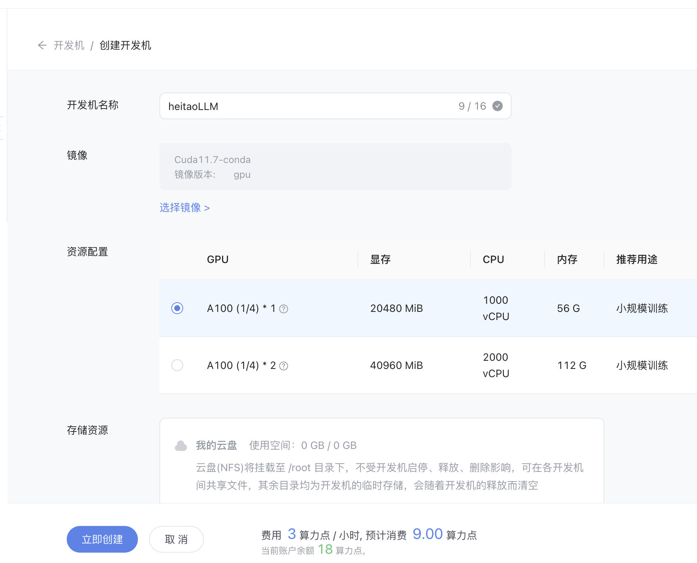
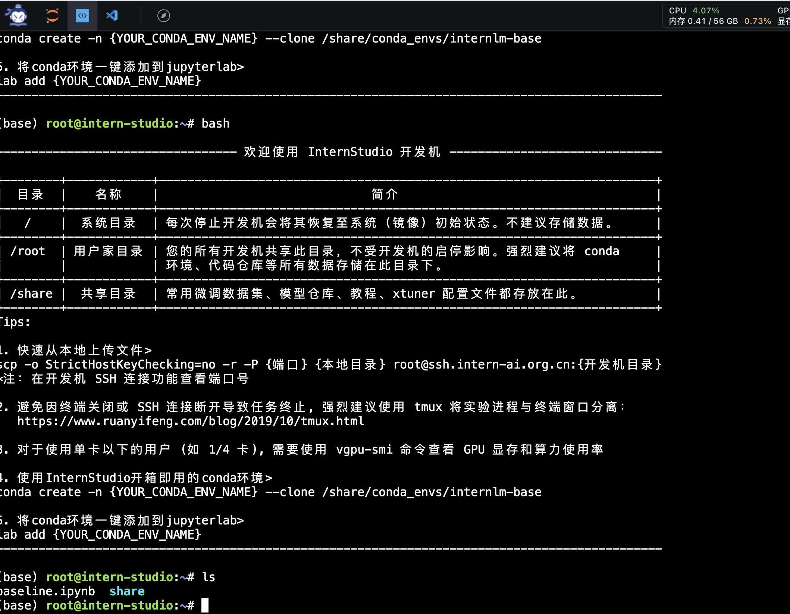
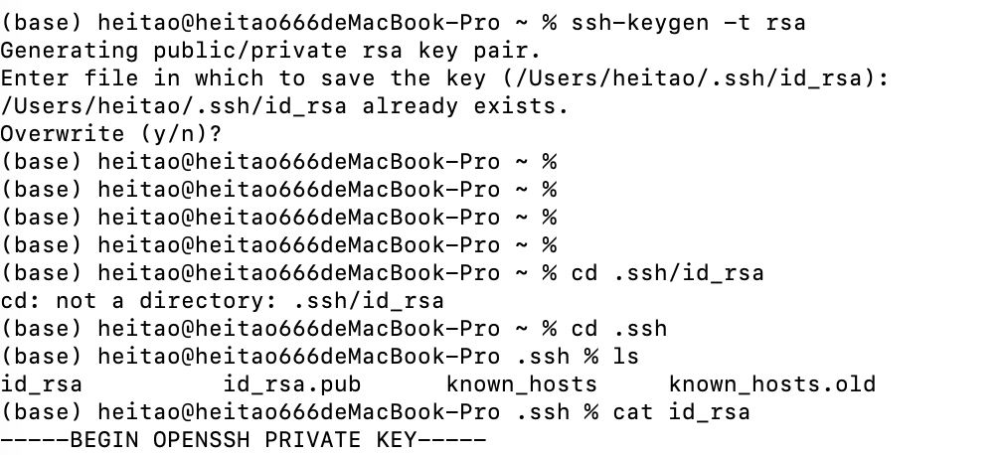
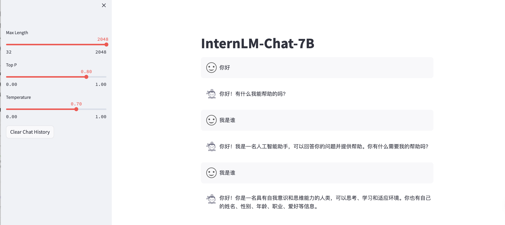
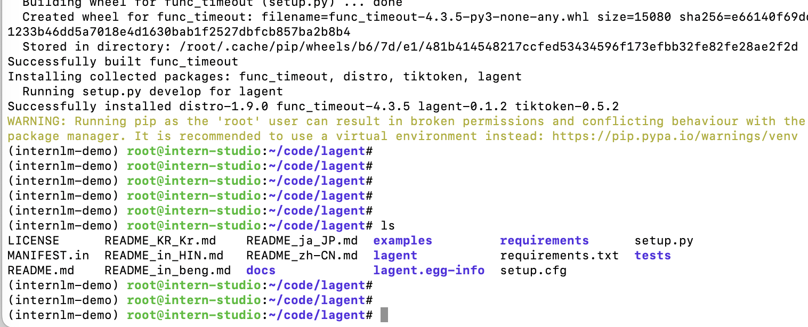
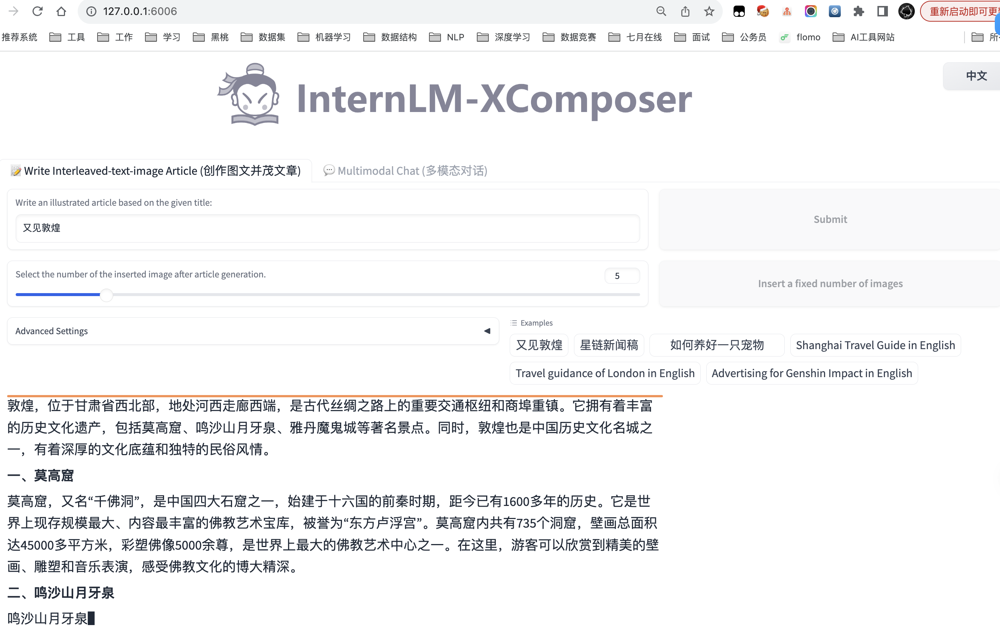
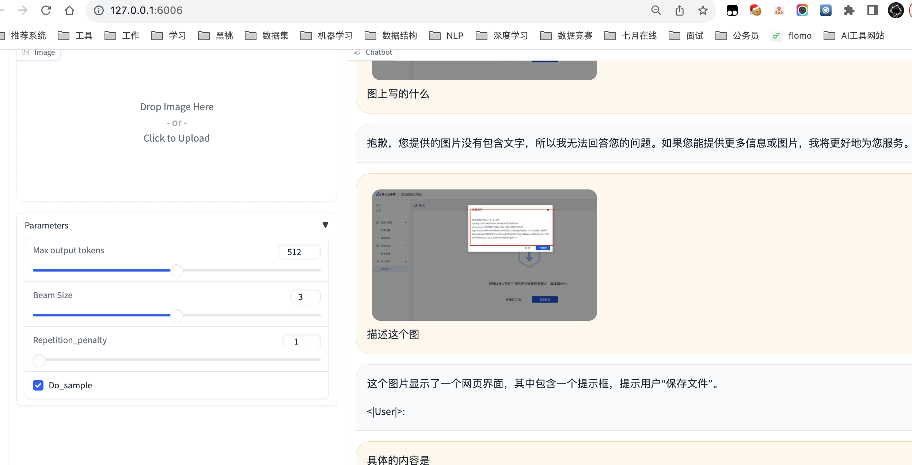

## **InternLM-Chat-7B** 智能对话 **Demo**

### 环境准备

### 创建开发机



### 进入开发机




### 克隆环境并激活&安装依赖包

```
bash # 请每次使用 jupyter lab 打开终端时务必先执行 bash 命令进入 bash 中 conda create --name internlm-demo --clone=/root/share/conda_envs/internlm-base
conda activate internlm-demo 
python -m pip install --upgrade pip
pip install modelscope==1.9.5
pip install transformers==4.35.2
pip install streamlit==1.24.0
pip install sentencepiece==0.1.99
pip install accelerate==0.24.1
```

### 模型下载

```
mkdir -p /root/model/Shanghai_AI_Laboratory
cp -r /root/share/temp/model_repos/internlm-chat-7b /root/model/Shanghai_AI_Laboratory
```

### 新建下载文件

`vim download.py`

```
import torch
from modelscope import snapshot_download, AutoModel, AutoTokenizer
import os
model_dir = snapshot_download('Shanghai_AI_Laboratory/internlm-chat-7b', cache_dir='/root/model', revision='v1.0.3')
```

### clone 代码

```
mkdir -p /root/code
cd /root/code
git clone https://gitee.com/internlm/InternLM.git
```

### 更换模型地址

```
cd /root/code
sed -i  s/internlm/Shanghai_AI_Laboratory/g web_demo.py
sed -i  s/Shanghai_AI_Laboratory-chat-7b/internlm-chat-7b/g web_demo.py 
```

### 运行

#### 终端运行 

`vim cli_demo.py`

```python
import torch
from transformers import AutoTokenizer, AutoModelForCausalLM
model_name_or_path = "/root/model/Shanghai_AI_Laboratory/internlm-chat-7b"
tokenizer = AutoTokenizer.from_pretrained(model_name_or_path,trust_remote_code=True)
model = AutoModelForCausalLM.from_pretrained(model_name_or_path,trust_remote_code=True,torch_dtype=torch.bfloat16, device_map='auto')
model = model.eval()
messages = []
print("=============Welcome to InternLM chatbot, type 'exit' toexit.=============")
while True:
    input_text = input("User  >>> ")
    if input_text == "exit":
       break
    response, history = model.chat(tokenizer, input_text,history=messages)
    messages.append((input_text, response))
    print(f"robot >>> {response}")
```

```
python /root/code/InternLM/cli_demo.py
```


#### **web demo** 运行

```
bash
conda activate internlm-demo # 首次进入 vscode 会默认是 base 环境，所以首 先切换环境
cd /root/code/InternLM
## 远程机器启动服务
streamlit run web_demo.py --server.address 127.0.0.1 --server.port 6006
```

#### 添加公钥




#### 查看机器对应端口号


#### 本地机器开端口映射

```
ssh -CNg -L 6006:127.0.0.1:6006 root@ssh.intern-ai.org.cn -p 33531

```

#### 登录浏览器

http://127.0.0.1:6006/




## **Lagent** 智能体工具调用 **Demo**

### 环境准备


### **Lagent** 安装

```
cd /root/code
git clone https://gitee.com/internlm/lagent.git
cd /root/code/lagent
git checkout 511b03889010c4811b1701abb153e02b8e94fb5e # 尽量保证和教程 commit版本一致
pip install -e . # 源码安装
```



修改代码


```
react_web_demo.py
```

```
import copy
import os
import streamlit as st
from streamlit.logger import get_logger
from lagent.actions import ActionExecutor, GoogleSearch,
PythonInterpreter
from lagent.agents.react import ReAct
from lagent.llms import GPTAPI
from lagent.llms.huggingface import HFTransformerCasualLM
class SessionState:
    def init_state(self):
        """Initialize session state variables."""
        st.session_state['assistant'] = []
				st.session_state['user'] = []
        #action_list = [PythonInterpreter(), GoogleSearch()]
        action_list = [PythonInterpreter()]
        st.session_state['plugin_map'] = {
            action.name: action
            for action in action_list
        }
        st.session_state['model_map'] = {}
        st.session_state['model_selected'] = None
        st.session_state['plugin_actions'] = set()
    def clear_state(self):
        """Clear the existing session state."""
        st.session_state['assistant'] = []
        st.session_state['user'] = []
        st.session_state['model_selected'] = None
        if 'chatbot' in st.session_state:
            st.session_state['chatbot']._session_history = []
class StreamlitUI:
    def __init__(self, session_state: SessionState):
        self.init_streamlit()
        self.session_state = session_state
    def init_streamlit(self):
        """Initialize Streamlit's UI settings."""
        st.set_page_config(
            layout='wide',
            page_title='lagent-web',
            page_icon='./docs/imgs/lagent_icon.png')
        # st.header(':robot_face: :blue[Lagent] Web Demo ',
divider='rainbow')
st.sidebar.title('模型控制')

def setup_sidebar(self):
        """Setup the sidebar for model and plugin selection."""
        model_name = st.sidebar.selectbox(
'模型选择:', options=['gpt-3.5-turbo','internlm']) if model_name != st.session_state['model_selected']:
            model = self.init_model(model_name)
            self.session_state.clear_state()
            st.session_state['model_selected'] = model_name
            if 'chatbot' in st.session_state:
                del st.session_state['chatbot']
        else:
            model = st.session_state['model_map'][model_name]
plugin_name = st.sidebar.multiselect( '插件选择',
            options=list(st.session_state['plugin_map'].keys()),
            default=[list(st.session_state['plugin_map'].keys())[0]],
        )
        plugin_action = [
            st.session_state['plugin_map'][name] for name in
plugin_name
        ]
        if 'chatbot' in st.session_state:
            st.session_state['chatbot']._action_executor =
ActionExecutor(
actions=plugin_action)
if st.sidebar.button('清空对话', key='clear'):
            self.session_state.clear_state()
        uploaded_file = st.sidebar.file_uploader(
'上传文件', type=['png', 'jpg', 'jpeg', 'mp4', 'mp3', return model_name, model, plugin_action, uploaded_file
'wav'])
def init_model(self, option):
        """Initialize the model based on the selected option."""
        if option not in st.session_state['model_map']:
            if option.startswith('gpt'):
                st.session_state['model_map'][option] = GPTAPI(
                    model_type=option)
            else:
                st.session_state['model_map'][option] =
HFTransformerCasualLM(
                    '/root/model/Shanghai_AI_Laboratory/internlm-chat-
        return st.session_state['model_map'][option]
    def initialize_chatbot(self, model, plugin_action):
        """Initialize the chatbot with the given model and plugin
actions."""
        return ReAct(
            llm=model,
action_executor=ActionExecutor(actions=plugin_action))
    def render_user(self, prompt: str):
        with st.chat_message('user'):
            st.markdown(prompt)
    def render_assistant(self, agent_return):
        with st.chat_message('assistant'):
            for action in agent_return.actions:
                if (action):
                    self.render_action(action)
            st.markdown(agent_return.response)
    def render_action(self, action):
        with st.expander(action.type, expanded=True):
            st.markdown(
"<p style='text-align: left;display:flex;'> <span style='font-size:14px;font-weight:600;width:70px;text-align-last: justify;'>插 件</span><span style='width:14px;text- align:left;display:block;'>:</span><span style='flex:1;'>" # noqa E501
                + action.type + '</span></p>',
                unsafe_allow_html=True)
            st.markdown(
"<p style='text-align: left;display:flex;'> <span style='font-size:14px;font-weight:600;width:70px;text-align-last: justify;'>思考步骤</span><span style='width:14px;text- align:left;display:block;'>:</span><span style='flex:1;'>" # noqa E501
                + action.thought + '</span></p>',
                unsafe_allow_html=True)
            if (isinstance(action.args, dict) and 'text' in
action.args):
                st.markdown(
                    "<p style='text-align: left;display:flex;'><span
style='font-size:14px;font-weight:600;width:70px;text-align-last:
justify;'> 执行内容</span><span style='width:14px;text- align:left;display:block;'>:</span></p>", # noqa E501
                    unsafe_allow_html=True)
                st.markdown(action.args['text'])
            self.render_action_results(action)
    def render_action_results(self, action):
        """Render the results of action, including text, images,
videos, and
        audios."""
        if (isinstance(action.result, dict)):
            st.markdown(
"<p style='text-align: left;display:flex;'><span style='font-size:14px;font-weight:600;width:70px;text-align-last: justify;'> 执行结果</span><span style='width:14px;text- align:left;display:block;'>:</span></p>", # noqa E501

                unsafe_allow_html=True)
            if 'text' in action.result:
                st.markdown(
                    "<p style='text-align: left;'>" +
action.result['text'] +
                    '</p>',
                    unsafe_allow_html=True)
            if 'image' in action.result:
                image_path = action.result['image']
                image_data = open(image_path, 'rb').read()
                st.image(image_data, caption='Generated Image')
            if 'video' in action.result:
                video_data = action.result['video']
                video_data = open(video_data, 'rb').read()
                st.video(video_data)
            if 'audio' in action.result:
                audio_data = action.result['audio']
                audio_data = open(audio_data, 'rb').read()
                st.audio(audio_data)
def main():
    logger = get_logger(__name__)
    # Initialize Streamlit UI and setup sidebar
    if 'ui' not in st.session_state:
        session_state = SessionState()
        session_state.init_state()
        st.session_state['ui'] = StreamlitUI(session_state)
    else:
        st.set_page_config(
            layout='wide',
            page_title='lagent-web',
            page_icon='./docs/imgs/lagent_icon.png')
        # st.header(':robot_face: :blue[Lagent] Web Demo ',
divider='rainbow')

    model_name, model, plugin_action, uploaded_file =
st.session_state[
        'ui'].setup_sidebar()
    # Initialize chatbot if it is not already initialized
    # or if the model has changed
    if 'chatbot' not in st.session_state or model != st.session_state[
            'chatbot']._llm:
        st.session_state['chatbot'] = st.session_state[
            'ui'].initialize_chatbot(model, plugin_action)
    for prompt, agent_return in zip(st.session_state['user'],
                                    st.session_state['assistant']):
        st.session_state['ui'].render_user(prompt)
        st.session_state['ui'].render_assistant(agent_return)
    # User input form at the bottom (this part will be at the bottom)
    # with st.form(key='my_form', clear_on_submit=True):
    if user_input := st.chat_input(''):
        st.session_state['ui'].render_user(user_input)
        st.session_state['user'].append(user_input)
        # Add file uploader to sidebar
        if uploaded_file:
            file_bytes = uploaded_file.read()
            file_type = uploaded_file.type
            if 'image' in file_type:
                st.image(file_bytes, caption='Uploaded Image')
            elif 'video' in file_type:
                st.video(file_bytes, caption='Uploaded Video')
            elif 'audio' in file_type:
                st.audio(file_bytes, caption='Uploaded Audio')
            # Save the file to a temporary location and get the path
            file_path = os.path.join(root_dir, uploaded_file.name)
            with open(file_path, 'wb') as tmpfile:
                tmpfile.write(file_bytes)
            st.write(f'File saved at: {file_path}')
user_input = '我上传了一个图像，路径为: {file_path}. {user_input}'.format(
                file_path=file_path, user_input=user_input)
        agent_return = st.session_state['chatbot'].chat(user_input)
st.session_state['assistant'].append(copy.deepcopy(agent_return))
        logger.info(agent_return.inner_steps)
        st.session_state['ui'].render_assistant(agent_return)
if __name__ == '__main__':
    root_dir =
os.path.dirname(os.path.dirname(os.path.abspath(__file__)))
    root_dir = os.path.join(root_dir, 'tmp_dir')
    os.makedirs(root_dir, exist_ok=True)
    main()
```


```
streamlit run /root/code/lagent/examples/react_web_demo.py --server.address 127.0.0.1 --server.port 6006
```


## 浦语**·**灵笔图文理解创作 Demo

### 环境准备

```
bash
conda create --name xcomposer-demo --clone=/root/share/conda_envs/internlm-base
conda activate xcomposer-demo
pip install transformers==4.33.1 timm==0.4.12 sentencepiece==0.1.99 gradio==3.44.4 markdown2==2.4.10 xlsxwriter==3.1.2 einops accelerate
pip install modelscope==1.9.5
```

### 模型下载

```
mkdir -p /root/model/Shanghai_AI_Laboratory
cp -r /root/share/temp/model_repos/internlm-xcomposer-7b /root/model/Shanghai_AI_Laboratory
```

```
vim download.py
```

```
import torch
from modelscope import snapshot_download, AutoModel, AutoTokenizer
import os
model_dir = snapshot_download('Shanghai_AI_Laboratory/internlm-xcomposer-7b', cache_dir='/root/model', revision='master')
```

### Clone 代码

```
cd /root/code
git clone https://gitee.com/internlm/InternLM-XComposer.git
cd /root/code/InternLM-XComposer
git checkout 3e8c79051a1356b9c388a6447867355c0634932d # 最好保证和教程的 commit 版本一致
```

### **Demo** 运行

```
cd /root/code/InternLM-XComposer
python examples/web_demo.py  --folder /root/model/Shanghai_AI_Laboratory/internlm-xcomposer-7b --num_gpus 1  --port 6006
```

### 登录浏览器

#### 创作图文测试




#### 多模态对话测试




[简洁而优雅地展示你的算法和数据——streamlit教程（一） 原理介绍与布局控制 - 锦恢的文章 - 知乎](https://zhuanlan.zhihu.com/p/670124993)