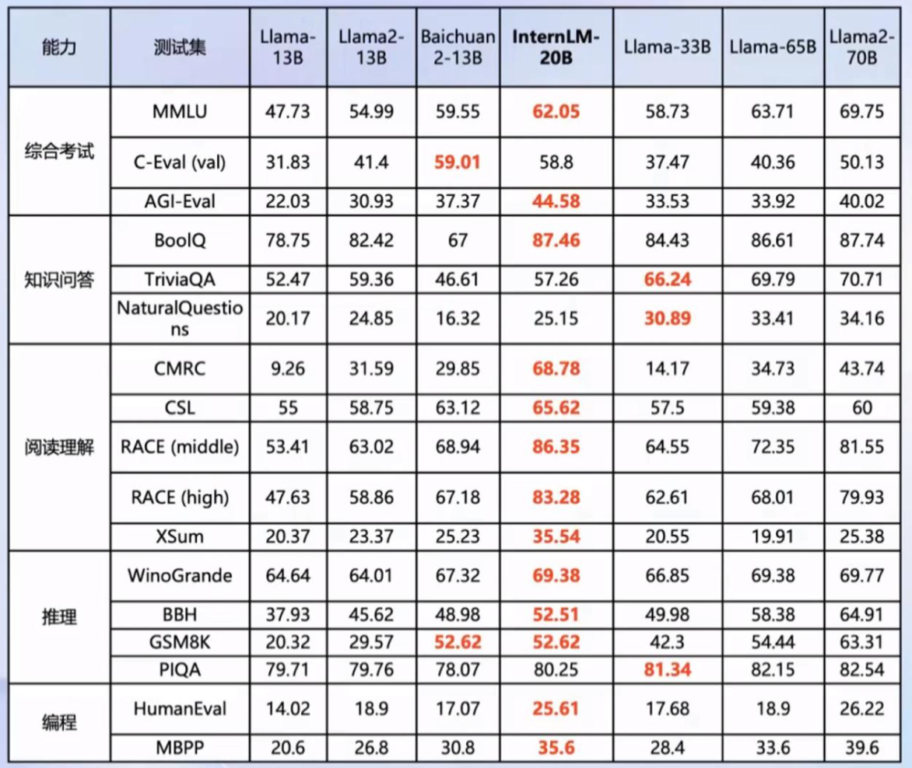
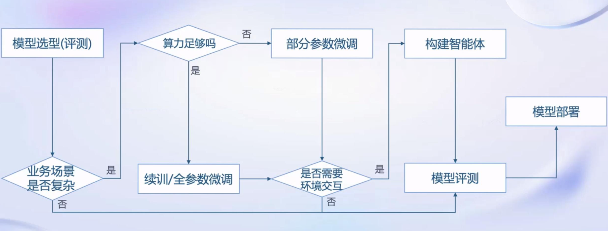
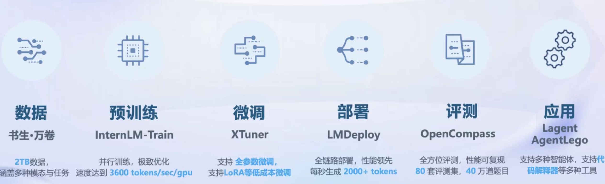

# TASK1

## 书生•浦语大模型系列

### 轻量级:InternLM-7B

- 70亿模型参数，小巧轻便，便于部署
- 10000亿训练token数据，信息全面，能力多维
- 具备长语境能力，支持8k语境窗又长度
- 具备通用工具调用能力，支持多种工具调用模板
- **社区低成本可用最佳模型规模**

### 中量级:InternLM-20B

- 200亿参数量，在模型能力与推理代价间取得平衡
- 采用深而窄的结构，降低推理计算量但提高了推理能力
- 4k训练语境长度，推理时可外推至16k
- **商业场景可开发定制高精度较小模型规模**

### 重量级:InternLM-123B

- 1230亿模型参数，强大的性能

- 具备极强的推理能力、全面的知识覆盖面、超强理解能力与对话能力
- 准确的AP调用能力，可实现各类Agent
- **通用大语言模型能力全面覆盖千亿模型规模**

## 书生•浦语20B开源大模型性能

全面领先相近量级的开源模型(包括Llama-33B、Llama2-13B以及国内主流的7B、13B开源模型)
•以不足三分之一的参数量，达到Llama2-70B水平

## 从模型到应用

### 模型应用场景

- 智能客服
- 个人助手
- 行业应用

### 使用模型搭建应用流程

## 相关课程信息

[书生·浦语大模型实战营课程介绍](https://github.com/InternLM/tutorial)

[书生·浦语课程学习算力平台](https://studio.intern-ai.org.cn/)

[**浦语·灵笔**是基于书生·浦语大语言模型研发的视觉-语言大模型](https://github.com/InternLM/InternLM-XComposer)

[**OpenDataLab**为大模型提供高质量的开放数据集开放平台！](https://opendatalab.org.cn/)

[**XTuner**是一个轻量级微调大语言模型的工具](https://github.com/InternLM/xtuner)

[**OpenCompass**是面向大模型评测的一站式平台](https://github.com/open-compass/opencompass)

[**LMDeploy**由MMDeploy和MMRazor团队联合开发，是涵盖了LLM任务的全套轻量化、部署和服务解决方案](https://github.com/InternLM/lmdeploy)

[**InternLM**是一个开源的轻量级训练框架](https://github.com/InternLM/lagent)

[**AgentLego**是一个开源的多功能工具API库](https://github.com/InternLM/agentlego)

### 备忘录

第一次课程视频链接：https://www.bilibili.com/video/BV1Rc411b7ns/，

第一次课程只需要记笔记，没有作业。第一次课程(1月3日)和第二次课程(1月5日)到本周末(1月7日)截止，

将你的笔记链接填写到 Github https://github.com/InternLM/tutorial/discussions/54(各个平台 知乎、CSDN 都行，贴一个链接到 discussion)

2. 教程仓库已经公开了，想提前学习可以去访问啦：https://github.com/InternLM/tutorial 记得star⭐喔~=======================
2. 学习手册链接：https://deepthought.feishu.cn/docx/ToCAdsRDFoJAKnxLFErcXDILnpg?from=from_copylink
2. 填写表格链接：https://deepthought.feishu.cn/sheets/T9Pssx6chhdkwFtEbc0cHYvkngg?from=from_copylinkQ&A==
2. 文档链接:https://cguue83gpz.feishu.cn/docx/Noi7d5lllo6DMGxkuXwclxXMn5f 
