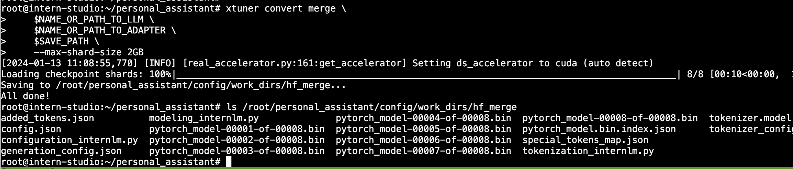

# XTuner 大模型单卡低成本微调实战

## Finetune简介


### 增量预训练


### 指令跟随


### LoRA&QLoRA


### XTuner介绍


### 8GB显卡玩转LLM


## 动手实践环节

### 从源码安装 XTuner

#### 安装python环境

````
conda create --name xtuner0.1.9 python=3.10 -y
conda activate xtuner0.1.9
````
#### 源码安装Xtuner

````
cd ~
mkdir xtuner019 && cd xtuner019
git clone -b v0.1.9 https://gitee.com/Internlm/xtuner
cd xtuner
pip install -e '.[all]'
````

### 微调

#### 准备配置文件

````
mkdir ~/ft-oasst1 && cd ~/ft-oasst1
# 列出所有内置配置
xtuner list-cfg
# 拷贝一个配置文件到当前目录
xtuner copy-cfg internlm_chat_7b_qlora_oasst1_e3 .
````


配置文件名的解释：

> xtuner copy-cfg internlm_chat_7b_qlora_oasst1_e3 .

| 模型名         | internlm_chat_7b     |
| -------------- | -------------------- |
| 使用算法       | qlora                |
| 数据集         | oasst1               |
| 把数据集跑几次 | 跑3次：e3 (epoch 3 ) |

#### 模型下载

````
# cp -r /root/share/temp/model_repos/internlm-chat-7b ~/ft-oasst1/
# 装一下拉取模型文件要用的库
pip install modelscope

# 从 modelscope 下载下载模型文件
cd ~/ft-oasst1
apt install git git-lfs -y
git lfs install
git lfs clone https://modelscope.cn/Shanghai_AI_Laboratory/internlm-chat-7b.git -b v1.0.3
````

#### 数据集下载

https://huggingface.co/datasets/timdettmers/openassistant-guanaco/tree/main


#### 数据说明


#### 修改配置文件

减号代表要删除的行，加号代表要增加的行。

```diff
# 修改模型为本地路径
- pretrained_model_name_or_path = 'internlm/internlm-chat-7b'
+ pretrained_model_name_or_path = './internlm-chat-7b'

# 修改训练数据集为本地路径
- data_path = 'timdettmers/openassistant-guanaco'
+ data_path = './openassistant-guanaco'
```

**常用超参**

| 参数名              | 解释                                                   |
| ------------------- | ------------------------------------------------------ |
| **data_path**       | 数据路径或 HuggingFace 仓库名                          |
| max_length          | 单条数据最大 Token 数，超过则截断                      |
| pack_to_max_length  | 是否将多条短数据拼接到 max_length，提高 GPU 利用率     |
| accumulative_counts | 梯度累积，每多少次 backward 更新一次参数               |
| evaluation_inputs   | 训练过程中，会根据给定的问题进行推理，便于观测训练状态 |
| evaluation_freq     | Evaluation 的评测间隔 iter 数                          |
| ......              | ......                                                 |

#### 开始微调

**训练：**

````
# 单卡
## 用刚才改好的config文件训练
xtuner train ./internlm_chat_7b_qlora_oasst1_e3_copy.py
# 多卡
NPROC_PER_NODE=${GPU_NUM} 
xtuner train ./internlm_chat_7b_qlora_oasst1_e3_copy.py


# 若要开启 deepspeed 加速，增加 --deepspeed deepspeed_zero2 即可
xtuner train ./internlm_chat_7b_qlora_oasst1_e3_copy.py --deepspeed deepspeed_zero2

````

**单卡训练**


**开启deepspeed加速**


**训练完成**


#### 将得到的 PTH 模型转换为 HuggingFace 模型

````
# xtuner convert pth_to_hf ${CONFIG_NAME_OR_PATH} ${PTH_file_dir} ${SAVE_PATH}

mkdir hf
export MKL_SERVICE_FORCE_INTEL=1

xtuner convert pth_to_hf ./internlm_chat_7b_qlora_oasst1_e3_copy.py ./work_dirs/internlm_chat_7b_qlora_oasst1_e3_copy/epoch_1.pth ./hf
````


### 部署与测试

#### 将 HuggingFace adapter 合并到大语言模型

````
xtuner convert merge ./internlm-chat-7b ./hf ./merged --max-shard-size 2GB
# xtuner convert merge \
#     ${NAME_OR_PATH_TO_LLM} \
#     ${NAME_OR_PATH_TO_ADAPTER} \
#     ${SAVE_PATH} \
#     --max-shard-size 2GB
````


#### 与合并后的模型对话

````
# 加载 Adapter 模型对话（Float 16）
xtuner chat ./merged --prompt-template internlm_chat

# 4 bit 量化加载
# xtuner chat ./merged --bits 4 --prompt-template internlm_chat
````


#### **`xtuner chat`** **的启动参数**

| 启动参数              | 干哈滴                                                       |
| --------------------- | ------------------------------------------------------------ |
| **--prompt-template** | 指定对话模板                                                 |
| --system              | 指定SYSTEM文本                                               |
| --system-template     | 指定SYSTEM模板                                               |
| -**-bits**            | LLM位数                                                      |
| --bot-name            | bot名称                                                      |
| --with-plugins        | 指定要使用的插件                                             |
| **--no-streamer**     | 是否启用流式传输                                             |
| **--lagent**          | 是否使用lagent                                               |
| --command-stop-word   | 命令停止词                                                   |
| --answer-stop-word    | 回答停止词                                                   |
| --offload-folder      | 存放模型权重的文件夹（或者已经卸载模型权重的文件夹）         |
| --max-new-tokens      | 生成文本中允许的最大 `token` 数量                            |
| **--temperature**     | 温度值                                                       |
| --top-k               | 保留用于顶k筛选的最高概率词汇标记数                          |
| --top-p               | 如果设置为小于1的浮点数，仅保留概率相加高于 `top_p` 的最小一组最有可能的标记 |
| --seed                | 用于可重现文本生成的随机种子                                 |

### 自定义微调

#### **场景需求**

   基于 InternLM-chat-7B 模型，用 MedQA 数据集进行微调，将其往`医学问答`领域对齐。

#### **真实数据预览**

| 问题                                                       | 答案                                                         |
| ---------------------------------------------------------- | ------------------------------------------------------------ |
| What are ketorolac eye drops?（什么是酮咯酸滴眼液？）      | Ophthalmic   ketorolac is used to treat itchy eyes caused by allergies. It also is used to   treat swelling and redness (inflammation) that can occur after cataract   surgery. Ketorolac is in a class of medications called nonsteroidal   anti-inflammatory drugs (NSAIDs). It works by stopping the release of   substances that cause allergy symptoms and inflammation. |
| What medicines raise blood sugar? （什么药物会升高血糖？） | Some   medicines for conditions other than diabetes can raise your blood sugar   level. This is a concern when you have diabetes. Make sure every doctor you   see knows about all of the medicines, vitamins, or herbal supplements you   take. This means anything you take with or without a prescription. Examples include:     Barbiturates.     Thiazide diuretics.     Corticosteroids.     Birth control pills (oral contraceptives) and progesterone.     Catecholamines.     Decongestants that contain beta-adrenergic agents, such as pseudoephedrine.     The B vitamin niacin. The risk of high blood sugar from niacin lowers after you have taken it for a few months. The antipsychotic medicine olanzapine (Zyprexa). |

### 数据准备 

````
git clone https://github.com/abachaa/Medication_QA_MedInfo2019.git
````

#### 数据下载


#### 将数据转为 XTuner 的数据格式

**目标格式：(.jsonL)**

```JSON
[{
    "conversation":[
        {
            "system": "xxx",
            "input": "xxx",
            "output": "xxx"
        }
    ]
},
{
    "conversation":[
        {
            "system": "xxx",
            "input": "xxx",
            "output": "xxx"
        }
    ]
}]
```


#### python脚本转换

````python
import openpyxl
import json

def process_excel_to_json(input_file, output_file):
    # Load the workbook
    wb = openpyxl.load_workbook(input_file)

    # Select the "DrugQA" sheet
    sheet = wb["DrugQA"]

    # Initialize the output data structure
    output_data = []

    # Iterate through each row in column A and D
    for row in sheet.iter_rows(min_row=2, max_col=4, values_only=True):
        system_value = "You are a professional, highly experienced doctor professor. You always provide accurate, comprehensive, and detailed answers based on the patients' questions."

        # Create the conversation dictionary
        conversation = {
            "system": system_value,
            "input": row[0],
            "output": row[3]
        }

        # Append the conversation to the output data
        output_data.append({"conversation": [conversation]})

    # Write the output data to a JSON file
    with open(output_file, 'w', encoding='utf-8') as json_file:
        json.dump(output_data, json_file, indent=4)

    print(f"Conversion complete. Output written to {output_file}")

# Replace 'MedQA2019.xlsx' and 'output.jsonl' with your actual input and output file names
process_excel_to_json('MedQA2019.xlsx', 'output.jsonl')

````


#### 划分训练集和测试集

````python
import json
import random

def split_conversations(input_file, train_output_file, test_output_file):
    # Read the input JSONL file
    with open(input_file, 'r', encoding='utf-8') as jsonl_file:
        data = json.load(jsonl_file)

    # Count the number of conversation elements
    num_conversations = len(data)
    
    # Shuffle the data randomly
    random.shuffle(data)
    random.shuffle(data)
    random.shuffle(data)

    # Calculate the split points for train and test
    split_point = int(num_conversations * 0.7)

    # Split the data into train and test
    train_data = data[:split_point]
    test_data = data[split_point:]

    # Write the train data to a new JSONL file
    with open(train_output_file, 'w', encoding='utf-8') as train_jsonl_file:
        json.dump(train_data, train_jsonl_file, indent=4)

    # Write the test data to a new JSONL file
    with open(test_output_file, 'w', encoding='utf-8') as test_jsonl_file:
        json.dump(test_data, test_jsonl_file, indent=4)

    print(f"Split complete. Train data written to {train_output_file}, Test data written to {test_output_file}")

# Replace 'input.jsonl', 'train.jsonl', and 'test.jsonl' with your actual file names
split_conversations('MedQA2019-structured.jsonl', 'MedQA2019-structured-train.jsonl', 'MedQA2019-structured-test.jsonl')

````


### 开始自定义微调

#### 下载模型

````
mkdir ~/ft-medqa && cd ~/ft-medqa
cp -r ~/ft-oasst1/internlm-chat-7b .
git clone https://github.com/InternLM/tutorial
cp ~/tutorial/xtuner/MedQA2019-structured-train.jsonl .
````

#### 准备配置文件

````
# 复制配置文件到当前目录
xtuner copy-cfg internlm_chat_7b_qlora_oasst1_e3 .
# 改个文件名
mv internlm_chat_7b_qlora_oasst1_e3_copy.py internlm_chat_7b_qlora_medqa2019_e3.py

# 修改配置文件内容
vim internlm_chat_7b_qlora_medqa2019_e3.py
````

减号代表要删除的行，加号代表要增加的行。

```diff
# 修改import部分
- from xtuner.dataset.map_fns import oasst1_map_fn, template_map_fn_factory
+ from xtuner.dataset.map_fns import template_map_fn_factory

# 修改模型为本地路径
- pretrained_model_name_or_path = 'internlm/internlm-chat-7b'
+ pretrained_model_name_or_path = './internlm-chat-7b'

# 修改训练数据为 MedQA2019-structured-train.jsonl 路径
- data_path = 'timdettmers/openassistant-guanaco'
+ data_path = 'MedQA2019-structured-train.jsonl'

# 修改 train_dataset 对象
train_dataset = dict(
    type=process_hf_dataset,
-   dataset=dict(type=load_dataset, path=data_path),
+   dataset=dict(type=load_dataset, path='json', data_files=dict(train=data_path)),
    tokenizer=tokenizer,
    max_length=max_length,
-   dataset_map_fn=alpaca_map_fn,
+   dataset_map_fn=None,
    template_map_fn=dict(
        type=template_map_fn_factory, template=prompt_template),
    remove_unused_columns=True,
    shuffle_before_pack=True,
    pack_to_max_length=pack_to_max_length)
```

#### **XTuner！启动！**

````
xtuner train internlm_chat_7b_qlora_medqa2019_e3.py --deepspeed deepspeed_zero2
````


#### pth 转 huggingface

详情见微调部分

#### 部署与测试

详情见微调部分

### 个人小助手认知微调实践

### 装 XTuner

#### 安装python环境

````
conda create --name personal_assistant python=3.10 -y
conda activate personal_assistant
````

#### 源码安装Xtuner

````
cd ~
# personal_assistant用于存放本教程所使用的东西
mkdir /root/personal_assistant && cd /root/personal_assistant
mkdir /root/personal_assistant/xtuner019 && cd /root/personal_assistant/xtuner019
git clone -b v0.1.9  https://github.com/InternLM/xtuner 
cd xtuner
# pip install -e '.[all]'  
pip install -i https://pypi.tuna.tsinghua.edu.cn/simple  -e '.[all]' # 换源
````

### 微调

#### 数据准备

````
mkdir -p /root/personal_assistant/data && cd /root/personal_assistant/data
````
#### 数据生成

````
import json

# 输入你的名字
name = '黑桃'
# 重复次数
n = 10000

data = [
    {
        "conversation": [
            {
                "input": "请做一下自我介绍",
                "output": "我是{}的小助手，内在是上海AI实验室书生·浦语的7B大模型哦".format(name)
            }
        ]
    }
]

for i in range(n):
    data.append(data[0])

with open('personal_assistant.json', 'w', encoding='utf-8') as f:
    json.dump(data, f, ensure_ascii=False, indent=4)
````

### 配置准备

创建用于存放配置的文件夹config并进入
```
mkdir /root/personal_assistant/config && cd /root/personal_assistant/config
```

拷贝一个配置文件到当前目录

```bash
# xtuner copy-cfg ${CONFIG_NAME} ${SAVE_PATH}
xtuner copy-cfg internlm_chat_7b_qlora_oasst1_e3 .
```


```bash
# PART 1 中
# 预训练模型存放的位置
pretrained_model_name_or_path = '/root/personal_assistant/model/Shanghai_AI_Laboratory/internlm-chat-7b'

# 微调数据存放的位置
data_path = '/root/personal_assistant/data/personal_assistant.json'

# 训练中最大的文本长度
max_length = 512

# 每一批训练样本的大小
batch_size = 2

# 最大训练轮数
max_epochs = 3

# 验证的频率
evaluation_freq = 90

# 用于评估输出内容的问题（用于评估的问题尽量与数据集的question保持一致）
evaluation_inputs = [ '请介绍一下你自己', '请做一下自我介绍' ]


# PART 3 中
dataset=dict(type=load_dataset, path='json', data_files=dict(train=data_path))
dataset_map_fn=None
```


#### 下载/复制模型

````
mkdir -p /root/personal_assistant/model/Shanghai_AI_Laboratory
cp -r /root/share/temp/model_repos/internlm-chat-7b /root/personal_assistant/model/Shanghai_AI_Laboratory
````


#### 微调启动

````
xtuner train /root/personal_assistant/config/internlm_chat_7b_qlora_oasst1_e3_copy.py
````


#### 微调后参数转换/合并

````
# 创建用于存放Hugging Face格式参数的hf文件夹
mkdir /root/personal_assistant/config/work_dirs/hf
export MKL_SERVICE_FORCE_INTEL=1
# 配置文件存放的位置
export CONFIG_NAME_OR_PATH=/root/personal_assistant/config/internlm_chat_7b_qlora_oasst1_e3_copy.py
# 模型训练后得到的pth格式参数存放的位置
export PTH=/root/personal_assistant/config/work_dirs/internlm_chat_7b_qlora_oasst1_e3_copy/epoch_3.pth
# pth文件转换为Hugging Face格式后参数存放的位置
export SAVE_PATH=/root/personal_assistant/config/work_dirs/hf
# 执行参数转换
xtuner convert pth_to_hf $CONFIG_NAME_OR_PATH $PTH $SAVE_PATH
````


### Merge模型参数

````
export MKL_SERVICE_FORCE_INTEL=1
export MKL_THREADING_LAYER='GNU'

# 原始模型参数存放的位置
export NAME_OR_PATH_TO_LLM=/root/personal_assistant/model/Shanghai_AI_Laboratory/internlm-chat-7b

# Hugging Face格式参数存放的位置
export NAME_OR_PATH_TO_ADAPTER=/root/personal_assistant/config/work_dirs/hf

# 最终Merge后的参数存放的位置
mkdir /root/personal_assistant/config/work_dirs/hf_merge
export SAVE_PATH=/root/personal_assistant/config/work_dirs/hf_merge

# 执行参数Merge
xtuner convert merge \
    $NAME_OR_PATH_TO_LLM \
    $NAME_OR_PATH_TO_ADAPTER \
    $SAVE_PATH \
    --max-shard-size 2GB
````



#### 修改模型路径

 `/root/personal_assistant/code/InternLM/web_demo.py` 


#### 网页DEMO

##### 配置环境

````
pip install streamlit==1.24.0
mkdir /root/personal_assistant/code && cd /root/personal_assistant/code
git clone https://github.com/InternLM/InternLM.git
````

##### 启动开启端口映射

````
streamlit run /root/personal_assistant/code/InternLM/web_demo.py --server.address 127.0.0.1 --server.port 6006
````


### 作业


[让 Tmux 和 Vim 无惧系统重启 ](https://www.cnblogs.com/zzxworld/p/13751885.html)

[DeepSpeed 通过系统优化加速大模型推理](https://zhuanlan.zhihu.com/p/629644249)


**基础作业：**

构建数据集，使用 XTuner 微调 InternLM-Chat-7B 模型, 让模型学习到它是你的智能小助手，效果如下图所示，本作业训练出来的模型的输出需要**将不要葱姜蒜大佬**替换成自己名字或昵称！

**微调前**（回答比较官方）


**微调后**（对自己的身份有了清晰的认知）


作业参考答案：https://github.com/InternLM/tutorial/blob/main/xtuner/self.md

**进阶作业：**

- 将训练好的Adapter模型权重上传到 OpenXLab、Hugging Face 或者 MoelScope 任一一平台。
- 将训练好后的模型应用部署到 OpenXLab 平台，参考部署文档请访问：https://aicarrier.feishu.cn/docx/MQH6dygcKolG37x0ekcc4oZhnCe

**整体实训营项目：**

时间周期：即日起致课程结束

即日开始可以在班级群中随机组队完成一个大作业项目，一些可提供的选题如下：

- 人情世故大模型：一个帮助用户撰写新年祝福文案的人情事故大模型
- 中小学数学大模型：一个拥有一定数学解题能力的大模型
- 心理大模型：一个治愈的心理大模型
- 工具调用类项目：结合 Lagent 构建数据集训练 InternLM 模型，支持对 MMYOLO 等工具的调用

其他基于书生·浦语工具链的小项目都在范围内，欢迎大家充分发挥想象力。


今天带小伙伴们使用 XTuner 单卡低成本微调你的大模型
文档链接：https://github.com/InternLM/tutorial/blob/main/xtuner/README.md

视频链接： https://www.bilibili.com/video/BV1yK4y1B75J/
作业是使用 XTuner 训练 InternLM-Chat-7B 模型，让模型具有是你的小助手的认知，作业详细信息请看文档的末尾

笔记提交链接：https://github.com/InternLM/tutorial/discussions/148

作业提交链接：https://github.com/InternLM/tutorial/discussions/152

基础作业参考答案：https://github.com/InternLM/tutorial/blob/main/xtuner/self.md
算力已经给大家补充到了 56 点，觉得不错欢迎 star 
https://github.com/internLM/internLM/
https://github.com/InternLM/xtuner