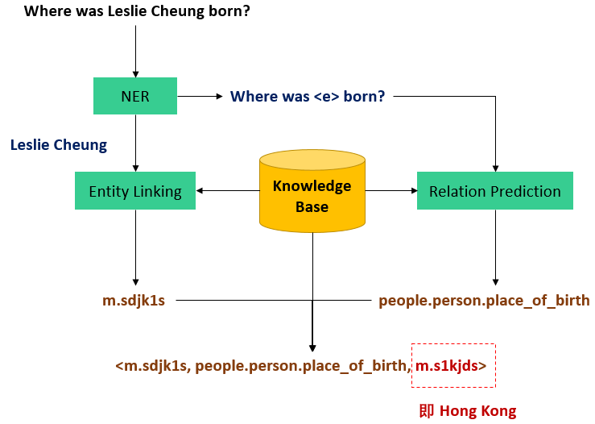
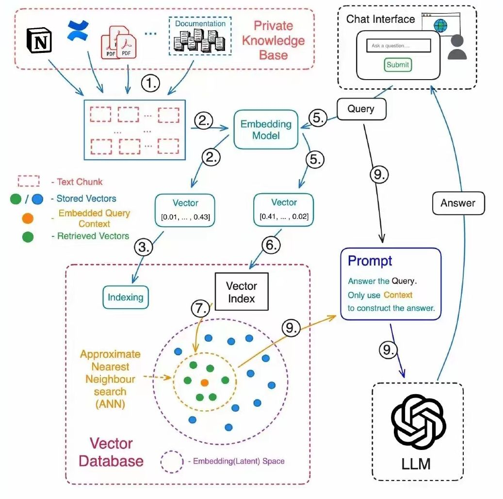
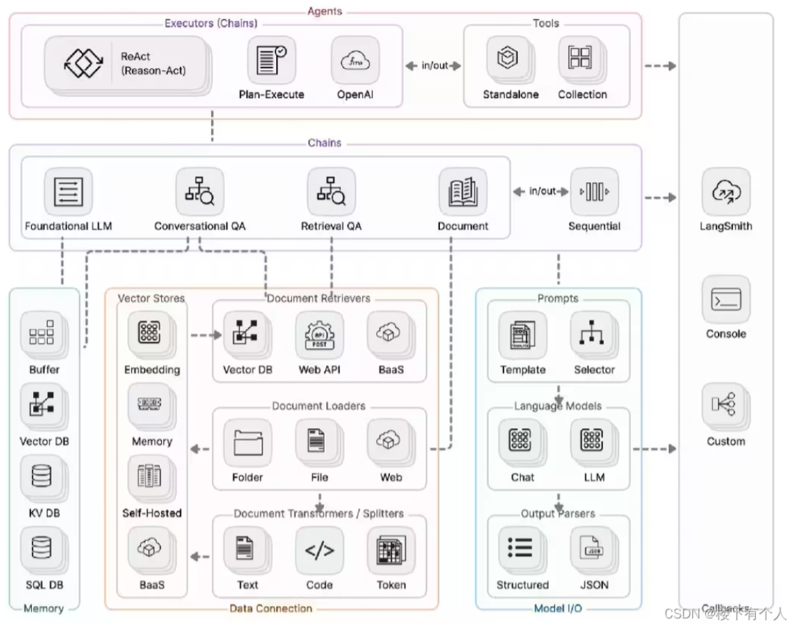

## 初始RAG

### 任务
- 任务说明：了解到现有大模型的缺陷和RAG的优点和流程
- 任务要求：
  - 了解大模型现有的缺点
  - 理解RAG的流程和实现步骤
  - 清楚RAG的需要的技术
- 打卡要求：阅读LangChain与RAG的[文章](https://juejin.cn/post/7310569308916334604)和LangChain的[官方文档](https://python.langchain.com/docs/expression_language/cookbook/retrieval)，列举LangChain能实现的功能。

### 大模型现有的缺点

- **训练的大多数据都是通用数据，垂直领域的数据不够全面，缺乏专业知识**

- **知识时间更新快，模型给出的回答可能过时**

- 存在**模型幻觉**
- 模型实效性有延迟

### 知识库问答（KBQA）

知识库问答（Knowledge Base Question Answering，简称KBQA）是一种早期的对话系统方法，旨在**利用结构化的知识库进行自然语言问题的回答**。这种方法**基于一个存储在图数据库中的知识库，通常以三元组的形式表示为<主题，关系，对象>**，其中**每个三元组都附带相关的属性信息**。

知识库问答早期是对话系统中的有效方法，其基于知识图谱的结构为系统提供了丰富的语义信息，使得系统能够更深入地理解用户提出的问题，并以结构化的形式回答这些问题。随着技术的不断发展，KBQA方法也在不断演进，为对话系统的进一步提升奠定了基础。

在KBQA中，有两种主流方法用于处理自然语言问题：

- 主题识别与实体链接

  - 识别问题的主题

  - 将其链接到知识库中的实体

  - 通过主题实体，在知识库中查找相关信息回答问题

    

- 多跳查询

  - 基于图数据库
  - 通过多个关系跨页多个实体获取更深层次的信息

### 什么是 RAG

检索模型的工作就像是在一个巨大的图书馆中寻找信息。设想你有成千上万本书籍和文章，当你提出一个问题时，**检索模型就像一个聪明的图书管理员**，能迅速理解你的问题并找到与之最相关的最佳信息。

## RAG的流程和实现步骤

检索的核心分为如下两部分：

- 索引：嵌入(Embeddings)，将知识库转换为可搜索/查询的内容。
- 查询：从搜索内容中提取最相关的、最佳知识片段。

1. 将私有知识库中的文档转换成可以处理的文本块
2. 切分之后的文本数据通过embedding模型转化为向量
3. 将文本块转换成向量，创建文本块向量的索引
4. 嵌入向量被存储在一个向量数据库中，通常使用近似最近邻（ANN）搜索来优化检索速度。
5. 用户在聊天界面输入查询语句
6. 查询嵌入：查询也被转换成向量，以便与文档的嵌入向量进行比较。
7. 检索向量：查询的向量在向量索引中被用来找出最相近的文本块向量，最相近的文本块向量代表了与用户查询最相关的知识片段。
8. 提示和回答：生成模型（LLM）接收到用户的查询和检索到的知识片段，然后生成回答。这个回答既包含了用户查询的上下文，也融合了从知识库中检索到的信息。
   

### RAG的需要的技术

| **意图理解**     | 意图理解模块负责准确把握用户提出的问题，确定用户的意图和主题。处理用户提问的模糊性和不规范性，为后续流程提供清晰的任务目标。 |
| ---------------- | ------------------------------------------------------------ |
| **文档解析**     | 文档解析模块用于处理来自不同来源的文档，包括PDF、PPT、Neo4j等格式。该模块负责将文档内容转化为可处理的结构化形式，为知识检索提供合适的输入。 |
| **文档索引**     | 文档索引模块将解析后的文档分割成短的Chunk，并构建向量索引。或通过全文索引进行文本检索，使得系统能够更快速地找到与用户问题相关的文档片段。 |
| **向量嵌入**     | 向量嵌入模块负责将文档索引中的内容映射为向量表示，以便后续的相似度计算。这有助于模型更好地理解文档之间的关系，提高知识检索的准确性。 |
| **知识检索**     | 知识检索模块根据用户提问和向量嵌入计算的相似度检索或文本检索打分。这一步骤需要解决问题和文档之间的语义关联，确保检索的准确性。 |
| **重排序**       | 重排序模块在知识检索后对文档库进行重排序，以避免“Lost in the Middle”现象，确保最相关的文档片段在前面。 |
| **大模型回答**   | 大模型回答模块利用大型语言模型生成最终的回答。该模块结合检索到的上下文，以生成连贯、准确的文本回答。 |
| **其他功能模块** | 可根据具体应用需求引入其他功能模块，如查询搜索引擎、融合多个回答等。模块化设计使得系统更加灵活，能够根据不同场景选择合适的功能模块组合。 |

### RAG面临的挑战

RAG在实施过程中确实面临着多项挑战，其中包括嵌入质量、性能优化和上下文理解。这些难点不仅关系到RAG系统的效率，还直接影响到最终生成文本的准确性和可用性。

- 提升嵌入的质量

  - 将外部知识源转换为向量时，需要保证嵌入（embedding）的高质量至关重要，这一过程对于提高查询与知识库信息匹配的准确性至关重要。技术上，这**要求嵌入能够捕获和保留文本的深层语义特征，包括上下文关系和词汇间的微妙联系**。

  - 此外，为了避免训练过程中的数据偏见，需要用到平衡和多样化的数据集。只有这样，通过嵌入生成的向量才能真正代表原始文本的意图和内容，从而在查询时提供更准确、更相关的结果。

- 查找精确知识的挑战
  - 从外部知识源中准确地查找与当前问题最匹配的知识是一个复杂的挑战。这要求大模型LLM能够**深入理解用户查询的真实意图**，同时利用**高效的检索算法在庞大的数据集中快速定位相关信息**。此外，确保检索结果的相关性和质量，以及处理大量数据的能力，也是这一挑战的关键部分。同时，**系统还需要适应模糊或复杂的查询**，并**保持知识库的时效性和准确性**。

- 上下文内容的理解

  - 上下文理解是一个核心挑战，要求生成模型不仅**深入理解检索到的上下文信息**，包括其隐含含义和语境；
  - 在理解检索到的内容后，挑战在于**如何将这些信息与原始查询请求以及模型已有的知识库相结合**。这要求模型能够在回答生成过程中，不仅准确地引用检索信息，还要保证信息的连贯性和逻辑性。

  - 上下文理解的挑战要求RAG在处理和生成回答时，能够展现出**高度的理解能力和灵活的信息整合能力**。这对于提升回答的质量和用户满意度至关重要。
    

### RAG和SFT对比

|      | 微调模型                                               | RAG                                                          |
| :--- | :----------------------------------------------------- | :----------------------------------------------------------- |
| 优点 | 针对特定任务调整预训练模型。优点是可针对特定任务优化； | 结合检索系统和生成模型。优点是能利用最新信息，提高答案质量，具有更好的可解释性和适应性： |
| 缺点 | 但缺点是更新成本高，对新信息适应性较差；               | 是可能面临检索质量问题和增加额外计算资源需求;                |

| 特性       | RAG技术                                    | SFT模型微调                              |
| :--------- | :----------------------------------------- | :--------------------------------------- |
| 知识更新   | 实时更新检索库，适合动态数据，无需频繁重训 | 存储静态信息，更新知识需要重新训练       |
| 外部知识   | 高效利用外部资源，适合各类数据库           | 可对齐外部知识，但对动态数据源不够灵活   |
| 数据处理   | 数据处理需求低                             | 需构建高质量数据集，数据限制可能影响性能 |
| 模型定制化 | 专注于信息检索和整合，定制化程度低         | 可定制行为，风格及领域知识               |
| 可解释性   | 答案可追溯，解释性高                       | 解释性相对低                             |
| 计算资源   | 需要支持检索的计算资源，维护外部数据源     | 需要训练数据集和微调资源                 |
| 延迟要求   | 数据检索可能增加延迟                       | 微调后的模型反应更快                     |
| 减少幻觉   | 基于实际数据，幻觉减少                     | 通过特定域训练可减少幻觉，但仍然有限     |
| 道德和隐私 | 处理外部文本数据时需要考虑隐私和道德问题   | 训练数据的敏感内容可能引发隐私问题       |

### 什么是LangChain

LangChain是一个基于语言模型开发应用程序的框架，帮助开发人员**使用语言模型构建端到端的应用程序**

它还提供了一套工具，可帮助开发人员构建上下文感知、推理应用程序， LangChain的工具包括**聊天机器人、文档分析、摘要、代码分析、工作流自动化、自定义搜索等**

### LangChain能实现的功能

#### LangChain主要包含组件

- Model I/O：管理大语言模型（Models），及其输入（Prompts）和格式化输出（Output Parsers）
- Data connection：管理主要用于建设私域知识（库）的向量数据存储（Vector Stores）、内容数据获取（Document Loaders）和转化（Transformers），以及向量数据查询（Retrievers）
- Memory：用于存储和获取 对话历史记录 的功能模块
- Chains：用于串联 Memory ↔️ Model I/O ↔️ Data Connection，以实现 串行化 的连续对话、推测流程
- Agents：基于 Chains 进一步串联工具（Tools），从而将大语言模型的能力和本地、云服务能力结合
- Callbacks：提供了一个回调系统，可连接到 LLM 申请的各个阶段，便于进行日志记录、追踪等数据导流

#### Langchain核心模块架构图

### 参考材料

https://zhuanlan.zhihu.com/p/665503140

https://www.zhihu.com/tardis/bd/art/656646499?source_id=1001