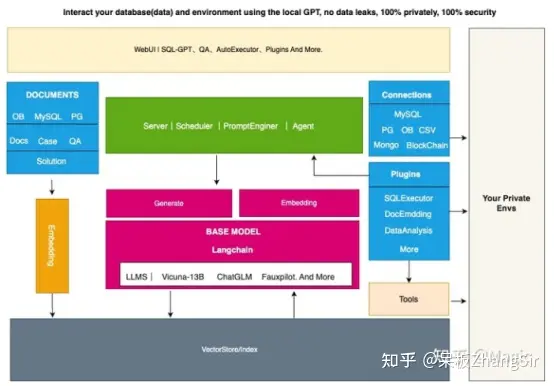

NL2SQL是语义解析和智能问答领域的前沿问题，旨在**将人类的自然语言问句转化为结构化查询语句**，是实现人类和数据库无缝交互、提升数据库分析效率的核心技术。

## [DB-GPT: 一个隐私的数据库垂直领域本地化大模型框架](https://zhuanlan.zhihu.com/p/629998078)

核心能力主要有以下几个部分。

1. 知识库能力：支持私域知识库问答能力
2. 大模型管理能力：基于FastChat提供一个大模型的运营环境。
3. 统一的数据向量化存储与索引：提供一种统一的方式来存储和索引各种数据类型。
4. 连接模块：用于连接不同的模块和数据源，实现数据的流转和交互。
5. Agent与插件：提供Agent和插件机制，使得用户可以自定义并增强系统的行为。
6. Prompt自动生成与优化：自动化生成高质量的Prompt，并进行优化，提高系统的响应效率。
7. 多端产品界面：支持多种不同的客户端产品，例如Web、移动应用和桌面应用等。