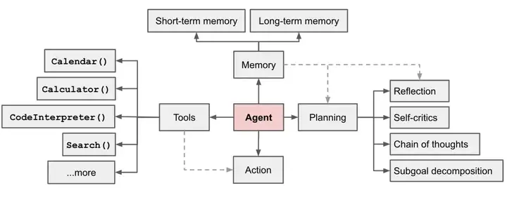
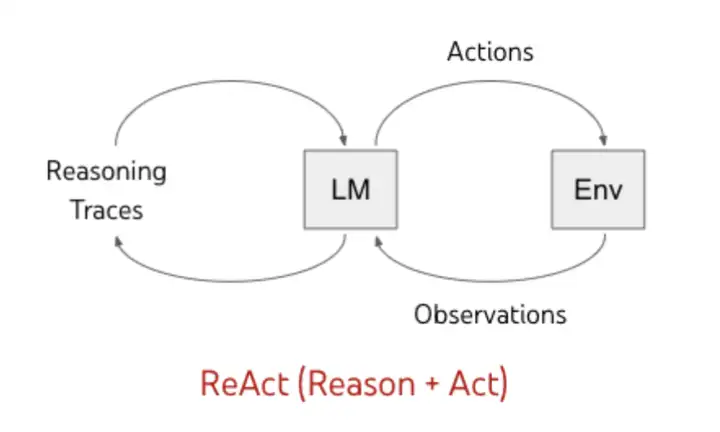
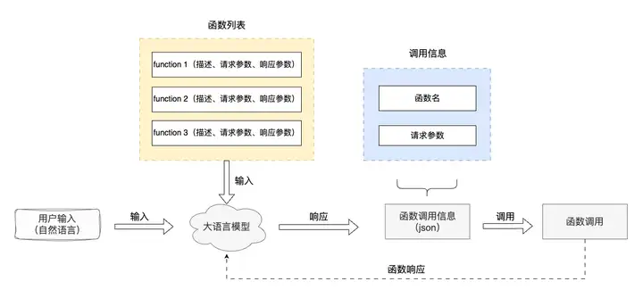
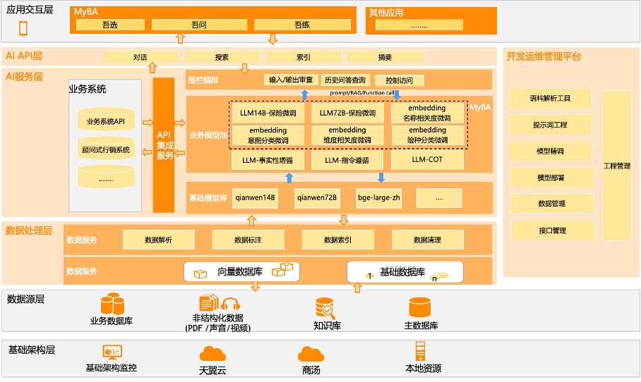

智能体是一种通用问题解决器。从软件工程的角度看来，智能体是一种基于大语言模型的，具备规划思考能力、记忆能力、使用工具函数的能力，能自主完成给定任务的计算机程序。

在基于 LLM 的智能体中，**LLM 的充当着智能体的“大脑”的角色**，同时还有 3 个关键部分：

- **规划（Planning）** : 智能体会把大型任务**分解为子任务**，并规划执行任务的流程；智能体会对任务执行的过程进行**思考和反思**，从而决定是继续执行任务，或判断任务完结并终止运行。
- **记忆（Memory）**: 短期记忆，是指在执行任务的过程中的上下文，会在子任务的执行过程产生和暂存，在任务完结后被清空。长期记忆是长时间保留的信息，一般是指外部知识库，通常用向量数据库来存储和检索。
- **工具使用（Tool use）** 为智能体配备工具 API，比如：计算器、搜索工具、代码执行器、数据库查询工具等。有了这些工具 API，智能体就可以是物理世界交互，解决实际的问题。


## 智能体的关键构成


### 规划（Planing）

规划，可以为理解**观察和思考**。如果用人类来类比，当我们接到一个任务，我们的思维模式可能会像下面这样:

- 我们首先会思考怎么完成这个任务。
- 然后我们会审视手头上所拥有的工具，以及如何使用这些工具高效地达成目的。
- 我们会把任务拆分成子任务（就像我们会使用 TAPD 做任务拆分）。
- 在执行任务的时候，我们会对执行过程进行反思和完善，吸取教训以完善未来的步骤
- 执行过程中思考任务何时可以终止

#### **子任务分解**

- 思维链（Chain of Thoughts, CoT）
  - **思维链已经是一种比较标准的提示技术**，能显著提升 LLM 完成复杂任务的效果。当我们对 LLM 这样要求「think step by step」，会发现 LLM 会把问题分解成多个步骤，一步一步思考和解决，能使得输出的结果更加准确。这是一种线性的思维方式。

- 思维树（Tree-of-thought, ToT）
  - 对 CoT 的进一步扩展，在思维链的每一步，推理出多个分支，拓扑展开成一棵思维树。使用启发式方法评估每个推理分支对问题解决的贡献。选择搜索算法，使用广度优先搜索（BFS）或深度优先搜索（DFS）等算法来探索思维树，并进行前瞻和回溯。

#### **反思和完善**


- ReAct

  - ReAct（[Yao et al. 2023](https://link.zhihu.com/?target=https%3A//arxiv.org/abs/2210.03629)） ，《ReAct: Synergizing Reasoning and Acting in Language Models》 这篇论文提出一种用于增强大型语言模型的方法，它通过结合推理（Reasoning）和行动（Acting）来增强推理和决策的效果。

  - **推理（Reasoning）：** LLM 基于「已有的知识」或「行动（Acting）后获取的知识」，推导出结论的过程。

  - **行动（Acting）：** LLM 根据实际情况，使用工具获取知识，或完成子任务得到阶段性的信息。


- 仅推理（Reasoning Only）：LLM 仅仅基于已有的知识进行推理，生成答案回答这个问题。很显然，如果 LLM 本身不具备这些知识，可能会出现幻觉，胡乱回答一通。
- 仅行动（Acting Only）： 大模型不加以推理，仅使用工具（比如搜索引擎）搜索这个问题，得出来的将会是海量的资料，不能直接回到这个问题。
- 推理+行动（Reasoning and Acting）： LLM 首先会基于已有的知识，并审视拥有的工具。当发现已有的知识不足以回答这个问题，则会调用工具，比如：搜索工具、生成报告等，然后得到新的信息，基于新的信息重复进行推理和行动，直到完成这个任务。其推理和行动的步骤会是如下这样：

```text
推理1：当前知识不足以回答这个问题，要回答该问题，需要知道什么是「特斯拉FSD 」和「华为ADS」
行动1：使用搜索工具搜索「特斯拉FSD 」和「华为ADS」的资料
观察1：总结行动1的内容

推理2：基于行动1和观察1的信息，得知这是关于两个自动驾驶提供商的方案对比，基于已有的信息，现在需要生成报告
行动2：使用生成报告的工具，生成调研报告
观察2：任务完成
```



### 记忆（Memory）

记忆是什么？当我们在思考这个问题，其实人类的大脑已经在使用记忆。记忆是大脑存储、保留和回忆信息的能力。记忆可以分为不同的类型：

- **短期记忆**：在当前任务执行过程中所产生的信息，比如某个工具或某个子任务执行的结果，会写入短期记忆中。记忆在当前任务过程中产生和暂存，在任务完结后被清空。
- **长期记忆**：长期记忆是长时间保留的信息。一般是指外部知识库，通常用向量数据库来存储和检索。


### 工具使用（Tool use）

在智能体中，工具就是函数（Function），工具使用就是调用函数（Call Function）。






https://zhuanlan.zhihu.com/p/697706325


测试 

部署

培训+调优

10天培训开物+llm

55 客户应用需求 + 教材

培训ppt


现场/远程

poc的对接人换人了


培训资料


top p

top k

token  


