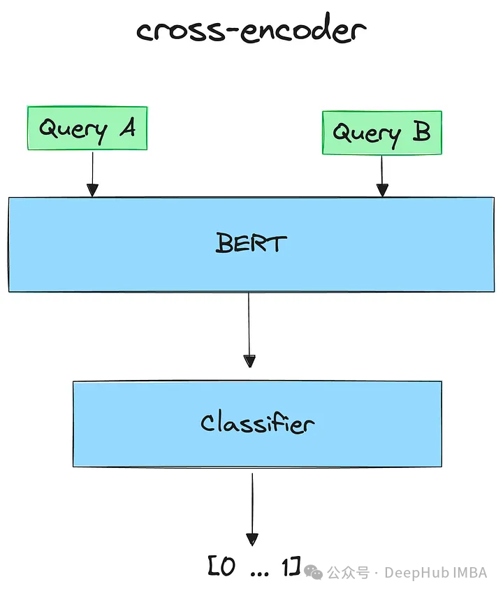
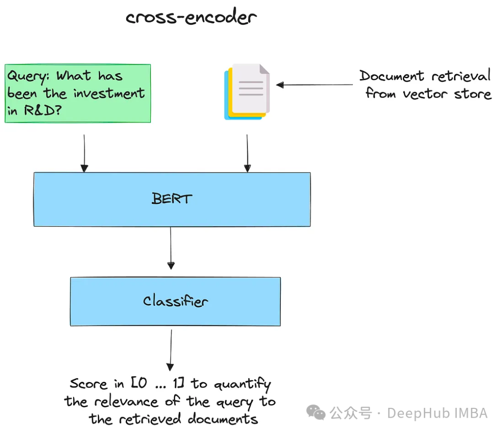

## RAG为什么需要重排序

### **RAG技术的挑战**：

- **召回率不足：**检索到的相关文档比例较低。如果增加返回的文档数来提升召回率，会有上下文窗口的限制。
- **信息丢失**：向量搜索将文本压缩成向量时不可避免地会丢失一些信息
- **上下文窗口限制**：大语言模型对可处理的文本量有限制

### 为什么能提高召回率

-  重排序器通常使用大型Transformer模型，能够更深入地理解文本的含义和上下文，从而生成更准确的相似度分数
- 嵌入模型在处理文档时，是在用户查询之前就已经创建了嵌入，因此对查询的上下文一无所知。而重排序器是在用户提出查询时才运行，能够针对具体的查询分析文档的含义，而非仅生成一个泛化的、平均化的含义。这种针对性的分析使得重排序器能够更好地理解查询与文档之间的相关性。

### **重排序算法的工作原理**：

- 交叉编码器cross-encoder是一种深度神经网络，它将两个输入序列作为单个输入处理。允许模型直接比较和对比输入，以更综合和细致的方式理解它们的关系。

  

  给定一个查询，用所有检索到的文档对其进行编码。然后按降序排序。得分高的认为是最相关的文件。

  

### **重排序器的优势**

- 精确度提升：重排序器的精确度远超嵌入模型，因为它能够直接处理原始信息，减少信息丢失。
- 针对性分析：重排序器在用户提出查询时运行，能够针对具体查询分析文档的含义，而非生成泛化的含义。
- 减少噪音：重新排序后，可以最小化输入到LLM（大语言模型）的噪音，提高整体性能。

### **重排序器的代价**

- 时间成本：重排序器通过完整的Transformer推理步骤生成相似度分数，处理速度较慢，相比向量搜索的时间成本更高。

### 参考资料：

https://zhuanlan.zhihu.com/p/664918134

https://cloud.tencent.cn/developer/article/2382902