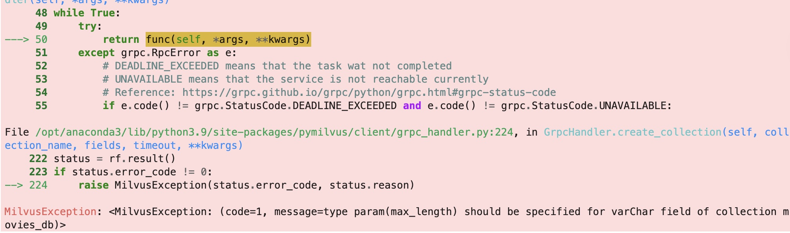
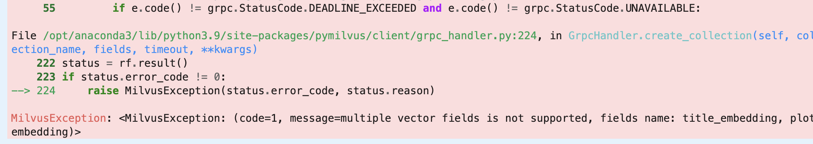

### 导入包


```python
from pymilvus import utility
from pymilvus import connections
from pymilvus import FieldSchema, CollectionSchema, DataType, Collection
import csv
import time
from tqdm import tqdm 
from sentence_transformers import SentenceTransformer
 
```

### 全局参数

在这里，我们可以找到需要修改以运行的主要参数。每个参数旁边都有一个描述。


```python
# Milvus Setup Arguments
COLLECTION_NAME = 'movies_db'  # Collection name
DIMENSION = 786  # Embeddings size
COUNT = 1000  # Number of vectors to insert
MILVUS_HOST = 'localhost'
MILVUS_PORT = '19530' # Inference Arguments
BATCH_SIZE = 128
MAX_LENGTH = 4096
 
 

 
```

# 读取数据


```python
import pandas as pd 
movie_data = pd.read_csv('wiki_movie_plots_deduped.csv')
```

### 连接到 Milvus 数据库


```python
connections.connect(host=MILVUS_HOST, port=MILVUS_PORT)
```

### 删除具有相同名称的以前集合


```python
def delete_collection(COLLECTION_NAME):
    if utility.has_collection(COLLECTION_NAME):
        utility.drop_collection(COLLECTION_NAME)
delete_collection(COLLECTION_NAME)   
```

### 创建包含 ID、标题和情节文本嵌入的集合


```python
def create_collection(collection_name):
 
    # 主键
    field_id = FieldSchema(name="id", dtype=DataType.INT64, is_primary=True, auto_id=True)
    # 向量检索的field
    field_title = FieldSchema(name='title', dtype=DataType.VARCHAR,  description ='Title', max_length=MAX_LENGTH )
    field_origin = FieldSchema(name='Origin', dtype=DataType.VARCHAR, description ='Origin/Ethnicity' , max_length=MAX_LENGTH)
    field_year = FieldSchema(name='Year', dtype=DataType.INT64,description ='Release_Year' )
    field_wiki = FieldSchema(name='Wiki', dtype=DataType.VARCHAR,description ='Wiki_Page' , max_length=MAX_LENGTH)
    field_plot = FieldSchema(name='Plot', dtype=DataType.VARCHAR,description ='Plot' , max_length=MAX_LENGTH)
    field_title_embedding = FieldSchema(name='title_embedding', dtype=DataType.FLOAT_VECTOR, dim=DIMENSION,description ='Title' )
    # field_plot_embedding = FieldSchema(name='plot_embedding', dtype=DataType.FLOAT_VECTOR,dim=64,description ='Plot' )
    schema = CollectionSchema(fields=[field_id, 
                                      field_title, 
                                      field_origin,
                                      field_year,
                                      field_wiki,
                                      field_plot,
                                      field_title_embedding,
                                      # field_plot_embedding
                                     ], description="wiki_movie_plots_deduped_collection")

    collection = Collection(name=collection_name, schema=schema)
    # print(pymilvus_orm.utility.get_connection().has_collection(collection_name))
    # print(pymilvus_orm.utility.get_connection().list_collections())

    return collection
collection_name = "movies_db"
collection = create_collection(collection_name)
```

### 为集合创建IVF_FLAT索引


```python
def create_index_collection(collection,index_params):

    index_params = {
        'metric_type':'L2',
        'index_type':"IVF_FLAT",
        'params':{'nlist': 1536}
    }
    collection.create_index(field_name="title_embedding", index_params=index_params)
    collection.load()
create_index_collection(collection,index_params)
```

### 读取模型


```python

# from modelscope import snapshot_download
# model_dir = snapshot_download('bensonpeng/all-MiniLM-L6-v2',cache_dir='./models')

transformer = SentenceTransformer('/Users/heitao/models/AI-ModelScope/bge-base-zh-v1-5')
```

### 创建分区


```python
def create_partition(collection,partition_name):
    """
    为collection创建分区
    :param collection:
    :return:
    """
    partition = collection.create_partition(partition_name)
    print(collection.partitions)
    print(collection.has_partition(partition_name))
    
create_partition(collection,partition_name = 'partition_test')    
```

## 插入数据


```python
def insert_data_collection(df ):
    
    field_title = df['Title'].apply(lambda x:x[:2048]).to_list()
    field_origin = df['Origin/Ethnicity'].apply(lambda x:x[:2048]).to_list()
    field_year = df['Release Year'].to_list()
    field_wiki = df['Wiki Page'].apply(lambda x:x[:2048]).to_list()
    field_plot = df['Plot'].apply(lambda x:x[:2048]).to_list()
    # embeds = transformer.encode(df_tmp['Title'])
    embeddings = []
    for x in tqdm(df['Title'].to_list()):
        embeddings.append(transformer.encode(x))

    ins = [field_title,field_origin,field_year,field_wiki,field_plot,embeddings]
    collection.insert(ins)
    collection.flush()
insert_data_collection(movie_data[:1000])
```

注意报错信息：

需要设置`max_length`，并且只能有一个embedding





### 将问题使用embedding转换成向量


```python
def embedding_query(search_terms):
    embeds = transformer.encode(search_terms) 
    return [x for x in embeds]
```


```python
# Search for titles that closest match these phrases.
search_terms = ['A movie about cars', 'A movie about monsters']
search_data = embedding_query(search_terms)
```

### 查询出结果


```python
TOP_K = 3
res = collection.search(
    data=search_data,  # Embeded search value
    anns_field="title_embedding",  # Search across embeddings
    param={
            # "nprobe": 128,
            # "metric_type": "L2",
            # "offset": 10,
            # "limit": 10,
                    },
    limit = TOP_K,  # Limit to top_k results per search
    output_fields=['title']  # Include title field in result
)
```


```python
 
for hits_i, hits in enumerate(res):
    print('Title:', search_terms[hits_i])
    # print('Search Time:', end-start)
    print('Results:')
    for hit in hits:
        print( hit.entity.get('title'), '----', hit.distance)
    print()
```


```python

```
