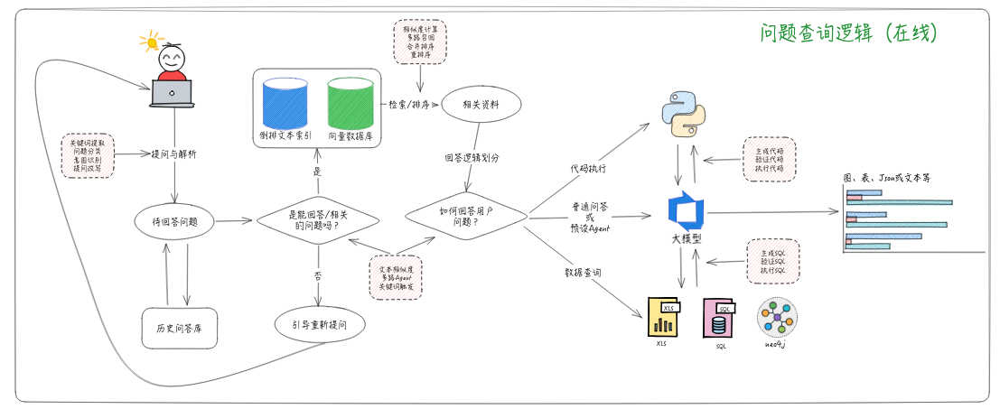
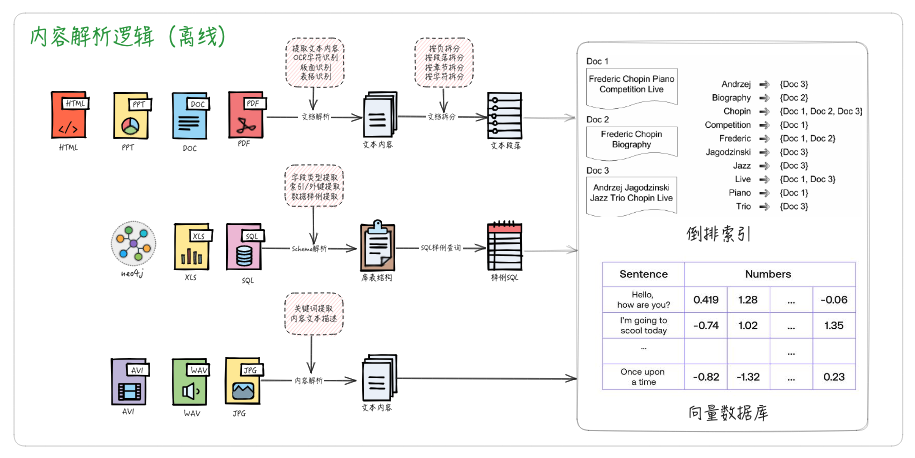
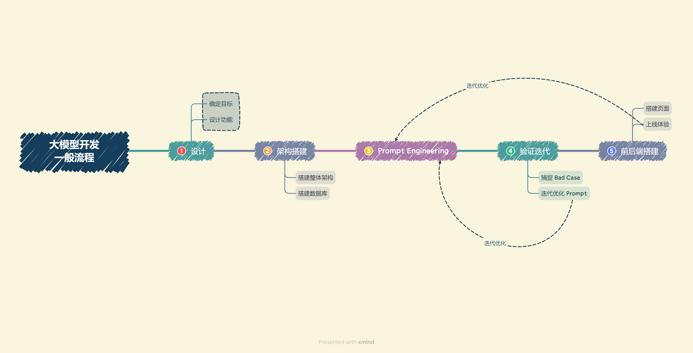

# 第一章：大模型简介

## 什么是大模型 

**大语言模型（LLM，Large Language Model），也称大型语言模型，是一种旨在理解和生成人类语言的人工智能模型**。

LLM 通常指包含**数百亿（或更多）参数的语言模型**，它们在海量的文本数据上进行训练，从而获得对语言深层次的理解。

## LLM 的发展历程

1. **20世纪90年代**：语言建模研究开始，主要采用统计学习方法预测词汇。
2. **2003年**：深度学习先驱Bengio在论文《A Neural Probabilistic Language Model》中首次将深度学习思想融入语言模型。
3. **2018年左右**：Transformer架构的神经网络模型开始受到关注，通过大量文本数据训练，显著提升了模型在自然语言处理任务上的表现。
4. **2019年**：大型语言模型（LLM）时代开启，随着模型规模的扩大，模型展现出惊人的能力。
5. **2022年11月**：OpenAI发布基于GPT模型的会话应用ChatGPT，具有特别优化的会话能力。
6. **2023年3月**：
   - OpenAI发布GPT-4，扩展了文本输入到多模态信号。
   - Claude系列模型由Anthropic公司开发并更新至Claude-2。
7. **2023年7月11日**：Claude系列模型更新至Claude-3。
8. **2023年11月7日**：OpenAI推出GPT-4 Turbo，上下文长度扩展到128k。
9. **2024年1月29日**：Baichuan发布Baichuan 3，但尚未开源。
10. **2024年3月4日**：Claude系列模型进一步更新。
11. **2024年5月14日**：OpenAI发布新一代旗舰生成模型GPT-4o，具备文本、语音、图像三种模态的深度理解能力。

## 大模型的能力和特点

- 三个 LLM 典型的**涌现能力**：

  - **上下文学习**：根据提供的自然语言指令或者多个任务示例，结合上下文并生成相应输出的方式来执行任务。无需额外的训练或参数更新

  - **指令遵循**： LLM 能够根据任务指令执行任务，而无需事先见过具体示例，展示了其强大的泛化能力。

  - **逐步推理**：LLM 通过采用 `思维链（CoT, Chain of Thought）` 推理策略，利用包含中间推理步骤的提示机制来解决这些任务，从而得出最终答案。

- 作为基座模型支持多元应用的能力

  - **多个应用可以只依赖于一个或少数几个大模型进行统一建设**。

- 支持对话作为统一入口的能力

- LLM 的特点包括：

  - **巨大的规模**：具有数十亿甚至数千亿个参数，能够捕捉更多的语言知识和复杂的语法结构。
  - **预训练和微调**：在大规模文本数据上进行预训练，然后通过微调适应特定任务。
  - **上下文感知**：强大的上下文感知能力，使得它们在对话、文章生成和情境理解方面表现出色。
  - **多语言和多模态支持**：能够处理多种语言和不同媒体类型的内容。
  - **伦理和风险问题**：引发了包括生成有害内容、隐私问题、认知偏差等伦理和风险问题。
  - **高计算资源需求**：需要大量的计算资源进行训练和推理。

 

## 检索增强RAG

### LLM 面临的主要问题

- **信息偏差/幻觉：** LLM 有时会产生与客观事实不符的信息，导致用户接收到的信息不准确 
- **知识更新滞后性：** LLM 基于静态的数据集训练，无法及时反映最新的信息动态 
- **内容不可追溯：** LLM 生成的内容往往缺乏明确的信息来源，影响内容的可信度 
- **领域专业知识能力欠缺：** LLM 特定领域的专业知识较少，效果不好
- **推理能力限制：** 面对复杂问题时，LLM 可能缺乏必要的推理能力， 
- **应用场景适应性受限：** 单一模型可能难以全面适应所有场景
- **长文本处理能力较弱：** LLM 在理解和生成长篇内容时受限于有限的上下文窗口，且必须按顺序处理内容，输入越长，速度越慢。

### 什么是RAG

**检索增强生成（RAG, Retrieval-Augmented Generation）**。该架构巧妙地**整合了从庞大知识库中检索到的相关信息，并以此为基础，指导大型语言模型生成更为精准的答案**

## RAG 的工作流程 

RAG 是一个完整的系统，其工作流程可以简单地分为数据处理、检索、增强和生成四个阶段：

## RAG VS Finetune 

| 特征比较 | RAG                                                          | 微调                                                         |
| -------- | ------------------------------------------------------------ | ------------------------------------------------------------ |
| 知识更新 | 直接更新检索知识库，无需重新训练。信息更新成本低，适合动态变化的数据。 | 通常需要重新训练来保持知识和数据的更新。更新成本高，适合静态数据。 |
| 外部知识 | 擅长利用外部资源，特别适合处理文档或其他结构化/非结构化数据库。 | 将外部知识学习到 LLM 内部。                                  |
| 数据处理 | 对数据的处理和操作要求极低。                                 | 依赖于构建高质量的数据集，有限的数据集可能无法显著提高性能。 |
| 模型定制 | 侧重于信息检索和融合外部知识，但可能无法充分定制模型行为或写作风格。 | 可以根据特定风格或术语调整 LLM 行为、写作风格或特定领域知识。 |
| 可解释性 | 可以追溯到具体的数据来源，有较好的可解释性和可追踪性。       | 黑盒子，可解释性相对较低。                                   |
| 计算资源 | 需要额外的资源来支持检索机制和数据库的维护。                 | 依赖高质量的训练数据集和微调目标，对计算资源的要求较高。     |
| 推理延迟 | 增加了检索步骤的耗时                                         | 单纯 LLM 生成的耗时                                          |
| 降低幻觉 | 通过检索到的真实信息生成回答，降低了产生幻觉的概率。         | 模型学习特定领域的数据有助于减少幻觉，但面对未见过的输入时仍可能出现幻觉。 |
| 伦理隐私 | 检索和使用外部数据可能引发伦理和隐私方面的问题。             | 训练数据中的敏感信息需要妥善处理，以防泄露。                 |

##  LangChain

### 什么是**LangChain **

**LangChain**框架是一个开源工具，充分利用了大型语言模型的强大能力，以便开发各种下游应用。它的目标是为各种大型语言模型应用提供通用接口，从而简化应用程序的开发流程。

### LangChain 的核心组件

- **模型输入/输出（Model I/O）**：与语言模型交互的接口
- **数据连接（Data connection）**：与特定应用程序的数据进行交互的接口
- **链（Chains）**：将组件组合实现端到端应用。比如后续我们会将搭建`检索问答链`来完成检索问答。
- **记忆（Memory）**：用于链的多次运行之间持久化应用程序状态；
- **代理（Agents）**：扩展模型的推理能力。用于复杂的应用的调用序列；
- **回调（Callbacks）**：扩展模型的推理能力。用于复杂的应用的调用序列；

### LangChain 的生态

- **LangChain Community**: 专注于第三方集成 

- **LangChain Core**: LangChain 框架的核心库、核心组件，提供了基础抽象和 LangChain 表达式语言（LCEL），提供基础架构和工具，用于构建、运行和与 LLM 交互的应用程序，为 LangChain 应用程序的开发提供了坚实的基础。我们后续会用到的处理文档、格式化 prompt、输出解析等都来自这个库。

- **LangChain CLI**: 命令行工具，使开发者能够通过终端与 LangChain 框架交互，执行项目初始化、测试、部署等任务。提高开发效率，让开发者能够通过简单的命令来管理整个应用程序的生命周期。

- **LangServe**: 部署服务，用于将 LangChain 应用程序部署到云端，提供可扩展、高可用的托管解决方案，并带有监控和日志功能。简化部署流程，让开发者可以专注于应用程序的开发，而不必担心底层的基础设施和运维工作。

- **LangSmith**: 开发者平台，专注于 LangChain 应用程序的开发、调试和测试，提供可视化界面和性能分析工具，旨在帮助开发者提高应用程序的质量，确保它们在部署前达到预期的性能和稳定性标准。

## 开发 LLM 应用的整体流程

- 确定目标，构建MVP
- 设计功能，确定核心功能，业务拆解
- 搭建整体架构，特定数据库 + Prompt + 通用大模型
- 搭建数据库，向量数据库+关系型数据库(milvus+ES+mysql)
- 模型部署(API/本地(fastchat,vllm等))
- Prompt Engineering(LangGPT)
- 验证迭代，根据找到的 Bad Case 不断迭代
- 前后端搭建(Gradio 和 Streamlit 或者Dify,FastGPT)
- 体验优化，记录 Bad Case 与用户负反馈，再针对性进行优化