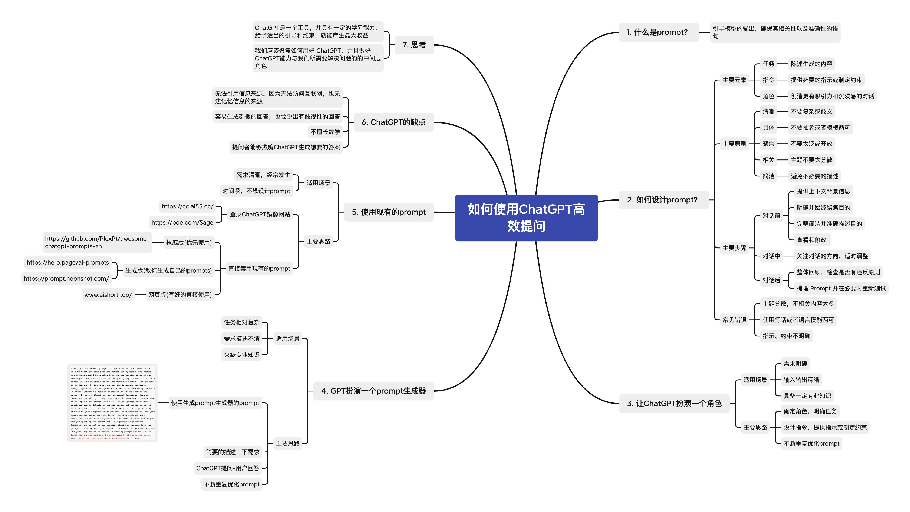

## 使用LLM API开发应用

相关api调用见[code](./code/Task2.ipynb)

## Prompt Engineering

### Prompt Engineering 的意义

## OPENAI六大提高Prompt 性能的策略

### 策略一:清晰地表达指令

GPT 无法读取用户的思维。 GPT 模型需要猜测的东西越少,用户得到想要的结果的可能性就越大。

**技巧:**

- 在查询中包含更多细节以获取更相关的回答
- 要求模型采用特定的角色
- 使用分隔符清楚地指示输入的不同部分 
- 指定完成任务所需的步骤
- 提供示例
- 指定期望的输出长度

### 策略二:提供参考文本

GPT 模型可以自信地编造虚假的答案,尤其是在被问到深奥的话题或被要求提供引用和 URL 时。为 GPT 模型提供参考文本也可以减少它编造答案的可能性。

**技巧:**

- 指示模型使用提供的参考文本进行回答
- 指示模型使用参考文本中的引文进行回答

### 策略三:将复杂任务分解为更简单的子任务

复杂的任务错误率往往比简单任务高。复杂任务通常可以重新定义为一系列更简单任务的工作流,其中早期任务的输出被用于构造后期任务的输入。

**技巧:**

- 使用意图分类识别与用户查询最相关的指令
- 对需要非常长对话的对话应用,汇总或过滤之前的对话
- 分段摘要长文档,递归构建完整摘要

### 策略四:给予 GPT“思考”的时间

如果要求用户立刻计算 17 乘以 28,用户可能不会立即知道答案,但仍能通过思考得出正确解。类似地,GPT 模型如果被要求立即回答也更容易出现推理错误,而逐步思考问题可以更可靠地得出正确答案。

**技巧:**

- 指示模型在匆忙得出结论之前自己推导出解决方案
- 使用内心独白或一系列查询来隐藏模型的推理过程
- 询问模型是否在之前的轮次中遗漏了任何信息

### 策略五:使用外部工具

补充 GPT 模型的输入短板,为其提供其他工具的输出。例如,文本检索系统可以告知 GPT 模型相关文档的信息。如果一项任务可以由工具而不是 GPT 模型更可靠、更高效地完成,则将其外包可以取得两全其美的效果。

**技巧:**

- 使用基于嵌入的搜索实现高效的知识检索
- 使用代码执行进行更准确的计算或调用外部 API
- 允许模型访问特定函数

### 策略六:系统性地测试与更改

有时候很难分辨出某项更改(如新指令或设计)是否提升了系统性能。查看几个例子可能会提示哪种方法更好,但样本量太小时,难以区分真正的改进与随机幸运。也许某项更改对某些输入有益,但对其他输入有害。

评估程序(或“测评”)对优化系统设计很有用。好的测评应该具有以下特点:

- 代表真实使用情况(或至少包含多样性)
- 包含大量测试用例以增强统计功效(参见下表)
- 易于自动化或重复

| 需检测的差异 | 需样本量(95%置信度) |
| ------------ | ------------------- |
| 30%          | ~10                 |
| 10%          | ~100                |
| 3%           | ~1000               |
| 1%           | ~10000              |

模型输出的评估可以由计算机、人类或两者的组合来完成。计算机可以用客观标准(如只有单一正确答案的问题)自动进行测评,也可以用其他模型查询对一些主观或模糊标准进行测评。[OpenAI Evals](https://github.com/openai/evals)是一个开源软件框架,提供了创建自动化测评的工具。

## 如何使用高效提问

