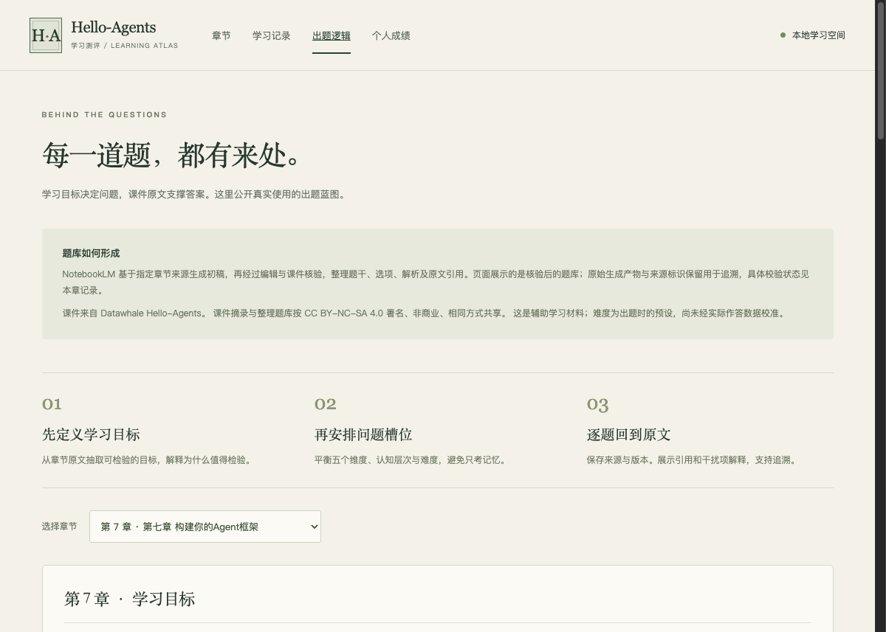

# Task02 构建 Agent 框架：统一接口与保留差异

整理日期：2026-09-18。阅读范围：第七章 7.1—7.5 及章末六组习题。

**记录状态：已整理个人口述总结与部分习题思路；第二题暂缓，实践代码、调用记录、运行截图及课程平台提交尚待完成或核实。** 本文不代表全部实践作业已经完成。

本文以我的口述为主。“校订补充”用于说明口述或题干与正文代码的差异；“参考设计”用于补充尚未展开的解题思路，不代表我已经独立完成或运行验证。

教材：[第七章 构建你的 Agent 框架](https://github.com/datawhalechina/hello-agents/blob/4f7682ceafe573d07cd8a7d0b89908500e83227d/docs/chapter7/第七章%20构建你的Agent框架.md)。本文按该版本正文核对，避免混用习题描述与其他版本接口。

任务表原定学习日期：2026/9/16—17；截止：2026/9/18 03:00（北京时间）。实际学习日期与用时待补充。

## 一、为何需要自建 Agent 框架

### 1. 我的理解：统一稳定的接口

Agent 可以通过统一的发现和调用机制，调度和使用搜索、记忆以及检索能力。如果让我设计框架，我会优先统一稳定的接口，同时保留不同模块的必要差异。

例如，Memory 的读写操作可以封装成工具，让 Agent 通过统一方式调用。我在口述中还提到了记忆的归属用户、保存时机和清除策略。

**校订补充：** 把读写接口封装成工具，并不会自动解决归属、保存和清除问题。这些仍需要记忆模块或框架的权限与生命周期管理来实现。统一的是调用入口，模块内部的状态与管理策略仍然可以不同。

### 2. 校订补充：自建框架要解决什么问题

课件 7.1.1 提到四类局限，可以从它们对开发的影响来理解：

| 局限 | 可能增加的开发成本 |
| --- | --- |
| 过度抽象 | 完成简单功能之前，需要理解大量概念、配置和调用层次 |
| 接口快速变化 | 升级后需要适配代码并重新验证原有行为 |
| 内部逻辑不透明 | 难以定位模型调用、输出解析和工具执行中的问题 |
| 依赖复杂 | 组件之间可能出现依赖版本冲突，增加集成成本 |

这些是课件提出的风险，不代表我已在自己的项目中逐一遇到。结合第六章或实际项目的具体经历，仍待我补充。

自建框架也会带来接口维护、异常处理、测试和文档成本。因此，需要先明确现有方案有哪些具体问题值得解决，而不是为了自建而重写。

### 3. 校订补充：从独立脚本到框架

与第四章的独立实现相比，框架化可以把模型访问、消息格式、Agent 执行入口和工具管理分离。更换模型或增加工具时，尽量把修改限制在对应模块内。

我会优先考虑：接口稳定、职责清晰、依赖可以替换、执行过程便于观察和验证。抽象应服务于实际复用，不能只是增加层数。

## 二、扩展模型供应商与本地部署

**按我的安排，本题暂时放着，不补写成已完成。**

待完成内容：

- 通过继承扩展一个模型供应商，并验证环境变量检测与调用。
- 根据课件代码推导多个配置同时存在时的优先级。
- 查阅官方资料，对比 vLLM、SGLang 和 Ollama，并说明测试条件。

## 三、Message、Config 与 Agent 基类

### 1. 我的理解：Message 尽早暴露数据问题

`Message` 使用 Pydantic 的 `BaseModel`，主要价值是让数据问题尽早暴露，而不是等请求发送时才报错。

内部还包含 `timestamp` 和 `metadata`，用于记录时间和附加信息；通过 `to_dict()` 转换为模型调用所需的字段，体现“对内丰富，对外兼容”。

需要注意，数据格式验证并不能证明消息内容的真实性与合理性。例如，角色字段合法，并不意味着消息中的事实就是正确的。

### 2. 设计模式：模板方法与抽象接口需要区分

我在口述中根据题干，将公开的 `run` 和抽象的 `execute` 理解为模板方法模式，并认为其作用是约束统一入口。

**校订补充：** 习题使用的名称是 `_execute`。如果基类的 `run()` 定义固定流程，再调用子类实现的 `_execute()` 完成可变步骤，这才体现了模板方法模式。

两者的侧重点不同：

- **统一抽象接口**：要求不同 Agent 都提供同样的调用入口。
- **模板方法模式**：在统一入口内固定公共流程，把某些步骤交给子类实现。

但课件 7.3.3 展示的 `Agent` 直接把 `run()` 标为抽象方法，没有展示 `run() → _execute()` 这一结构。因此，对该段代码应描述为“通过抽象基类约束统一执行入口”，不能把题干中的结构当成已经实现。

### 3. 单例模式：集中管理配置不等于只能有一个对象

我理解的单例模式，是在规定范围内只存在一个实例。口述中“Config 使用了单例模式”的说法来自题干，但与正文代码不一致。

**校订补充：** 7.3.2 中的 `Config` 是普通的 `BaseModel`，没有展示限制实例数量的机制。`from_env()` 用于从环境变量创建配置，也不等于单例。

配置管理不一定需要单例。多个 Agent 可能分别使用不同模型、温度和历史长度，此时显式传入不同的配置对象更容易隔离行为和进行测试。

不使用单例并不会必然出错。真正需要避免的是配置来源分散、覆盖顺序不清楚，以及不同模块拿到互相矛盾的配置。反过来，全局可变单例也可能让一个 Agent 的配置修改影响其他 Agent。

**待验证：** 给两个 Agent 传入不同配置，观察修改其中一个配置是否影响另一个，检查对象是否意外共享。

## 四、Agent 范式的框架化实现

### 1. 我的理解：ReAct 的三个改进方向

| 改进 | 对维护和扩展的帮助 |
| --- | --- |
| 统一模型调用接口 | 更换模型时，减少对 ReAct 主流程的修改 |
| 接入工具注册表 | 新增工具时，减少对执行流程的修改 |
| 提示模板和执行参数可配置 | 同一实现更容易适应不同任务 |

不要把“加强提示词格式要求”写成“保证输出一定能解析”。解析失败、未知工具以及工具执行异常仍然需要处理。

**校订补充：** 框架化应让这些错误更容易被识别和处理，但不会自动消除它们。后续可以记录模型原始输出、解析结果、实际调用和异常反馈，定位失败发生在哪一层。

### 2. 我的理解：给 Reflection 增加质量自评

我考虑的流程是：

```text
生成初稿 → 反思并评分 → 达到阈值：结束
                     → 未达到阈值：修改后重新评估
```

还应该设置最大迭代次数，并保留目前最好的版本，避免反复修改后反而丢失更好的结果。

**校订补充：** 需要先定义评价维度和评分尺度，并将分数、理由与对应版本一起保存。达到迭代上限、连续无改进或评分无法解析时，也应有明确处理方式。

模型自评分只是评价信号，不是客观正确率。可独立检查的要求，应尽量通过规则、测试或外部证据验证。

**状态：设计思路已记录，评分机制尚未实现或运行验证。**

### 3. Tree-of-Thought：参考设计，尚未实现

这部分口述尚未展开，可先按以下思路理解：

```text
当前状态 → 生成多个候选 → 评价候选 → 保留部分候选继续扩展
                                      → 满足结束条件后返回结果
```

需要明确每一步产生多少候选、保留多少候选、最大深度及模型调用预算。如果每层只留下一个候选且从不回溯，更接近贪心搜索；要体现树搜索，可以保留多个候选路径，或支持回溯。

后续实现时应遵守当前版本 `Agent` 的实际接口。搜索效果与成本仍待验证。

## 五、工具接口、工具链与并发

### 1. 我的理解：统一的是调用约定

统一接口让调用方不必针对每一种工具编写特殊的调用逻辑，但并不要求所有工具都提供相同的信息。

如果搜索工具需要返回标题、摘要和链接，我考虑使用 JSON，把多个字段组织成结构化结果。

**校订补充：** 题干说的是 `BaseTool.execute()`，而课件 7.5.1 展示的是 `Tool.run(parameters)` 与 `get_parameters()`。学习统一接口的原则时，也需要认清当前代码实际采用的名称与返回类型。

正文的 `Tool.run()` 返回字符串，因此有两种不同的改法：

- 保持现有接口：把结构化结果序列化为 JSON 字符串，由调用方按约定解析。
- 修改返回契约：引入结构化结果对象，同时修改注册表、Agent 和后续工具对结果的处理。

不能只把返回值从字符串改成字典，就假设整个调用链仍然兼容。

### 2. 三工具串联：参考设计，尚未实现

可以设计“资料摘要助手”：

```text
用户给出主题 → 搜索工具 → 正文提取工具 → 摘要工具 → 返回摘要及来源
```

三个工具的输入输出需要明确：

| 工具 | 输入 | 输出及后续用途 |
| --- | --- | --- |
| 搜索工具 | 主题或关键词 | 候选文章及 URL，作为提取正文的依据 |
| 正文提取工具 | 选定的 URL | 正文和来源信息，交给摘要工具 |
| 摘要工具 | 正文与摘要要求 | 摘要及来源标识 |

工具之间需要按约定提取字段、转换输入，不能只连接三个名称。还需要处理搜索无结果、正文提取失败，以及错误信息被误当成正文继续总结等情况。

课件中的工具链通过上下文保存步骤输出，再用模板填入下一步输入；这些输入输出约定仍需实际验证。

### 3. 并发执行：校订补充

这部分口述尚未展开。课件中的 `AsyncToolExecutor` 使用线程池包装工具调用，适合分析“哪些任务值得同时执行”。

多个相互独立、主要时间花在网络或其他 I/O 等待上的工具调用，通常更有机会从并发中获益。例如，同时查询多个信息源。

上述“搜索 → 提取 → 摘要”有前后依赖，不能直接把三步全部并发。并发前还需要确认工具是否线程安全、外部服务是否限流，以及调度成本是否值得。

**待验证：** 在相同输入和并发限制下，对比串行与并发用时，同时检查结果是否完整、失败是否得到正确反馈。

## 六、框架扩展：流式输出、对话管理与插件

### 1. 我的理解：从已有流式接口完善中断处理

我考虑从已有的流式调用和 `stream_run()` 开始完善，重点思考：中断以后，历史记录应该保存什么？

**校订补充：** 7.4.1 已展示流式响应示例，正常完成后将完整对话写入历史。但生成中断时，需要额外设计状态和保存策略。

**参考设计，尚未实现：** 区分“生成中、已完成、已取消、失败”。用户输入单独记录；部分响应如果需要保存，应标明未完成，不能直接当作完整回答进入后续上下文。还应避免重试或重新连接时重复保存消息。

### 2. 我的理解：多轮对话需要可靠的消息标识

我认为对话管理不能只靠一个不断增长的列表，需要可靠的消息和会话标识，由会话管理器决定当前分支包含哪些信息。

口述中提到了 `message_id`、`participant_id` 和 `conversation_id`。

**校订补充：** 原题重点是多轮对话、分支和回溯。`participant_id` 用于区分参与者，不能代替记录父子关系的 `parent_id`。

| 字段 | 作用 |
| --- | --- |
| `message_id` | 唯一标识一条消息 |
| `conversation_id` | 标识消息所属会话 |
| `parent_id` | 记录消息的父节点，支持分支与回溯 |
| `participant_id` | 多人或多 Agent 场景下区分参与者，按需添加 |

**参考设计，尚未实现：** 新增会话管理器，记录当前会话及分支末端消息。构造上下文时沿父节点关系选出当前路径，并控制上下文长度。回溯是切换当前路径，不必删除其他分支。

这些信息可作为 `Message` 的扩展字段，或暂存于 `metadata`，但必须约定一致的读写方式。

### 3. 插件系统：暂未形成自己的方案

这部分我暂时没有好的想法，先保留为待思考。

**参考设计，尚未实现，也不代表我的独立结论：** 可以从“发现插件 → 检查兼容性 → 调用注册入口 → 加入 Agent 或工具注册表”这一流程入手。

插件至少需要说明名称、版本、支持的框架版本及注册入口；注册入口通过框架公开接口添加组件。框架负责处理名称冲突和加载失败，尽量让第三方扩展不需要修改核心代码。

这一设计需要继续明确插件生命周期、失败隔离和兼容性测试；有注册机制不等于具备安全隔离能力。

## 七、我的章节学习测评小工具

为了把阅读和自测结合起来，我还做了一个 Hello-Agents 章节学习测评小工具。读完课件后，可以按章节作答，结合解析检查理解，再回到原文复习。

**[打开学习测评小工具 →](https://heitao5200.github.io/my_blog/组队学习/2026-09hello-agents进阶/学习测评/#home)**


*工具首页预览。截图来自与线上发布文件一致的本地页面，不包含个人答题成绩。*

目前包含 16 章、320 道题，每章有 12 道单选、6 道多选和 2 道思考题：

- **逐题反馈**：提交后显示答案解析、选项解释和对应课件依据。
- **五维诊断**：从概念理解、机制推演、关联辨析、场景应用和权衡判断五个维度观察本次作答表现，并提供复习建议。
- **出题逻辑公开**：先依据课件安排学习目标与题目，再用 NotebookLM 生成初稿，经过编辑与原文核验后形成题库。
- **个人成绩榜**：无需登录，比较本浏览器历次完整测评的正确率和客观题用时，支持导出记录。



*第七章出题逻辑页面预览：说明题库形成过程，并按章节展示学习目标与实际题目安排。*

思考题用于自评，不计入正确率；答题速度不计入知识维度评分。测评结果只反映这份题库覆盖的内容，不能代替代码实践和真实调用验证。记录保存在当前浏览器，清除网站数据前应先导出备份。

## 八、任务进度与待验证事项

### 当前记录

- 口述内容：已整理第一、三、四、五、六题的个人理解。
- 第二题：按计划暂缓。
- 教材核对：已区分模板方法与抽象接口，纠正 Config 单例和工具方法名称的混淆。
- Tree-of-Thought、三工具串联、并发与插件：已补充参考思路，未记作个人独立完成或实践成功。
- 真实调用记录、运行截图和实践代码：待补充或核实。
- 课程平台提交：尚未确认。
- 实际学习日期与用时：待填写。

### 后续验证清单

- [ ] 为第一题补充一个真实框架使用案例，说明具体问题及维护成本。
- [ ] 完成第二题的供应商扩展、配置推导和部署工具比较。
- [ ] 验证两个 Agent 的配置是否隔离，并确认 Message 非法字段的报错行为。
- [ ] 验证 ReAct 对解析失败、未知工具和工具异常的处理。
- [ ] 实现 Reflection 评分与终止条件，记录各轮结果及实际成本。
- [ ] 实现并验证 Tree-of-Thought 的候选筛选和终止策略。
- [ ] 验证三工具链的数据传递和失败处理，再对独立调用比较串行与并发。
- [ ] 验证流式中断后的历史状态，以及会话分支切换是否串入其他分支内容。
- [ ] 继续形成自己的插件方案，再补架构图和关键接口。

### 保留原任务安排

| 日期 | 原定重点 | 计划总时长（含笔记与小测） |
| --- | --- | --- |
| 9/16 | 阅读 7.1—7.3，梳理 LLM、Message、Config、Agent 的关系，运行基础示例。 | 90—120 分钟 |
| 9/17 | 阅读 7.4—7.5，追踪 ReActAgent 与工具注册，整理习题，自定义工具选做。 | 90—120 分钟 |

以上为原计划，不作为实际学习完成记录。后续练习仍尽量控制在每日 90—120 分钟内，不要求一次完成所有扩展设计。

复习入口：[闪卡](../学习资源/闪卡.md) · [测验题](../学习资源/测验题.md) · [学习测评](../学习测评/ ':ignore') · [学习思考笔记模板](../学习思考笔记模板.md)
