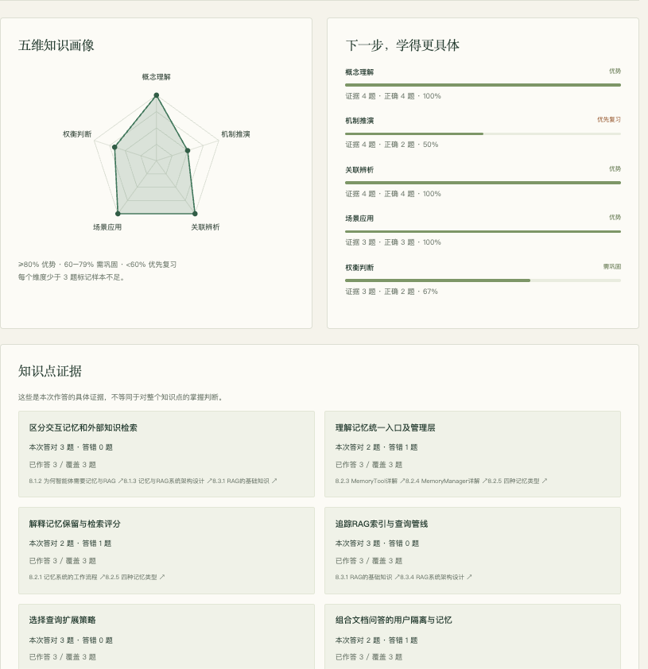

# Task03 记忆与检索：评分机制、记忆组合与 RAG 分块

整理日期：2026-09-20。阅读范围：第八章 8.1—8.4 及章末前两组习题。

**记录状态：已整理口述回答——章末习题第一题（三小问）与第二题（三小问）的机制部分；已完成第八章学习测评（结果页见第五节）；分块算法实现、MQE/HyDE 对比实验、嵌入方案对比、智能文档助手页面截图与运行证据、引导思考第一问均待完成或验证。** 本文不代表 Task03 全部交付已完成。

本文以我的口述为主。“校订补充”用于说明口述与教材正文、代码的差异；“参考补充”“参考设计”用于补充我尚未展开或尚未运行的思路，不代表我已经独立想到、完成或验证。尚未形成判断的地方保留为“待思考”。

教材：[第八章 记忆与检索](https://github.com/datawhalechina/hello-agents/blob/main/docs/chapter8/第八章%20记忆与检索.md)。行号按本地 `hello-agents/docs/chapter8/第八章 记忆与检索.md` 核对。

任务表原定学习日期：2026/9/18—20；截止：2026/9/21 03:00（北京时间）。交付重点为智能文档助手页面截图、输入与检索片段、指定习题与笔记。实际用时待补充。

## 一、章末习题第一题：四种记忆与评分机制

### 1. 我的回答：情景记忆 0.2 给时间、语义记忆 0.3 给图

首先，它们都不是主导项，主导项依然是向量。

- 0.2 给时间：时间主要起过滤作用，时间越近权重越高。
- 0.3 给图检索：主要是因为图存在多跳关系。

其实 0.3 和 0.2 并没有很大的区别，两者对应的是不同场景。情景记忆中离当前时间越近权重肯定越高；语义记忆给图 0.3 也没太大问题。它们更多代表了两种信息各自的结构——时间序列与图谱关系；在证据可靠性上，并没有直接拿 0.3 和 0.2 进行对比的必要。

**校订补充：** 教材里“时间”在情景记忆检索中有两处作用，需要分开（教材 803—811、822—834 行）：

| 作用 | 实现位置 | 性质 |
| --- | --- | --- |
| 结构化预过滤 | `_structured_filter()` 按时间范围、会话等筛掉候选 | 硬过滤，不满足条件的记忆不进入评分 |
| 时间近因性 | `(向量×0.8 + 近因性×0.2) × (0.8 + 重要性×0.4)` | 软排序，只影响候选集内部的先后 |

口述中“起过滤作用”主要对应前者；0.2 本身是后者。两者混在一起，容易被追问“既然已经过滤，为什么还要 0.2”。

另外，“主导项依然是向量”对情景记忆（0.8）和语义记忆（0.7）成立，但工作记忆不同：它的时间项是**乘性衰减** `base_relevance × time_decay × (0.8 + 重要性×0.4)`（教材 750—761 行），不是加权相加。三种记忆里“时间”的角色分别是：硬过滤加软权重、完全没有、乘性衰减。

**参考补充：** 把差异落在“结构”而不是“0.2 与 0.3 谁大”上更站得住。真正值得指出的结构差异是：语义记忆公式里**完全没有时间项**，而情景记忆与感知记忆都是 `0.8×向量 + 0.2×近因性`，两者同形（教材 1054—1081 行）。所以“0.2 → 0”才是有意义的对比，“0.2 → 0.3”意义有限。图检索给 0.3 的理由也可以更具体：多跳关系和关系方向性（谁师从谁）是纯向量检索拿不到的；但实体和关系由系统自动抽取（教材 876—893 行），覆盖不全且可能有噪声，所以它只能作补充项、不能作主导项。

### 2. 我的回答：健康管理助手的四种记忆组合

| 记忆类型 | 记录内容 | 检索方式 |
| --- | --- | --- |
| 工作记忆 | 用户当下陈述的当天信息（口述举例为“今天做了什么”） | 内存存储，配合关键词检索 |
| 情景记忆 | 每日的日常情况，例如饮食、运动 | SQLite 加时间，再加向量检索 |
| 语义记忆 | 特殊情况、目标、规则，以及营养相关的背景知识 | 向量检索与图谱检索 |
| 感知记忆 | 用户通过外部设备或外部资源传入的数据，例如体检／体质报告、饮食 | 多模态检索 |

重要程度方面：健康相关的背景知识重要程度比较高，权重也会相对更高；情景记忆的权重往后排。感知记忆的数据权重也比较高。

**校订补充（两个“权重”不是一回事）：** 教材里有两套数值，口述中容易混用：

- `importance`（0.0—1.0）：添加记忆时标记的重要程度，也用于 `forget`／`consolidate` 的阈值筛选。说“背景知识 importance 高、单次饮食记录低”是准确的。
- 评分公式里的权重（0.7／0.8／0.2／0.3）：决定**同一种记忆内部**候选的排序。

`importance` 在评分中只以 `0.8 + importance×0.4`（区间 0.8—1.2）的形式相乘（教材 830、957 行），作用是调节而不是重排。因此**不能靠调 importance 把某一类记忆整体排到另一类之后**；跨类型的合并顺序由 `MemoryManager` 决定，而正文没有展示这部分规则。稳妥的写法是：用 importance 表达“这条记忆本身多重要”，跨类型优先级作为待确认问题。

**校订补充（工作记忆的“关键词检索”）：** 教材实现是 TF-IDF 词项权重相似度 ×0.7 加关键词匹配 ×0.3 的组合，只有在 TF-IDF 不可用或没有有效得分时才退化为纯关键词（教材 736—761 行）。这属于词法检索，不等同于语义检索。

**参考补充（一次完整流转，尚未运行验证）：** 用户发一张餐食照片 → 感知记忆存原图并抽出“红烧肉＋米饭” → 情景记忆写入带时间戳的饮食事件 → 同时抽取实体写入语义记忆图谱（红烧肉—高GI、高钠；用户—过敏—花生）→ 工作记忆只保留本轮“正在分析午餐”的临时上下文。下一轮问“我今天摄入够了吗”：情景记忆按“今天”过滤取出全部饮食事件，语义记忆提供钠／糖阈值与本人禁忌，再由模型生成建议。

**待思考：** 健康数据属于敏感信息。多用户场景下如何按 `user_id` 隔离？教材 8.4.2（1699—1728 行）展示了 `MemoryTool(user_id=...)` 与 `RAGTool(rag_namespace=f"pdf_{user_id}")` 两种隔离方式，但它主要覆盖 Qdrant 命名空间与记忆归属，**Neo4j 图层面的隔离正文没有展开**。这一点我尚未核对。

### 3. 我的回答：工作记忆在什么情况下整合为长期记忆

现有机制其实是工作记忆到期或内存满了就直接自动清理掉。至于怎么转存为语义记忆，目前还没想到特别完美的方案，不过可以从以下几个维度来设计整合机制：

1. 访问频率
2. 是否在跨会话中重复出现
3. 实体命中的关联关系
4. 引入时间衰减，时间越久权重越小

触发时机方面，可以在会话结束时触发整合，随后自动关闭。

**校订补充（顺序问题）：** 教材的工作记忆是 TTL 到期即清理，容量满时淘汰“优先级最低”的一条（教材 722—734 行），会话结束也会清理（教材 312 行）。所以“会话结束时整合”必须是**先整合、后清理**；如果清理是定时任务，整合就要在 TTL 到期前跑完，否则素材已经没了。我口述时没有强调这一点。

**参考补充（目标类型路由）：** 教材的 `consolidate` 是两级路径，不是一步到位——默认 `working → episodic`（阈值 0.7），再用 `episodic → semantic`（阈值 0.8）（教材 597—627 行）。所以“转存为语义记忆”实际是“先转情景、再转语义”。这可能是我想不出完美方案的原因之一：中间层的判定标准需要分别定义。

**参考设计，尚未实现**（把我口述的四个维度落成可判定的条件）：

```text
触发时机：会话结束 / 工作记忆容量达 80% / 距 TTL 到期前 / 每小时批处理兜底

score = w1·importance
      + w2·归一化访问频率
      + w3·跨会话重复出现次数
      + w4·实体与关系命中数（归一化）
      − w5·时间衰减

score ≥ θ 才整合，并按内容路由：
  带时间地点的事件性内容     → 情景记忆
  规则／偏好／事实（可抽出实体关系） → 语义记忆
  带文件的多模态内容         → 感知记忆
```

需要同时定下的实现约束：

- **幂等去重**：整合前先用向量检索查近似记忆，命中则更新（提升 importance、累加访问次数），不要每次会话结束都新增一份副本。
- **可回滚与溯源**：配套代码 `hello-agents/code/chapter8/06_Memory_Consolidation_Demo.py` 显示整合是“创建新记忆项＋加整合标记＋保存原始 ID 引用”，所以必须保留 `source_id` 才能追回原始会话。
- **阈值靠评估定**：不要照抄教材的 0.7／0.8；用一小批标注对话测“该整合的被整合、不该整合的没被整合”，再定 `θ` 和各权重。
- **敏感内容先确认**：健康、财务类信息在自动长期化之前询问用户一次。

**待思考：** 我口述的四个维度里没有“重要性”这一项。如果一条记忆访问频率低、也没有跨会话出现，但它是一条一次性告知的关键事实（例如“我对花生过敏”），会不会被漏掉？要补哪个信号才能兜住？

## 二、章末习题第二题：RAG 分块、检索策略与嵌入选型

### 1. 我的回答：没有明确标题结构的文档怎样切分

如果没有明确标记结构的文档，可以根据段落进行切分，也可以按语义切分。语义切分通常是根据段与段之间的语义相关性，来判断是否存在语义边界，这是一种切分方式。

**校订补充：** 教材现有的标题感知分块在遇到没有 `#` 的文档时会走兜底逻辑：整篇文本被当成一个段落（教材 1345 行），随后只能按 token 预算硬切，切点会落在句子中间，而且每个块的 `heading_path` 都为空。所以“按段落切分”其实依赖文档本身有空行分段；对从 PDF 直接抽出、没有空行的长文本，它会退化成“单块加硬切”。

另外，口述说的是“段与段之间的语义相关性”。如果段落本身很长、或者根本没有段落，需要先切到**句子级**再算相邻相似度，否则边界粒度太粗。

**参考补充（语义边界分块的一种做法）：** 边界应当是“优先切点”而不是“必须切点”：

```text
句切分（中文按 。！？，并吸收收尾的 」）。』 等）
  → 计算相邻句相似度（真实场景用嵌入模型）
  → 取低分位且为局部谷值的位置作为候选边界
  → 在候选边界上做带 token 预算的贪心装箱
  → 结构保护：法条列举项、表格、代码块优先于预算，不被切开
  → 每块保留 start/end 偏移与 section_path（可过滤、可引用）
```

两个中文场景的具体坑：

- **分号不等于句末**：法条里 `；` 是列举分隔符，把它当句末会把一个条款拆成碎片。更稳的做法是先按“第X条／第X章”做硬边界，再在条内按 `。！？` 切句。
- **相似度度量决定上限**：轻量的字 n-gram 相似度只适合术语密集的法律、技术文本；对话体小说里大量相邻句相似度为 0，候选边界会退化成“每句一切”。这类文本要么换真正的嵌入模型，要么改用叙事结构线索（对话轮次、场景转换）。

**参考实现与实测（参考材料，不是我的评测结论）：** 上述算法已有一份约 60 行、无第三方依赖的参考实现，在自造小样例上的结果是：块内相邻句平均相似度从 0.003 提升到 0.247（法条先做结构识别后为 0.287），被切断的句子数从 3／2 降到 0，且法条模式下的分块恰好落回整条。该样例规模很小、相似度用的是字 n-gram 代理，**只能说明方法可行，不能作为评测结论**；我自己尚未复现。

**待验证（这一小问真正的“动手”部分）：** 设计三层指标做对照实验——①边界切断率；②块内凝聚度；③下游效果（构造“问题＋正确 chunk”标注，比较 Recall@k、答案完整率、MRR）。对照必须只改一个条件：相同 token 预算下比“固定切分”与“语义边界”，并同时报告块数与平均块长，因为切得太碎会让凝聚度虚高、而单块信息不足。

**待思考：** 如果只把块大小从 90 token 改到 300 token，“语义边界”和“块大小”这两个因素哪一个对检索质量影响更大？可以用固定切分／语义切分 × 小／大预算的 2×2 对照把它分开。

### 2. 我的回答：基础检索、MQE 与 HyDE

- **基础检索**：查询向量检索 Top K。
- **Multi-Query（MQE）**：生成 N 个 query 各自检索，按最高分去重后合并。
- **假设性文档嵌入（HyDE／假设答案段落）**：让 AI 先生成假设性答案，再用段落向量检索。

**校订补充：** 三者对应两类不同问题——MQE 解决的是**用词不匹配**（同一问题的不同表述会命中不同文档），HyDE 解决的是**语义鸿沟**（疑问句与陈述句在向量空间分布不同，且假设答案会带入领域术语）。口述只写了流程，答题时还要补上“各自解决什么问题”，否则无法回答题干要求的“适用场景”。

**参考补充（对比实验设计，尚未运行）：** 题干要求对比三种方法的效果，所以只有机制描述不够。设计如下：

- 场景选**技术文档问答**：`hello-agents/code/chapter8/05_RAGTool_Advanced_Search.py` 已内置 Transformer、深度学习优化等文档，不必自建语料。
- 固定条件：同一知识库、同一嵌入模型、同一分块、同一 `top_k`，模型温度尽量低。
- 四组对照：基础／仅 MQE／仅 HyDE／MQE+HyDE。
- **一个实操坑**：`RAGTool.run(..., enable_advanced_search=True)` 会把 MQE 与 HyDE 一起打开，无法单独隔离；要分开对比，需要直接调用 `search_vectors_expanded(enable_mqe=..., enable_hyde=...)`（教材 1577 行的签名）。
- 评测集分层：准备 15—30 题并标注正确 chunk，题目分“用词差异型”和“语义鸿沟型”两类，否则无法解释结果差异。
- 指标：Recall@k、MRR、答案正确率、延迟、额外 LLM 调用次数、去重后的唯一 chunk 数。

**预测（先写预测，再跑实验）：** MQE 提升召回但引入噪声；HyDE 精度提升明显、延迟接近翻倍；两者叠加召回最高，但需要重排控制噪声。教材 1650 行的建议是：一般查询用 MQE，专业领域用 MQE+HyDE，性能敏感只用基础检索或仅 MQE。

**一个需要点明的风险：** HyDE 生成的假设文档内容可能是错的，它只是“用来检索的查询代理”，不能当作事实写进答案（教材 1551—1568 行）。如果把 HyDE 文本混进上下文，等于把幻觉预置进证据链。

**状态：机制理解已完成，对比实验待运行。**

### 3. 我的回答：三种嵌入方案的选型

- 准确性方面百炼 API 会好一点。
- 生产中以中文为主，建议选百炼。
- 如果要求离线、对安全隐私有较高要求，选本地模型。不过中文场景下，更建议用百炼。
- 如果只做学习，用 TF-IDF 跑一下就行了。

**校订补充（两个原则冲突时哪个优先）：** “中文场景更建议百炼”和“隐私要求高选本地”在同一个系统里可能冲突。如果离线或数据不出域是**硬约束**（医疗、法律、企业内部），百炼就不可选；此时不应该在“中文效果差”与“放弃隐私”之间退让，而应换成更强的本地中文／多语模型，而不是停在教材默认的 `all-MiniLM-L6-v2`。我口述时把两条并列了，没有说明优先级。

**参考补充（评估维度）：**

| 维度 | 百炼 API | 本地 Transformer | TF-IDF |
| --- | --- | --- | --- |
| 准确性 | 最高，中文尤其好 | 中等；英文强、中文一般 | 只有字面词项匹配，改写与同义词失效 |
| 速度 | 含网络往返，受限流影响 | CPU 慢、GPU 快，可批量摊薄 | 最快 |
| 成本 | 按 token 计费，增量索引会累积 | 零边际成本 | 零成本 |
| 离线部署 | 不可 | 可（模型需预下载） | 可，零依赖 |
| 维度 | 1024（教材 262 行日志） | 384 | 词表大小、稀疏 |

**三个容易漏的工程点：**

- **索引与查询必须同模型同维度，换模型等于全量重建索引**——这是选型中最贵的隐性成本。
- **维度一致性不能靠兜底掩盖**：教材配置里 `QDRANT_VECTOR_SIZE=384`（181 行），而百炼日志显示维度 1024（262 行），代码里还有补零／截断的兜底（1501—1506 行）。补零会让余弦相似度失真，生产上应在索引前校验并报错。这一处不一致我准备动手复核，作为“指出代码或日志依据”的素材。
- **评估要落到数据上**：用同一批标注问题比较 Recall@k，而不是凭“感觉哪个更准”。

## 三、引导思考：答案错了，是没有找到资料，还是找到后理解错了？

**第一问（我的直觉回答）：待思考。**

没有方向时可以先看教材提示：先看送入模型的检索片段，再看答案是否忠实于片段。

回答后按陪学方式依次追问，不一次公布结论：

1. 你能指出哪一条代码、日志或教材段落支持这个判断？
2. 还有没有另一种解释？怎样区分？
3. 如果只改一个条件，结果应如何变化？

**可选的小实验（尚未进行）：** 用资料内问题和资料外问题各问一次，观察是否有依据、是否承认不知道。

## 四、我的学习记录

- 日期与实际用时：2026/9/18—20（计划区间）；实际用时待填写。
- 我用自己的话理解的核心概念：四种记忆的分工与评分公式、无标题文档的语义边界分块、MQE 与 HyDE 各自解决的问题、嵌入方案在准确性与隐私之间的取舍。
- 运行前预测：见第二题第 2 小问的“预测”。
- 实际输入、输出与证据：待实践（智能文档助手页面截图、输入与检索片段均未保存）。
- 与预测的差异：待填写。
- 证据支持的认识：待思考。
- 仍待验证的猜测：待思考。
- 报错、尝试与下一步：第八章实验环境（`.env`、Qdrant、嵌入模型）待确认；先跑通 `04` 与 `05` 两个示例，再写单独的对比脚本。

## 五、第八章学习测评记录

用[学习测评小工具](../学习测评/ ':ignore')完成第八章自测后，结果页如下。



*第八章学习测评结果页预览，截图包含本次作答成绩。*

测评结果只反映这份题库覆盖的内容，不能代替代码实践和真实调用验证。记录保存在当前浏览器，清除网站数据前应先导出备份。

## 六、任务进度与待验证事项

### 当前记录

- 口述内容：已整理习题第一题（三小问）与第二题（三小问）的回答。
- 第八章学习测评：已完成，结果页截图见第五节。
- 教材核对：已区分情景记忆“硬过滤／软权重”两种时间作用；纠正 importance 与评分权重的混用；补出 `working→episodic→semantic` 两级整合路径与标题分块的兜底行为；把用户隔离的出处更正为 8.4.2。
- 分块算法实现、MQE 与 HyDE 对比实验、嵌入方案对比：已列设计，未运行。
- 智能文档助手页面截图、输入与检索片段：待补充。
- 引导思考第一问：待思考。
- 课程平台提交状态：未提交。
- 实际用时：待填写。

### 后续验证清单

- [ ] 用资料内／资料外问题各问一次，验证“没找到”与“理解错”如何区分。
- [ ] 实现语义边界分块，在相同 token 预算下与固定切分对照，记录边界切断率、块内凝聚度、块数与平均块长。
- [ ] 构造 15—30 题带标注的评测集，对比基础／MQE／HyDE／MQE+HyDE 的 Recall@k 与延迟。
- [ ] 复核 `QDRANT_VECTOR_SIZE=384` 与百炼 1024 维不一致时的实际行为。
- [ ] 复核多用户场景下 Qdrant 与 Neo4j 的数据隔离方式。
- [ ] 设计并验证一次工作记忆自动整合，包含幂等去重与回滚。
- [ ] 跑通 8.4 文档问答助手，保存页面截图与检索片段。

### 复习与收尾

- 从[闪卡](../学习资源/闪卡.md)选本任务 3—5 张，先答后翻：待完成。
- 从[测验题](../学习资源/测验题.md)选本任务 2—3 题，计入实践时间：待完成。
- 错题编号／混淆点／明天如何验证：待填写。
- 指定习题与运行截图状态：习题已回答，截图未完成。
- 提交状态：未提交。

### 保留原任务安排

| 日期 | 原定重点 | 计划总时长（含笔记与小测） |
| --- | --- | --- |
| 9/18 | 读 8.1—8.2，运行记忆写入、检索和更新示例。 | 90—120 分钟 |
| 9/19 | 读 8.3，梳理切分、向量化、检索和生成；高级检索先略读。 | 90—120 分钟 |
| 9/20 | 跟做 8.4 文档问答助手，用少量文档验证，保存页面截图并收尾。 | 120 分钟 |

以上为原计划，不作为实际学习完成记录。后续练习仍尽量控制在每日 90—120 分钟内。

复习入口：[闪卡](../学习资源/闪卡.md) · [测验题](../学习资源/测验题.md) · [学习测评](../学习测评/ ':ignore') · [学习思考笔记模板](../学习思考笔记模板.md)
