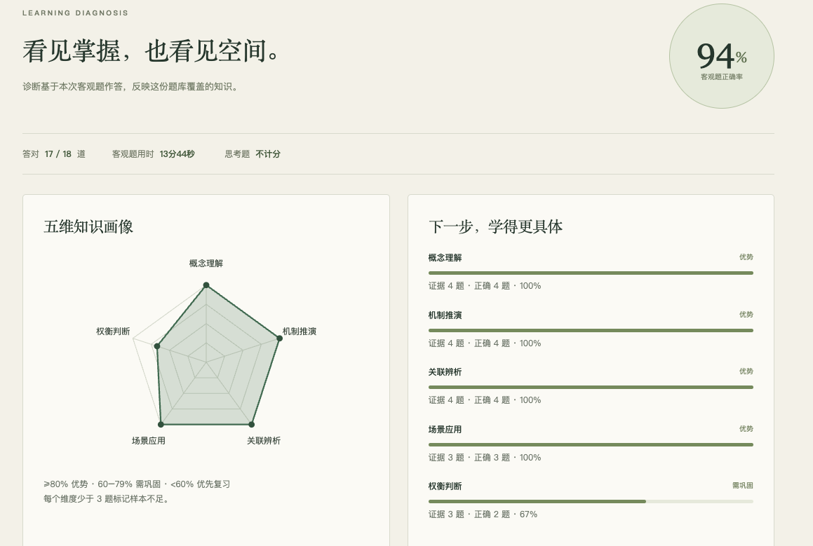

# Task05 MCP协议实战

状态：**已完成第十章学习测评（诊断页截图见下）。** 其余为待填写的学习大纲，本文不代表 Task05 全部交付已完成。

- 学习日期：2026/9/23—24；截止：2026/9/25 03:00（北京时间）。
- 建议完成：截止前一晚22:00。
- 阅读范围：第十章仅10.1、10.2、10.5。
- 交付重点：首个MCP Server调用证据、参数与返回值、指定习题。

## 每日安排

| 日期 | 当天重点 | 总时长（含笔记与小测） |
| --- | --- | --- |
| 9/23 | 学习协议基础与MCP客户端，跑通一次工具调用。 | 90—120分钟 |
| 9/24 | 跟做自定义MCP Server，验证一个工具的成功与错误输入，整理结果。 | 120分钟 |

## 引导思考：一次只推进一问

**第一问：服务启动了，是否就意味着Agent已经能调用其中的工具？**

先写直觉回答：待思考。

没有方向时，先看这一条提示

依次检查连接、工具发现、参数、执行结果，不跳到最终回答。

回答后请陪学AI依次追问，不要一次公布结论：

1. 你能指出哪一条代码、日志或教材段落支持这个判断？
2. 还有没有另一种解释？怎样区分？
3. 如果只改一个条件，结果应如何变化？

可选的小实验：给工具一次正常输入和一次不合法输入，观察错误是否能被清楚识别。

只在当日实践时间内进行；先完成指定任务，不为扩展实验超时。

## 我的学习记录

- 日期与实际用时：待填写。
- 我用自己的话理解的核心概念：待填写。
- 运行前预测：待填写。
- 实际输入、输出与证据：待实践。
- 与预测的差异：待填写。
- 证据支持的认识：待思考。
- 仍待验证的猜测：待思考。
- 报错、尝试与下一步：待填写。

## 第十章学习测评记录

用[学习测评小工具](../学习测评/ ':ignore')完成第十章自测后，诊断页如下。

*诊断页截图：客观题正确率 94%，答对 17/18 道，客观题用时 13 分 44 秒（思考题不计分）。*

该次作答的五维证据（图中数值）：

| 维度 | 证据 | 判定 |
| --- | --- | --- |
| 概念理解 | 4 题 · 正确 4 题 · 100% | 优势 |
| 机制推演 | 4 题 · 正确 4 题 · 100% | 优势 |
| 关联解析 | 4 题 · 正确 4 题 · 100% | 优势 |
| 场景应用 | 3 题 · 正确 3 题 · 100% | 优势 |
| 权衡判断 | 3 题 · 正确 2 题 · 67% | 需巩固 |

测评结果只反映这份题库覆盖的内容，不能代替代码实践和真实调用验证。记录保存在当前浏览器，清除网站数据前应先导出备份。

## 复习与任务收尾

- 从[闪卡](../学习资源/闪卡.md)选本任务3—5张，先答后翻。
- 从[测验题](../学习资源/测验题.md)选本任务2—3题，计入实践时间。
- 错题编号／混淆点／明天如何验证：待填写。
- 指定习题与运行截图状态：未完成。
- 提交状态：未提交。

需要更完整记录时使用[学习思考笔记模板](../学习思考笔记模板.md)。
