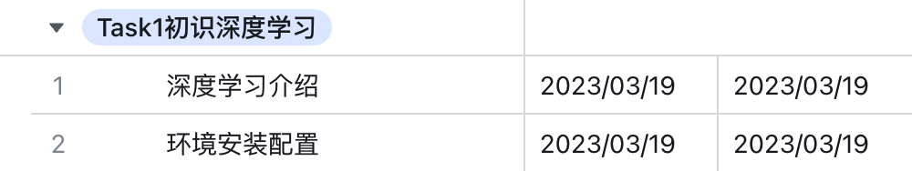

# Open Learning Camp - 《动手学深度学习》

## 面向人员

- 有Python基础
- 有高数，线代，概率论基础
- 本科大二左右，或者研一
- 希望入门深度学习

## 学习资源

- 教材：https://zh-v2.d2l.ai/
- 纸质书： https://j.youzan.com/2E82KT（最低折扣五折购买地址）
- 视频： https://space.bilibili.com/1567748478/channel/seriesdetail?sid=358497
- 笔记：https://github.com/MLNLP-World/DeepLearning-MuLi-Notes/tree/main/notes
- 竞赛：https://tianchi.aliyun.com/competition/entrance/231784/introduction?spm=5176.12281973.0.0.7c47106baWMBl3
- OpenI云环境（可直接运行）：https://openi.pcl.ac.cn/Datawhale/d2l

## Task01：初识深度学习

📑【任务介绍】

观看【初识深度学习】章节的视频，结合电子书与代码材料，完整环境安装配置，输出学习笔记

⏰【任务时间安排】

📒【任务学习链接】

[🖥️深度学习介绍视频](https://www.bilibili.com/video/BV1J54y187f9/?p=1&vd_source=92dec0740d9d8929f8fb26d1ac900465)

[📖深度学习介绍教程](https://zh-v2.d2l.ai/chapter_introduction/index.html)

[🖥️环境安装配置视频](https://www.bilibili.com/video/BV18p4y1h7Dr/?vd_source=4cc9f0023dddad3ba6f7edc17eb3040d)

[📖环境安装配置教程](https://zh-v2.d2l.ai/chapter_installation/index.html)

