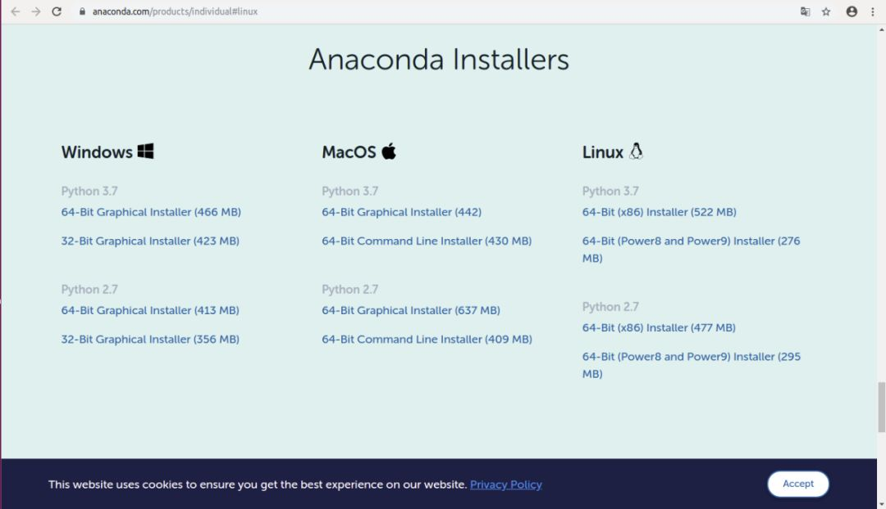
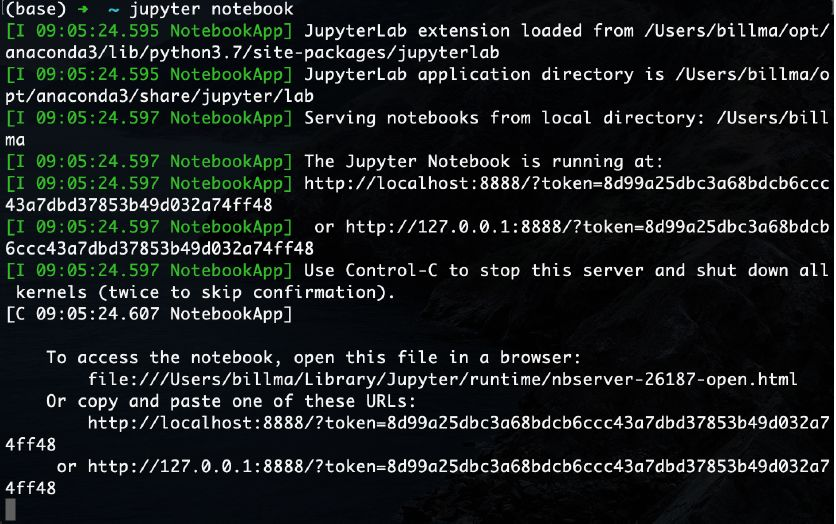
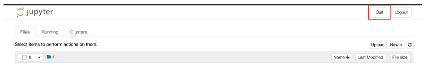
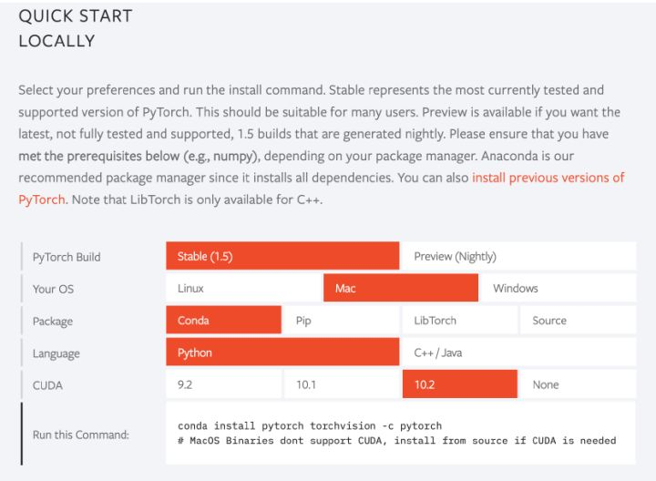
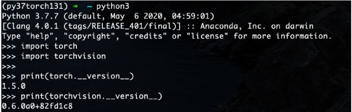

# Task1 初识深度学习

## 深度学习介绍

深度学习是机器学习中的一个分支，它是一种通过多层神经网络学习数据表示的方法。深度学习的核心思想是通过多层次的非线性变换来自动学习数据的表示，从而使得机器可以对数据进行更加准确的预测和分类。

### 深度学习的应用

深度学习已经被广泛应用于**图像识别、语音识别、自然语言处理、推荐系统**等领域。在图像识别领域，深度学习已经取得了很多重大突破，如**图像分类、目标检测、图像分割**等。在语音识别领域，深度学习已经成为了语音识别的主流方法，取得了很多优秀的成果。在自然语言处理领域，深度学习可以用于文本分类、情感分析、机器翻译等任务。在推荐系统领域，深度学习可以用于推荐算法，提高推荐的准确率。

### 深度学习的基本原理

深度学习的基本原理是构建一个多层的神经网络，每一层都有很多神经元，相邻两层之间的神经元之间都有权重连接。输入数据通过网络进行正向传播，每一层都对数据进行一次非线性变换，并将结果传递给下一层。最后一层经过激活函数后输出结果。

深度学习的训练过程通常使用**反向传播算法**来更新网络中的权重。反向传播算法首先计算输出层的误差，然后逐层向前计算各层的误差，并根据误差大小更新权重，使得网络的输出结果与真实结果之间的误差最小化。

### 深度学习的挑战

深度学习虽然已经在许多领域取得了很多成功，但是也面临着很多挑战。其中最大的挑战之一是**数据稀缺性**。深度学习需要大量的数据来训练模型，但是在一些领域，如医疗、金融等领域，数据往往非常稀缺，这就给深度学习带来了很大的挑战。

另外一个挑战是**模型的可解释性**。深度学习模型通常是黑盒子，很难理解模型的决策过程。这在一些需要透明度和可解释性的领域，如法律、金融等领域，也是一个很大的问题。


## 深度学习环境安装配置

### **安装Anaconda**

Anaconda 的安装有两种方式，这里仅介绍一种最直观的- macOS graphical install。[https://www.anaconda.com/products/individual](https://link.zhihu.com/?target=https%3A//www.anaconda.com/products/individual)里，Anaconda Installers的位置，选择Python 3.7 下方的“64-Bit Graphical Installer (442)”。下载好



pkg 安装包后点击进入，按下一步完成安装即可。默认安装地点为~/opt。想用command line install 的，请自行参考：[https://docs.anaconda.com/anaco](https://link.zhihu.com/?target=https%3A//docs.anaconda.com/anaconda/install/mac-os/)

**确认下载情况**

打开Terminal 里，输入以下命令，确保安装的Python 是3.x 版本。

```
python --version
jupyter notebook
```



在网页右上角点击Quit，或返回Terminal，command + c，退出notebook。




### 创建一个新的虚拟环境 

在Terminal 中输入

```text
conda create --name env_name
```

就可以创建一个虚拟环境，叫“env_name”。输入

```text
conda env list
```

即可看到创建了的所有虚拟环境，其中打* 的就是当前环境。输入

```text
conda activate env_name
```

进入环境

```text
conda deactivate
```

退出当前虚拟环境，进入base。

### 下载Pytorch

进入[https://pytorch.org/](https://link.zhihu.com/?target=https%3A//pytorch.org/) 可以看到



pytorch 官网显示当前设备应该用的下载语句。此情况，我的是

```text
conda install pytorch torchvision -c pytorch
```

复制下来，粘贴到Terminal 中运行就可以开始下载了。下载完成后，在Terminal 输入

```text
python3
```

之后import 两个刚下载的包，确认下载完成

```text
import torch
import torchvision
print(torch.__version__)
print(torchvision.__version__)
```

如果import 和输出正常，配置就完成了！输入



```text
quit()
```

就ok 了。

## 参考资料

[深度学习环境配置](https://www.zhihu.com/search?q=深度学习环境配置&utm_content=search_suggestion&type=content)