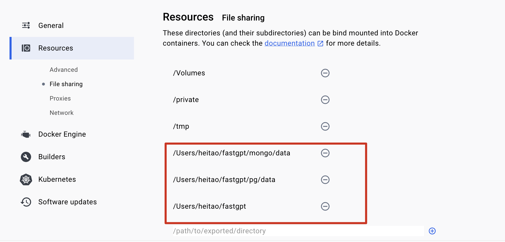
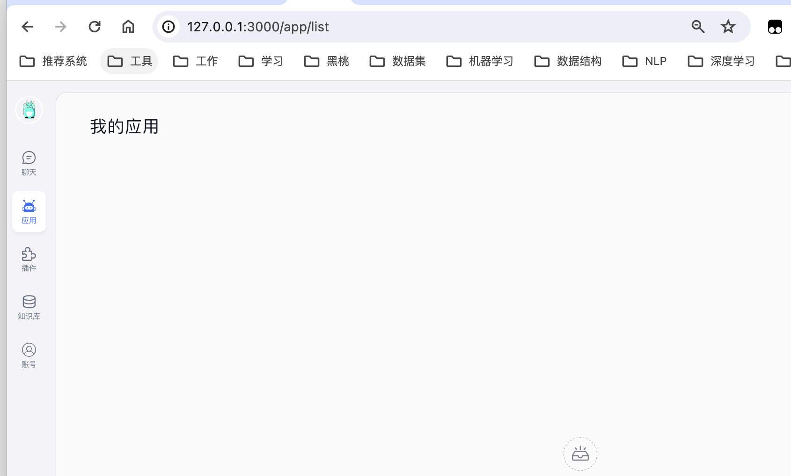
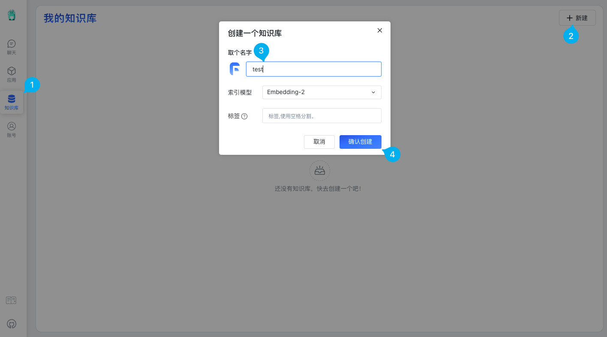
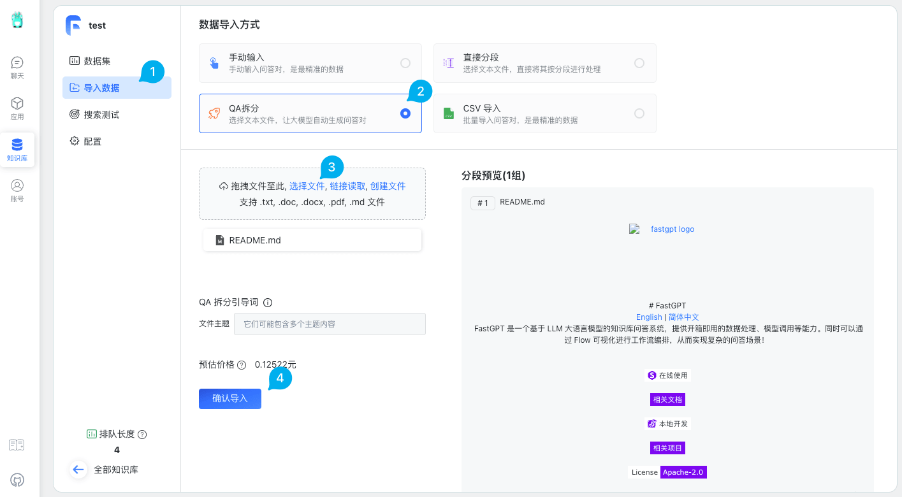
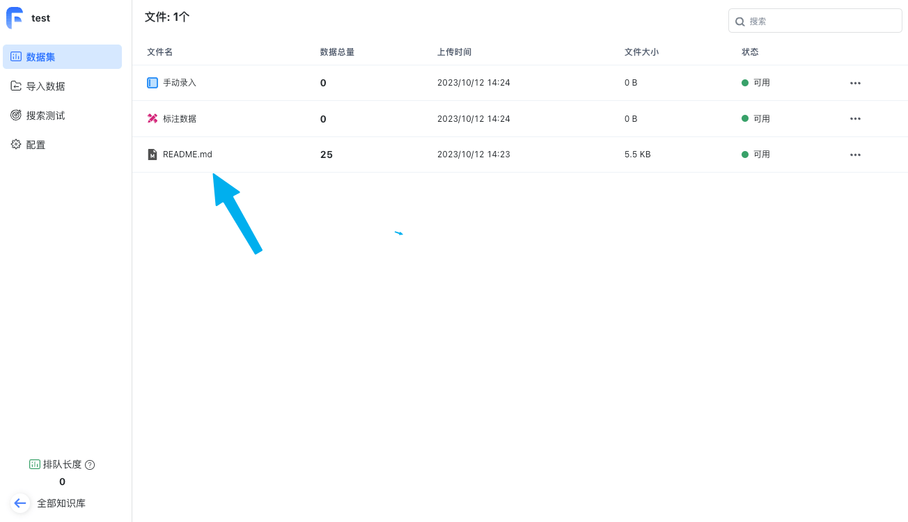

安装docker、docker-compose

````
# 安装docker
wget -qO- https://get.docker.com/ | bash
# docker-compose
curl -L "https://github.com/docker/compose/releases/download/1.29.2/docker-compose-$(uname -s)-$(uname -m)" -o /usr/local/bin/docker-compose
chmod +x /usr/local/bin/docker-compose
或者
pip3 install -U -i https://pypi.tuna.tsinghua.edu.cn/simple docker-compose
````

下载one-api

````
git clone https://github.com/songquanpeng/one-api.git
````

详细信息：https://github.com/songquanpeng/one-api


安装Node.js v18.x

https://registry.npmmirror.com/-/binary/node/latest-v18.x/node-v18.0.0-linux-x64.tar.xz

https://www.cnblogs.com/withheart/p/15578430.html


# 安装fastgpt

详细信息：https://github.com/labring/FastGPT.git

````
git clone https://github.com/labring/FastGPT.git
````

https://doc.fastgpt.in/docs/development/docker/

## Docker Compose 快速部署

使用 Docker Compose 快速部署 FastGPT

**推荐配置**

| 环境        | 最低配置（单节点） | 推荐配置     |
| ----------- | ------------------ | ------------ |
| 测试        | 2c2g               | 2c4g         |
| 100w 组向量 | 4c8g 50GB          | 4c16g 50GB   |
| 500w 组向量 | 8c32g              | 16c64g 200GB |

### 1. 准备好代理环境（国外服务器可忽略）

确保可以访问 OpenAI，具体方案可以参考：[代理方案](https://doc.fastgpt.in/docs/development/proxy/)。或直接在 Sealos 上 [部署 OneAPI](https://doc.fastgpt.in/docs/development/one-api/)，既解决代理问题也能实现多 Key 轮询、接入其他大模型。

### 2. 多模型支持

FastGPT 使用了 one-api 项目来管理模型池，其可以兼容 OpenAI 、Azure 、国内主流模型和本地模型等。

可选择 [Sealos 快速部署 OneAPI](https://doc.fastgpt.in/docs/development/one-api/)，更多部署方法可参考该项目的 [README](https://github.com/songquanpeng/one-api)，也可以直接通过以下按钮一键部署：

[](https://template.cloud.sealos.io/deploy?templateName=one-api)

### 一、安装 Docker 和 docker-compose

https://mp.weixin.qq.com/s?__biz=MzI3NDc4NTQ0Nw==&mid=2247541524&idx=1&sn=21ea1e4a505110605811d178deefb12c&chksm=eb0cd6dcdc7b5fcadb5a5b72c216f85d823d82065552a5764a60cd4ff8d49b26c51f885c966d&scene=27

LinuxMacOSWindows

```bash
# 安装 Docker
curl -fsSL https://get.docker.com | bash -s docker --mirror Aliyun
systemctl enable --now docker
# 安装 docker-compose
curl -L https://github.com/docker/compose/releases/download/2.20.3/docker-compose-`uname -s`-`uname -m` -o /usr/local/bin/docker-compose
chmod +x /usr/local/bin/docker-compose
# 验证安装
docker -v
docker-compose -v
# 如失效，自行百度~
```

### 二、创建目录并下载 docker-compose.yml

依次执行下面命令，创建 FastGPT 文件并拉取`docker-compose.yml`和`config.json`，执行完后目录下会有 2 个文件。

非 Linux 环境或无法访问外网环境，可手动创建一个目录，并下载下面2个链接的文件: [docker-compose.yml](https://github.com/labring/FastGPT/blob/main/files/deploy/fastgpt/docker-compose.yml),[config.json](https://github.com/labring/FastGPT/blob/main/projects/app/data/config.json)

**注意: `docker-compose.yml` 配置文件中 Mongo 为 5.x，部分服务器不支持，需手动更改其镜像版本为 4.4.24**

```bash
mkdir fastgpt
cd fastgpt
curl -O https://raw.githubusercontent.com/labring/FastGPT/main/files/deploy/fastgpt/docker-compose.yml
curl -O https://raw.githubusercontent.com/labring/FastGPT/main/projects/app/data/config.json
```

如果下载不下来，可以先 

````
git clone https://github.com/labring/FastGPT.git
cp -r FasterGPT/projects/app/data/config.json ./
cp -r FasterGPT/files/deploy/fastgpt/docker-compose.yml ./
````


### 三、启动容器

修改`docker-compose.yml`中的`OPENAI_BASE_URL`和`CHAT_API_KEY`即可，对应为 API 的地址(别忘记加/v1)和 key。

```bash
# 在 docker-compose.yml 同级目录下执行
docker-compose pull
docker-compose up -d
```

如果启动失败，注意给相应的文件夹权限





#### 四、访问 FastGPT

目前可以通过 `ip:3000` 直接访问(注意防火墙)。登录用户名为 `root`，密码为`docker-compose.yml`环境变量里设置的 `DEFAULT_ROOT_PSW`。

如果需要域名访问，请自行安装并配置 Nginx。



## 创建知识库

### 知识库

开始前，请准备一份测试电子文档，WORD，PDF，TXT，excel，markdown 都可以，比如公司休假制度，不涉密的销售说辞，产品知识等等。

这里使用 FastGPT 中文 README 文件为例。

首先我们需要创建一个知识库。



知识库创建完之后我们需要上传一点内容。

上传内容这里有四种模式：

- 手动输入：手动输入问答对，是最精准的数据
- QA 拆分：选择文本文件，让AI自动生成问答对
- 直接分段：选择文本文件，直接将其按分段进行处理
- CSV 导入：批量导入问答对

这里，我们选择 QA 拆分，让 AI 自动生成问答，若问答质量不高，可以后期手动修改。



点击上传后我们需要等待数据处理完成，等到我们上传的文件状态为可用。



## **部署one api**


````
docker run --name one-api -d --restart always -p 13000:3000 -e TZ=Asia/Shanghai -v /Users/heitao/fastgpt/one-api:/data justsong/one-api
````

````
docker run：用于启动一个新容器的命令。
--name one-api：为容器指定一个名称，便于识别。
-d：表示以分离模式运行容器，使得容器在后台运行。
--restart always：设置容器的重启策略，当容器退出时，自动重启。
-p 13000:3000：端口映射，将主机的 13000 端口映射到容器的 3000 端口。
-e TZ=Asia/Shanghai：设置容器的时区为上海时区。
-v /home/ubuntu/data/one-api:/data：volume 映射，将主机的 /home/ubuntu/data/one-api 目录映射到容器的 /data 目录。
justsong/one-api：要运行的容器镜像名称，该镜像包含了 one-api 应用程序。
````


在Ubuntu系统中安装npm，需要先安装Node.js。可以通过以下命令来安装Node.js：

\```

sudo apt-get update

sudo apt-get install nodejs

安装完成后，可以通过以下命令来检查Node.js的版本：

node -v

接下来，可以通过以下命令来安装npm：

sudo apt-get install npm

安装完成后，可以通过以下命令来检查npm的版本：

npm -v


## 本地Qwen-14B接入知识库

**① 下载qwen-14b/7b权重+启动仓库！
**

**② 修改API启动文件，让它可以支持API启动**

**③ 创建miniconda虚拟环境！启动大模型！**

**④ 接入one api，打通本地大模型和知识库！**


conda create --name internlm-demo --clone=/root/share/conda_envs/internlm-base


/Users/heitao/fastgpt/one-api/ 


https://mp.weixin.qq.com/s/Fy-dNFOf-KhAMTJnBwjICQ


chatgptProxyAPI

https://github.com/x-dr/chatgptProxyAPI.git


https://mp.weixin.qq.com/s/GUY0i2Vt3TG2fu0JbJP5SQ