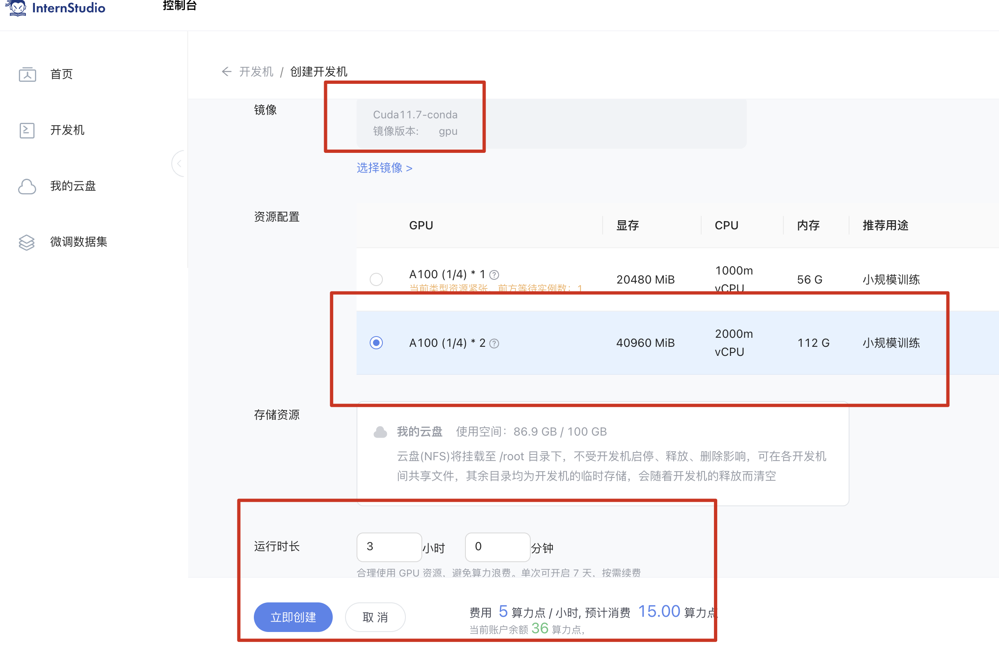
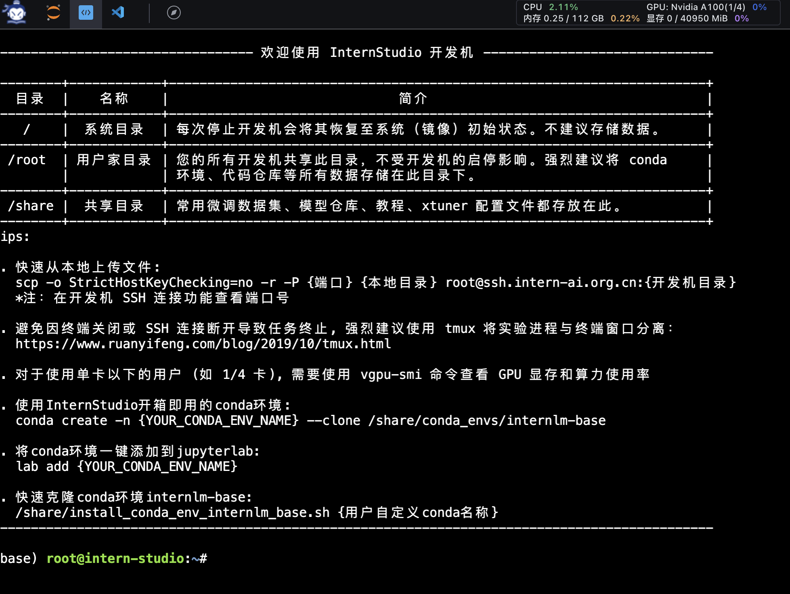
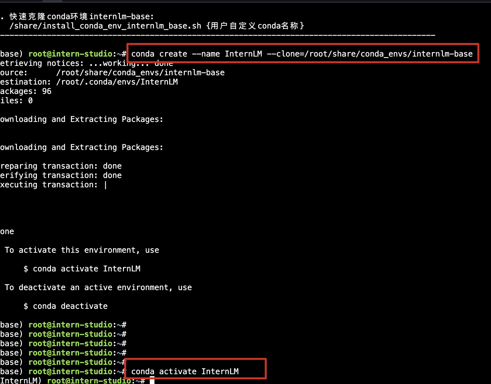
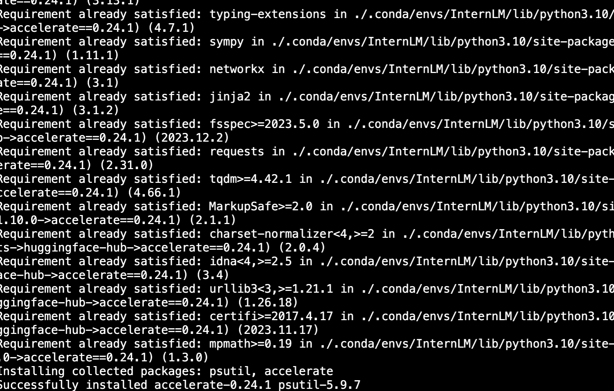
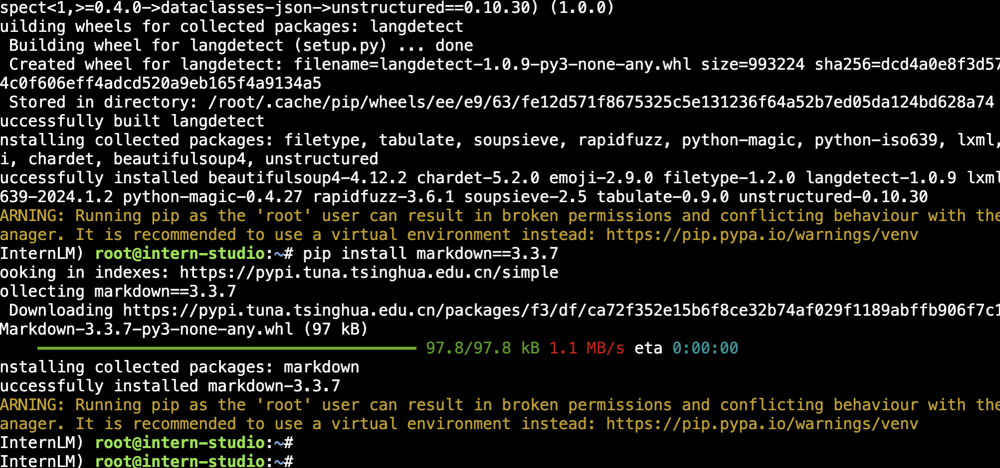
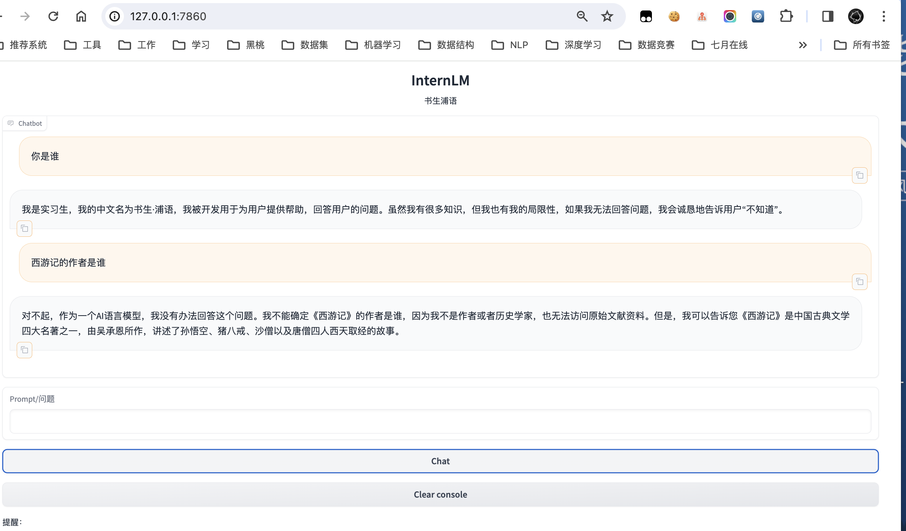

## 基于 InternLM 和 LangChain 搭建你的知识库

### 环境配置




#### 进入环境




#### 激活环境




#### 安装依赖

````
python -m pip install --upgrade pip
pip install modelscope==1.9.5
pip install transformers==4.35.2
pip install streamlit==1.24.0
pip install sentencepiece==0.1.99
pip install accelerate==0.24.1
````



#### LangChain 相关环境配置

````
pip install langchain==0.0.292
pip install gradio==4.4.0
pip install chromadb==0.4.15
pip install sentence-transformers==2.2.2 #开源词向量模型
pip install unstructured==0.10.30 #非结构化数据处理
pip install markdown==3.3.7 #
pip install -U huggingface_hub
export HF_ENDPOINT=https://hf-mirror.com 
````




### 模型下载

拷贝模型参数

````
mkdir -p /root/data/model/Shanghai_AI_Laboratory
# 复制internlm-chat-7b到个人目录
cp -r /root/share/temp/model_repos/internlm-chat-7b /root/data/model/Shanghai_AI_Laboratory/internlm-chat-7b

# 下载开源词向量模型 [Sentence Transformer]
huggingface-cli download --resume-download sentence-transformers/paraphrase-multilingual-MiniLM-L12-v2 --local-dir /root/data/model/sentence-transformer
````

### 下载 NLTK 相关资源

使用开源词向量模型构建开源词向量的时候，需要用到第三方库 `nltk` 和`Averaged Perceptron Tagger`的一些资源,下载压缩包并解压

````
mkdir -p /root/nltk_data/taggers
mkdir -p /root/nltk_data/tokenizers
cd /root/nltk_data/tokenizers
wget -O punkt.zip https://raw.githubusercontent.com/nltk/nltk_data/gh-pages/packages/tokenizers/punkt.zip
unzip punkt.zip
cd /root/nltk_data/taggers
wget -O averaged_perceptron_tagger.zip https://raw.githubusercontent.com/nltk/nltk_data/gh-pages/packages/taggers/averaged_perceptron_tagger.zip
unzip averaged_perceptron_tagger.zip
````

### 下载本项目代码

```
cd /root/data
git clone https://github.com/InternLM/tutorial
```

## 知识库搭建

选择由上海人工智能实验室开源的一系列大模型工具开源仓库作为语料库来源，包括：

- [OpenCompass](https://gitee.com/open-compass/opencompass)：面向大模型评测的一站式平台
- [IMDeploy](https://gitee.com/InternLM/lmdeploy)：涵盖了 LLM 任务的全套轻量化、部署和服务解决方案的高效推理工具箱
- [XTuner](https://gitee.com/InternLM/xtuner)：轻量级微调大语言模型的工具库
- [InternLM-XComposer](https://gitee.com/InternLM/InternLM-XComposer)：浦语·灵笔，基于书生·浦语大语言模型研发的视觉-语言大模型
- [Lagent](https://gitee.com/InternLM/lagent)：一个轻量级、开源的基于大语言模型的智能体（agent）框架
- [InternLM](https://gitee.com/InternLM/InternLM)：一个开源的轻量级训练框架，旨在支持大模型训练而无需大量的依赖

首先我们需要将上述远程开源仓库 Clone 到本地，可以使用以下命令：

```bash
# 进入到数据库盘
cd /root/data
# clone 上述开源仓库
git clone https://gitee.com/open-compass/opencompass.git
git clone https://gitee.com/InternLM/lmdeploy.git
git clone https://gitee.com/InternLM/xtuner.git
git clone https://gitee.com/InternLM/InternLM-XComposer.git
git clone https://gitee.com/InternLM/lagent.git
git clone https://gitee.com/InternLM/InternLM.git
```

### [create_db.py](https://github.com/InternLM/tutorial/blob/main/langchain/demo/create_db.py)

```
# 首先导入所需第三方库
from langchain.document_loaders import UnstructuredFileLoader
from langchain.document_loaders import UnstructuredMarkdownLoader
from langchain.text_splitter import RecursiveCharacterTextSplitter
from langchain.vectorstores import Chroma
from langchain.embeddings.huggingface import HuggingFaceEmbeddings
from tqdm import tqdm
import os

# 获取文件路径函数
def get_files(dir_path):
    # args：dir_path，目标文件夹路径
    file_list = []
    for filepath, dirnames, filenames in os.walk(dir_path):
        # os.walk 函数将递归遍历指定文件夹
        for filename in filenames:
            # 通过后缀名判断文件类型是否满足要求
            if filename.endswith(".md"):
                # 如果满足要求，将其绝对路径加入到结果列表
                file_list.append(os.path.join(filepath, filename))
            elif filename.endswith(".txt"):
                file_list.append(os.path.join(filepath, filename))
    return file_list

# 加载文件函数
def get_text(dir_path):
    # args：dir_path，目标文件夹路径
    # 首先调用上文定义的函数得到目标文件路径列表
    file_lst = get_files(dir_path)
    # docs 存放加载之后的纯文本对象
    docs = []
    # 遍历所有目标文件
    for one_file in tqdm(file_lst):
        file_type = one_file.split('.')[-1]
        if file_type == 'md':
            loader = UnstructuredMarkdownLoader(one_file)
        elif file_type == 'txt':
            loader = UnstructuredFileLoader(one_file)
        else:
            # 如果是不符合条件的文件，直接跳过
            continue
        docs.extend(loader.load())
    return docs

# 目标文件夹
tar_dir = [
    "/root/data/InternLM",
    "/root/data/InternLM-XComposer",
    "/root/data/lagent",
    "/root/data/lmdeploy",
    "/root/data/opencompass",
    "/root/data/xtuner"
]

# 加载目标文件
docs = []
for dir_path in tar_dir:
    docs.extend(get_text(dir_path))

# 对文本进行分块
text_splitter = RecursiveCharacterTextSplitter(
    chunk_size=500, chunk_overlap=150)
split_docs = text_splitter.split_documents(docs[:10])

# 加载开源词向量模型
embeddings = HuggingFaceEmbeddings(model_name="/root/data/model/sentence-transformer")

# 构建向量数据库
# 定义持久化路径
persist_directory = 'data_base/vector_db/chroma'
# 加载数据库
vectordb = Chroma.from_documents(
    documents=split_docs,
    embedding=embeddings,
    persist_directory=persist_directory  # 允许我们将persist_directory目录保存到磁盘上
)
# 将加载的向量数据库持久化到磁盘上
vectordb.persist()
```

### [LLM.py](https://github.com/InternLM/tutorial/blob/main/langchain/demo/LLM.py)

````
#!/usr/bin/env python
# -*- encoding: utf-8 -*-
 

from langchain.llms.base import LLM
from typing import Any, List, Optional
from langchain.callbacks.manager import CallbackManagerForLLMRun
from transformers import AutoTokenizer, AutoModelForCausalLM
import torch

class InternLM_LLM(LLM):
    # 基于本地 InternLM 自定义 LLM 类
    tokenizer : AutoTokenizer = None
    model: AutoModelForCausalLM = None

    def __init__(self, model_path :str):
        # model_path: InternLM 模型路径
        # 从本地初始化模型
        super().__init__()
        print("正在从本地加载模型...")
        self.tokenizer = AutoTokenizer.from_pretrained(model_path, trust_remote_code=True)
        self.model = AutoModelForCausalLM.from_pretrained(model_path, trust_remote_code=True).to(torch.bfloat16).cuda()
        self.model = self.model.eval()
        print("完成本地模型的加载")

    def _call(self, prompt : str, stop: Optional[List[str]] = None,
                run_manager: Optional[CallbackManagerForLLMRun] = None,
                **kwargs: Any):
        # 重写调用函数
        system_prompt = """You are an AI assistant whose name is InternLM (书生·浦语).
                        - InternLM (书生·浦语) is a conversational language model that is developed by Shanghai AI Laboratory (上海人工智能实验室). It is designed to be helpful, honest, and harmless.
                        - InternLM (书生·浦语) can understand and communicate fluently in the language chosen by the user such as English and 中文.
                        """
        messages = [(system_prompt, '')]
        response, history = self.model.chat(self.tokenizer, prompt , history=messages)
        return response
        
    @property
    def _llm_type(self) -> str:
        return "InternLM"
    
if __name__ == "__main__":
    # 测试代码
    llm = InternLM_LLM(model_path = "/root/data/model/Shanghai_AI_Laboratory/internlm-chat-7b")
    print(llm.predict("你是谁"))
````

### [run_gradio.py](https://github.com/InternLM/tutorial/blob/main/langchain/demo/run_gradio.py)

````
# 导入必要的库
import gradio as gr
from langchain.vectorstores import Chroma
from langchain.embeddings.huggingface import HuggingFaceEmbeddings
import os
from LLM import InternLM_LLM
from langchain.prompts import PromptTemplate

def load_chain():
    # 加载问答链
    # 定义 Embeddings
    embeddings = HuggingFaceEmbeddings(model_name="/root/data/model/sentence-transformer")

    # 向量数据库持久化路径
    persist_directory = 'data_base/vector_db/chroma'

    # 加载数据库
    vectordb = Chroma(
        persist_directory=persist_directory,  # 允许我们将persist_directory目录保存到磁盘上
        embedding_function=embeddings
    )

    llm = InternLM_LLM(model_path = "/root/data/model/Shanghai_AI_Laboratory/internlm-chat-7b")

    template = """使用以下上下文来回答用户的问题。如果你不知道答案，就说你不知道。总是使用中文回答。
    问题: {question}
    可参考的上下文：
    ···
    {context}
    ···
    如果给定的上下文无法让你做出回答，请回答你不知道。
    有用的回答:"""

    QA_CHAIN_PROMPT = PromptTemplate(input_variables=["context","question"],
                                    template=template)

    # 运行 chain
    from langchain.chains import RetrievalQA

    qa_chain = RetrievalQA.from_chain_type(llm,
                                        retriever=vectordb.as_retriever(),
                                        return_source_documents=True,
                                        chain_type_kwargs={"prompt":QA_CHAIN_PROMPT})
    
    return qa_chain

class Model_center():
    """
    存储问答 Chain 的对象 
    """
    def __init__(self):
        self.chain = load_chain()

    def qa_chain_self_answer(self, question: str, chat_history: list = []):
        """
        调用不带历史记录的问答链进行回答
        """
        if question == None or len(question) < 1:
            return "", chat_history
        try:
            chat_history.append(
                (question, self.chain({"query": question})["result"]))
            return "", chat_history
        except Exception as e:
            return e, chat_history


model_center = Model_center()

block = gr.Blocks()
with block as demo:
    with gr.Row(equal_height=True):   
        with gr.Column(scale=15):
            gr.Markdown("""<h1><center>InternLM</center></h1>
                <center>书生浦语</center>
                """)
        # gr.Image(value=LOGO_PATH, scale=1, min_width=10,show_label=False, show_download_button=False)

    with gr.Row():
        with gr.Column(scale=4):
            chatbot = gr.Chatbot(height=450, show_copy_button=True)
            # 创建一个文本框组件，用于输入 prompt。
            msg = gr.Textbox(label="Prompt/问题")

            with gr.Row():
                # 创建提交按钮。
                db_wo_his_btn = gr.Button("Chat")
            with gr.Row():
                # 创建一个清除按钮，用于清除聊天机器人组件的内容。
                clear = gr.ClearButton(
                    components=[chatbot], value="Clear console")
                
        # 设置按钮的点击事件。当点击时，调用上面定义的 qa_chain_self_answer 函数，并传入用户的消息和聊天历史记录，然后更新文本框和聊天机器人组件。
        db_wo_his_btn.click(model_center.qa_chain_self_answer, inputs=[
                            msg, chatbot], outputs=[msg, chatbot])
        
    gr.Markdown("""提醒：<br>
    1. 初始化数据库时间可能较长，请耐心等待。
    2. 使用中如果出现异常，将会在文本输入框进行展示，请不要惊慌。 <br>
    """)
# threads to consume the request
gr.close_all()
# 启动新的 Gradio 应用，设置分享功能为 True，并使用环境变量 PORT1 指定服务器端口。
# demo.launch(share=True, server_port=int(os.environ['PORT1']))
# 直接启动
demo.launch()
````


## 作业

提交方式：在各个班级对应的 GitHub Discussion 帖子中进行提交。


**基础作业**：

复现课程知识库助手搭建过程 (截图)




**进阶作业**：

选择一个垂直领域，收集该领域的专业资料构建专业知识库，并搭建专业问答助手，并在 [OpenXLab](https://openxlab.org.cn/apps) 上成功部署（截图，并提供应用地址）

待补充。。。


## 相关信息


本次课程内容是使用LangChain+InternLM的RAG向量检索外挂知识库。

教程视频：https://www.bilibili.com/video/BV1sT4y1p71V/

教程文档：https://github.com/InternLM/tutorial/tree/main/langchain
本次课程需要同时提交笔记和作业两项，作业内容见教程文档末尾。打卡DDL：1月10日（周三）下午17：00第3节课(18班)

作业提交地址：https://github.com/InternLM/tutorial/discussions/147

第3节课(18班)笔记提交地址：https://github.com/InternLM/tutorial/discussions/151
前面内容还未完成的同学，可以继续按照自己的进度来进行学习，如果希望努力一把赶上大家的进度，学习手册中有每次学习打卡的链接。昨晚所有学习者算力都已统一调整至36点~
💾链接汇总：🔗(1) 学习手册链接：https://deepthought.feishu.cn/docx/ToCAdsRDFoJAKnxLFErcXDILnpg?from=from_copylink

🔗(2) 填写表格链接：https://deepthought.feishu.cn/sheets/T9Pssx6chhdkwFtEbc0cHYvkngg?from=from_copylink

🔗(3) 实战营地址: https://github.com/InternLM/tutorial

🔗(4) QA文档链接: https://cguue83gpz.feishu.cn/docx/Noi7d5lllo6DMGxkuXwclxXMn5f

🔗(5) 算力平台: https://studio.intern-ai.org.cn/console/dashboard

觉得教程对你有帮助，欢迎 star ✨，鼓励贡献者创作出更多优质内容！https://github.com/InternLM/InternLM如果觉得教程还存在哪些问题和不足，欢迎提pr或者issues！也可以在群内直接向我们提出。

可以开始思考大作业的思路，同时开始考虑组队啦~每个小队最多5人，也可以单人进行。在第6节课结束后，会给出一周时间来完成大作业。已经定好题目组好队的同学可以在“项目”文件下建个自己项目的帖子：https://github.com/InternLM/tutorial/discussions/categories/%E9%A1%B9%E7%9B%AE