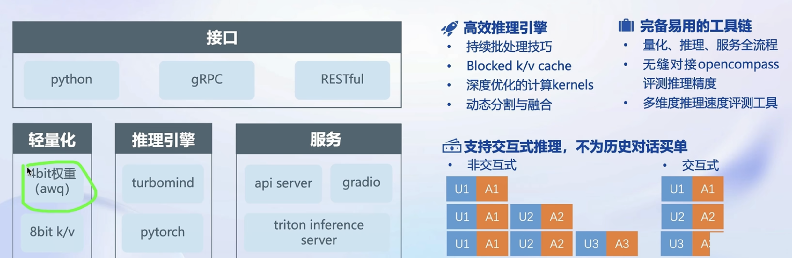
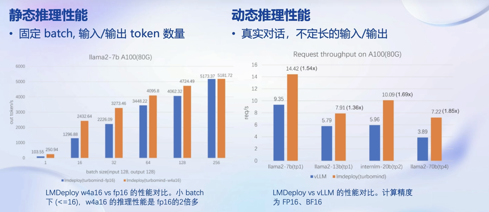
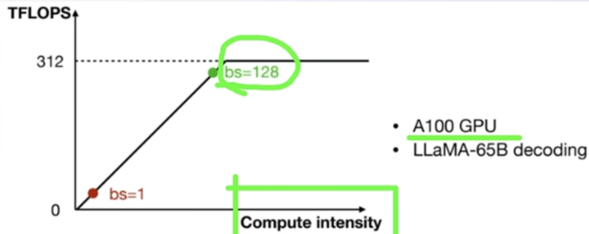
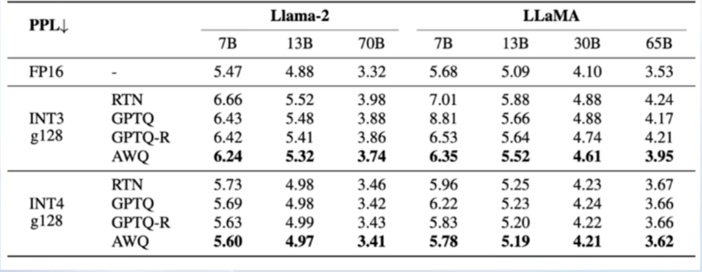
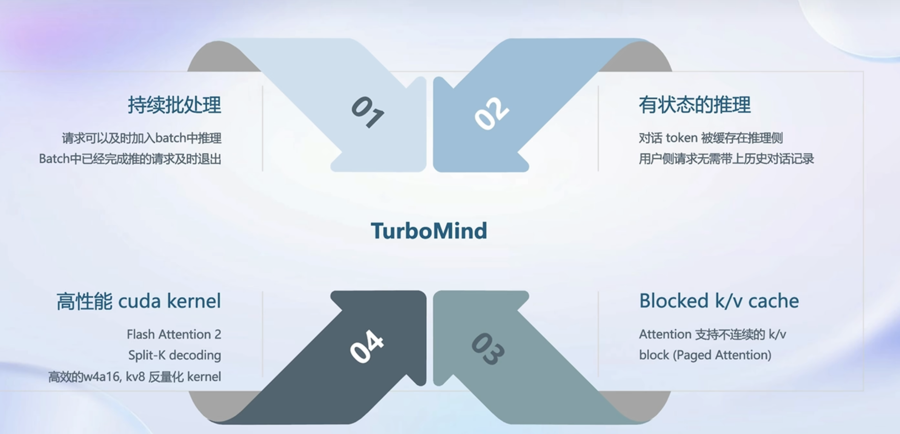
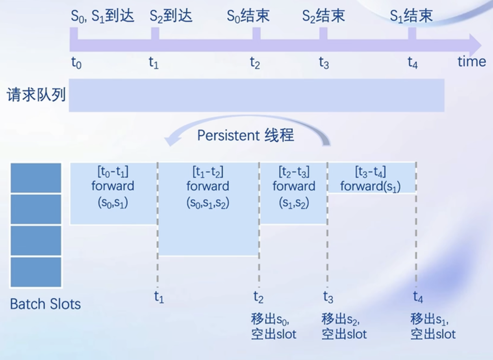
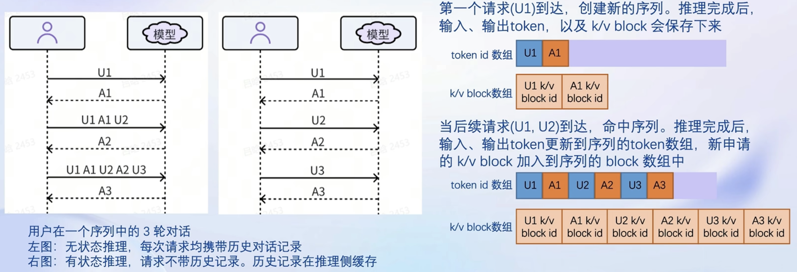
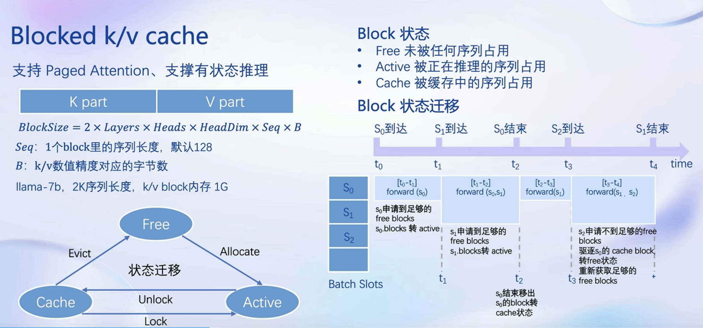
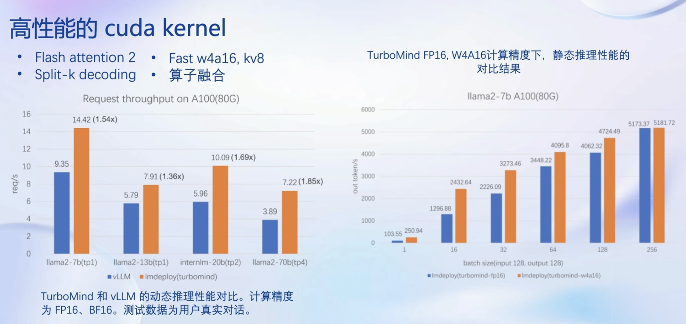
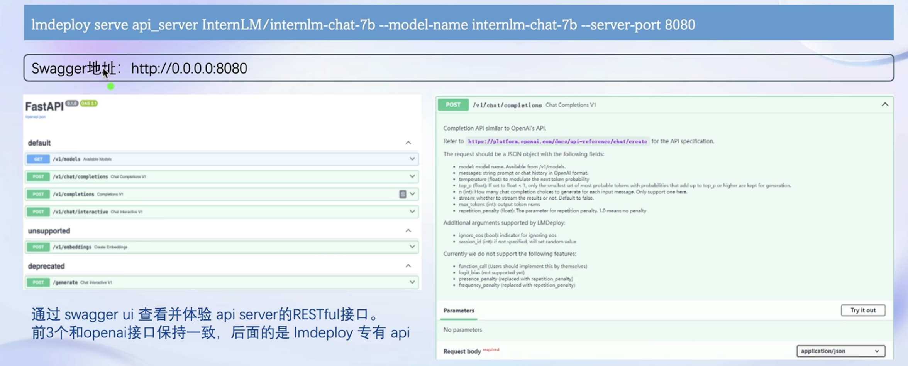

# LMDeploy 的量化和部署

## 大模型部署背景

随着大模型参数规模的不断增长，在有限的算力资源下，提升模型的推理速度逐渐变为一个重要的研究方向。为了满足性能和效率的要求，常常对需要对模型进行优化，例如模型压缩和硬件加速。

常用的推理加速框架包含**lmdeploy、FasterTransformer和vLLM**等。

### 模型部署

lmdeploy由上海人工智能实验室开发，推理使用C++/CUDA，对外提供python/gRPC/http接口和WebUI界面

- 支持tensor parallel分布式推理、
- 支持fp16/weightint4/kv cache int8量化。
- lmdeploy支持transformer结构（例如LLaMA、LLaMa2、InternLM、Vicuna等）
- 支持fp16，int8和int4。

#### 产品形态

- 云端

- 边缘计算端

- 移动端

#### 计算设备

CPU、GPU、NPU、TPU等

#### 大模型特点

- 内存开销巨大
  - 庞大的参数量。7B模型仅权重就需要14+G内存
  - 采用自回归生成token，需要缓存Attention的k/v，带来巨大的内存开销
- 动态shape
  - 请求数不固定
  - Token逐个生成，且数量不定
- 相对视觉模型，LLM结构简单
  - Transformers结构，大部分使decoder-only 

### 大模型部署挑战

- 设备
  - 如何应对巨大的存储问题？低存储设备（消费级显卡、手机等）如何部署？

- 推理
  - 如何加速token的生成速度
  - 如何解决动态shape，让推理可以不间断
  - 如何有效管理和利用内存
- 服务
  - 如何提升系统整体吞吐量？
  - 对于个体用户，如何降低响应时间？

### 大模型部署方案

- 技术点
  - 模型并行
  - 低比特量化
  - Page Attention
  - transformer计算和访存优化
  - Continuous Batch
    ...
- 方案
  - huggingface transformers
  - 专门的推理加速框架
  - 云端
    - Imdeploy
    - vllm
    - tensorrt-llm
    - deepspeed
      ...
  - 移动端
    - llama.cpp
    - mlc-llm

### LMDeploy简介

LMDeploy 是 LLM 在**英伟达设备**上部署的全流程解决方案。包括模型轻量化、推理和服务。

opencompass是测评工具

#### 推理性能

#### 量化

**计算密集 (compute-bound)** : 推理的绝大部分时间消耗在**数值计算**上针对计算密集场景，可以通过使用更快的硬件计算单元来提升计算速度比如量化为 W8A8 使用 INT8 Tensor Core 来加速计算。
**访存密集 (memory-bound)** : 推理时，绝大部分时间消耗在**数据读取**上;针对访存密集型场景，一般是通过提高计算访存比来提升性能。

#### LLM 是典型的访存密集型任务

常见的 LLM 模型是 Decoder Only 架构。推理时**大部分时间消耗在逐Token 生成阶段** (Decoding 阶段) ，是典型的访存密集型场景如图，A100 的 FP16 峰值算力为 312 TFLOPS，只有在 Batch Size 达到128 这个量级时，计算才成为推理的瓶颈，但由于 LLM 模型本身就很**大推理时的 KV Cache 也会占用很多显存**，还有一些其他的因素影响 (如Persistent Batch) ，实际推理时很难做到 128 这么大的 Batch Size。

####  Weight Only 量化一举多得

- 4bit Weight Onily 量化，将FP16 的模型权重量化为INT4，访存量直接降为 FP16模型的 1/4，大幅降低了访
   存成本，提高了 Decoding 的速度。
- 加速的同时还节省了显存，同样的设备能够支持更大的模型以及更长的对话长度

#### 如何做 Weight Only 的量化？

LMDeploy 使用 MIT HAN LAB 开源的**AWQ** 算法，量化为 4bit 模型

- 推理时，先把 4bit 权重，反量化回 FP16（在Kernel 内部进行，从Global Memory 读取时仍是 4bit），依旧使用的是 FP16 计算
- 相较于社区使用比较多的GPTQ 算法，AWQ 的推理速度更快，量化的时间更短

#### 推理引擎TurboMind

##### 持续批处理

**请求队列**

- 推理请求首先先加入到请求队列中

**Persistent线程**

- 若batch中有空闲槽位，从队列拉取请求，尽量填满空闲槽位。若无，继续对当前batch中的请求进行forward。
- Batch每forward完一次。
- 转步骤1。

##### 有状态的推理

##### Blocked k/v cache

支持Paged Attention、支撑有状态推理。

#### 

##### 高性能的cuda kernel

#### 核心功能-推理服务 api server

## 动手实践

参考资料：

 [Llama2-Chinese项目](https://www.cnblogs.com/shengshengwang/category/2349375.html)

## 作业

提交方式：在各个班级对应的 GitHub Discussion 帖子中进行提交。 

**基础作业：**

- 使用 LMDeploy 以本地对话、网页Gradio、API服务中的一种方式部署 InternLM-Chat-7B 模型，生成 300 字的小故事（需截图）

**进阶作业（可选做）**

- 将第四节课训练自我认知小助手模型使用 LMDeploy 量化部署到 OpenXLab 平台。
- 对internlm-chat-7b模型进行量化，并同时使用KV Cache量化，使用量化后的模型完成API服务的部署，分别对比模型量化前后和 KV Cache 量化前后的显存大小（将 bs设置为 1 和 max len 设置为512）。  
- 在自己的任务数据集上任取若干条进行Benchmark测试，测试方向包括：  
  （1）TurboMind推理+Python代码集成  
  （2）在（1）的基础上采用W4A16量化  
  （3）在（1）的基础上开启KV Cache量化  
  （4）在（2）的基础上开启KV Cache量化  
  （5）使用Huggingface推理

备注：**由于进阶作业较难，完成基础作业之后就可以先提交作业了，在后续的大作业项目中使用这些技术将作为重要的加分点！**

**整体实训营项目：**

时间周期：即日起致课程结束

即日开始可以在班级群中随机组队完成一个大作业项目，一些可提供的选题如下：

- 人情世故大模型：一个帮助用户撰写新年祝福文案的人情事故大模型
- 中小学数学大模型：一个拥有一定数学解题能力的大模型
- 心理大模型：一个治愈的心理大模型
- 工具调用类项目：结合 Lagent 构建数据集训练 InternLM 模型，支持对 MMYOLO 等工具的调用

其他基于书生·浦语工具链的小项目都在范围内，欢迎大家充分发挥想象力。

课程上新啦，今天带小伙伴们使用 LMDeploy 量化部署你的 InternLM 大模型，体验极致的推理速度和显存优化，作业在文档末尾~

文档：https://github.com/InternLM/tutorial/blob/vansin-patch-4/lmdeploy/lmdeploy.md
视频：https://www.bilibili.com/video/BV1iW4y1A77P

笔记提交链接：
https://github.com/InternLM/tutorial/discussions/149
作业提交链接：
https://github.com/InternLM/tutorial/discussions/153

算力中午时已经给大家补充到 56 点了，觉得不错欢迎 star

https://github.com/internLM/lmdeploy