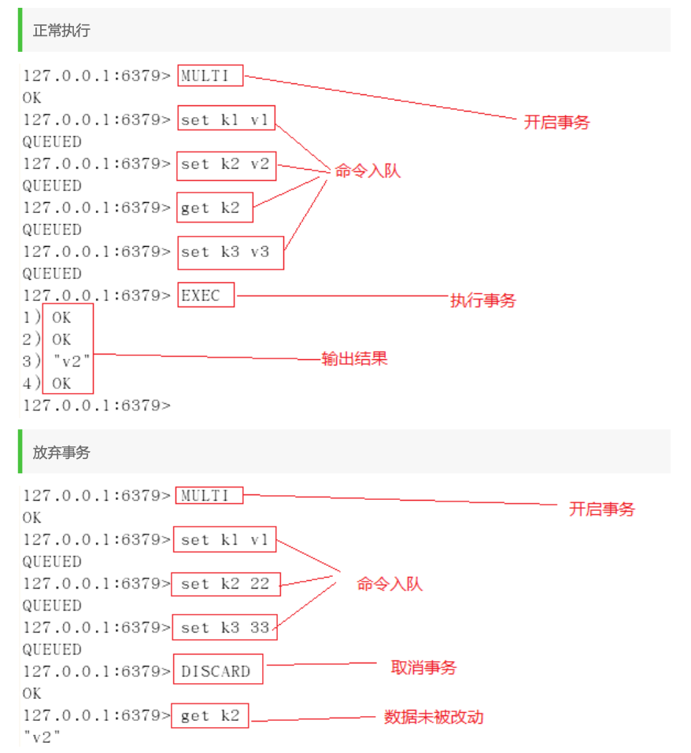
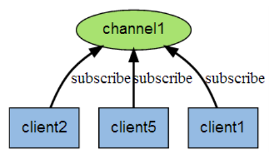
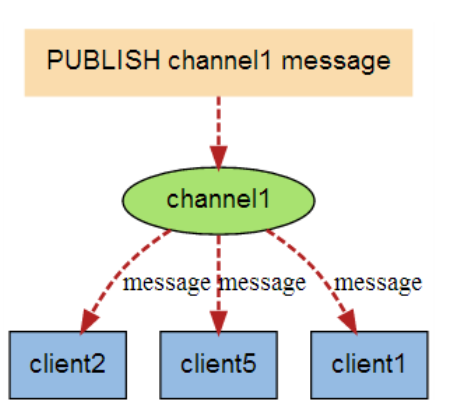

# Task02 数据库的基本使用

## Mysql学习

### Mysql介绍

MySQL为关系型数据库(Relational Database Management System), 这种所谓的"关系型"可以理解为"表格"的概念, 一个关系型数据库由一个或数个表格组成，关联数据库将数据保存在不同的表中，而不是将所有数据放在一个大仓库内，这样就增加了速度并提高了灵活性。

主要特点：

- MySQL 使用标准的 SQL 数据语言形式。
- MySQL 支持大型数据库，支持 5000 万条记录的数据仓库，32 位系统表文件最大可支持 4GB，64 位系统支持最大的表文件为8TB。
- MySQL 是可以定制的，采用了 GPL 协议，你可以修改源码来开发自己的 MySQL 系统。

### MySQL基本操作

1. 登录数据库：`mysql -u root -p   password`

2. MySQL 创建数据库：`CREATE DATABASE 数据库名;`

3. 删除数据库：`drop database <数据库名>;`

4. 选择数据库：`use  <数据库名>;`

5. 创建数据表：`CREATE TABLE table_name (column_name column_type);`

6. 删除数据表：`DROP TABLE table_name ;`

7. 数据表插入数据：

   ```
   INSERT INTO table_name ( field1, field2,...fieldN )
                          VALUES
                          ( value1, value2,...valueN );
   ```

   

8. 数据库中查询数据：

   ```
   SELECT column_name,column_name
   FROM table_name
   [WHERE Clause]
   [LIMIT N][ OFFSET M]
   ```

   

9. 更新 MySQL 中的数据：

   ```
   UPDATE table_name SET field1=new-value1, field2=new-value2
   [WHERE Clause]
   ```

   

10. 删除 MySQL 数据表中的记录：DELETE FROM table_name [WHERE Clause]

11. 从数据表中读取数据的通用语法(正则)：

    ```
    SELECT field1, field2,...fieldN 
    FROM table_name
    WHERE field1 LIKE condition1 [AND [OR]] filed2 = 'somevalue'
    ```

    

12. 连接表：

    ```
    SELECT expression1, expression2, ... expression_n
    FROM tables
    [WHERE conditions]
    UNION [ALL | DISTINCT]
    SELECT expression1, expression2, ... expression_n
    FROM tables
    [WHERE conditions];
    
    参数
    expression1, expression2, ... expression_n: 要检索的列。
    tables: 要检索的数据表。
    WHERE conditions: 可选， 检索条件。
    DISTINCT: 可选，删除结果集中重复的数据。默认情况下 UNION 操作符已经删除了重复数据，所以 DISTINCT 修饰符对结果没啥影响。
    ALL: 可选，返回所有结果集，包含重复数据。
    ```

    

13. - **INNER JOIN（内连接,或等值连接）**：获取两个表中字段匹配关系的记录。
    - **LEFT JOIN（左连接）：**获取左表所有记录，即使右表没有对应匹配的记录。
    - **RIGHT JOIN（右连接）：** 与 LEFT JOIN 相反，用于获取右表所有记录，即使左表没有对应匹配的记录。

14. MySQL 排序：

    ```
    SELECT field1, field2,...fieldN FROM table_name1, table_name2...
    ORDER BY field1 [ASC [DESC][默认 ASC]], [field2...] [ASC [DESC][默认 ASC]]
    ```

    

15. 分组：

    ```
    SELECT column_name, function(column_name)
    FROM table_name
    WHERE column_name operator value
    GROUP BY column_name;
    ```

    

### MySQL 事务

MySQL 事务主要用于处理操作量大，复杂度高的数据。事务是必须满足4个条件（ACID）：：原子性（**A**tomicity，或称不可分割性）、一致性（**C**onsistency）、隔离性（**I**solation，又称独立性）、持久性（**D**urability）。

- **原子性：**一个事务（transaction）中的所有操作，要么全部完成，要么全部不完成，不会结束在中间某个环节。事务在执行过程中发生错误，会被回滚（Rollback）到事务开始前的状态，就像这个事务从来没有执行过一样。
- **一致性：**在事务开始之前和事务结束以后，数据库的完整性没有被破坏。这表示写入的资料必须完全符合所有的预设规则，这包含资料的精确度、串联性以及后续数据库可以自发性地完成预定的工作。
- **隔离性：**数据库允许多个并发事务同时对其数据进行读写和修改的能力，隔离性可以防止多个事务并发执行时由于交叉执行而导致数据的不一致。事务隔离分为不同级别，包括读未提交（Read uncommitted）、读提交（read committed）、可重复读（repeatable read）和串行化（Serializable）。
- **持久性：**事务处理结束后，对数据的修改就是永久的，即便系统故障也不会丢失。

#### 事务控制语句

- BEGIN 或 START TRANSACTION 显式地开启一个事务；
- COMMIT 也可以使用 COMMIT WORK，不过二者是等价的。COMMIT 会提交事务，并使已对数据库进行的所有修改成为永久性的；
- ROLLBACK 也可以使用 ROLLBACK WORK，不过二者是等价的。回滚会结束用户的事务，并撤销正在进行的所有未提交的修改；
- SAVEPOINT identifier，SAVEPOINT 允许在事务中创建一个保存点，一个事务中可以有多个 SAVEPOINT；
- RELEASE SAVEPOINT identifier 删除一个事务的保存点，当没有指定的保存点时，执行该语句会抛出一个异常；
- ROLLBACK TO identifier 把事务回滚到标记点；
- SET TRANSACTION 用来设置事务的隔离级别。InnoDB 存储引擎提供事务的隔离级别有READ UNCOMMITTED、READ COMMITTED、REPEATABLE READ 和 SERIALIZABLE。

#### 事务处理主要有两种方法

1. 用 BEGIN, ROLLBACK, COMMIT来实现

   - **BEGIN** 开始一个事务

   - **ROLLBACK** 事务回滚

   - **COMMIT** 事务确认


2. 直接用 SET 来改变 MySQL 的自动提交模式:

   - **SET AUTOCOMMIT=0** 禁止自动提交

   - **SET AUTOCOMMIT=1** 开启自动提交


### 修改数据表名或者修改数据表字段

1. 删除表的 i 字段：`ALTER TABLE testalter_tbl  DROP i;`

2. 向数据表中添加列：`ALTER TABLE testalter_tbl ADD i INT;`

3. 修改字段类型及名称：`ALTER TABLE testalter_tbl MODIFY c CHAR(10);`

4. 指定字段 j 为 NOT NULL 且默认值为100 ：

   `ALTER TABLE testalter_tbl MODIFY j BIGINT NOT NULL DEFAULT 100;`

5. 修改字段的默认值： `ALTER TABLE testalter_tbl ALTER i SET DEFAULT 1000;`

6. 修改数据表的名称：`ALTER TABLE testalter_tbl RENAME TO alter_tbl;`


### MySQL 索引

1. 创建索引：`CREATE INDEX indexName ON table_name (column_name)`
2. 修改表结构(添加索引)：`ALTER table tableName ADD INDEX indexName(columnName)`
3. 修改表结构(添加索引)：`ALTER table tableName ADD INDEX indexName(columnName)`
4. 创建表的时候直接指定：
    ```
    CREATE TABLE mytable(  
    
    ID INT NOT NULL,   
    
    username VARCHAR(16) NOT NULL,  
    
    INDEX [indexName] (username(length))  
    
    );  
    ```
5. 删除索引：`DROP INDEX [indexName] ON mytable;` 


## MongoDB学习

### MongoDB 介绍

MongoDB 是由C++语言编写的，是一个基于**分布式文件存储**的开源数据库系统。MongoDB 将数据存储为一个文档，数据结构由**键值(key=>value)对**组成。**MongoDB 文档类似于 JSON 对象**。字段值可以包含其他文档，数组及文档数组。

主要特点

- 可以在MongoDB记录中设置任何属性的索引 (如：FirstName="Sameer",Address="8 Gandhi Road")来实现更快的排序。
- 你可以通过本地或者网络创建数据镜像，这使得MongoDB有更强的扩展性。
- Mongo支持丰富的查询表达式。查询指令使用JSON形式的标记，可轻易查询文档中内嵌的对象及数组。
- MongoDB允许在服务端执行脚本，可以用Javascript编写某个函数，直接在服务端执行，也可以把函数的定义存储在服务端，下次直接调用即可。

### MongoDB基本操作

1. 创建数据库，如果数据库不存在，则创建，否则切换到指定数据库：`use DATABASE_NAME`

2. 查看所有数据库：`show dbs` 

3. 删除当前数据库：`db.dropDatabase()`

4. 创建集合：`db.createCollection(name, options)`

5. 查看已有集合：`show collections；show tables`

6. 删除集合：`db.mycol2.drop() #mycol2为集合名`

7. 插入文档：`db.COLLECTION_NAME.insert(document) ；db.COLLECTION_NAME.save(document)`

8. 向集合插入一个新文档：
    ```
    db.collection.insertOne(
       <document>,
       {
          writeConcern: <document>
       }
    )
    ```

9. 向集合插入一个多个文档：
    ```
    db.collection.insertMany(
       [ <document 1> , <document 2>, ... ],
       {
          writeConcern: <document>,
          ordered: <boolean>
       }
    )
    参数说明：
    document：要写入的文档。
    writeConcern：写入策略，默认为 1，即要求确认写操作，0 是不要求。
    ordered：指定是否按顺序写入，默认 true，按顺序写入。
    ```

10. 更新已存在的文档：`db.collection.update() ，db.collection.save()` 
    ```
    db.collection.update(
       <query>,
       <update>,
       {
         upsert: <boolean>,
         multi: <boolean>,
         writeConcern: <document>
       }
    )
    参数说明：
    query : update的查询条件，类似sql update查询内where后面的。
    update : update的对象和一些更新的操作符（如$,$inc...）等，也可以理解为sql update查询内set后面的
    upsert : 可选，这个参数的意思是，如果不存在update的记录，是否插入objNew,true为插入，默认是false，不插入。
    multi : 可选，mongodb 默认是false,只更新找到的第一条记录，如果这个参数为true,就把按条件查出来多条记录全部更新。
    writeConcern :可选，抛出异常的级别。
    ```

11. 删除文档：`db.collection.remove()` 

    ```
    db.collection.remove(
       <query>,
       {
         justOne: <boolean>,
         writeConcern: <document>
       }
    )
    参数说明：
    
    query :（可选）删除的文档的条件。
    justOne : （可选）如果设为 true 或 1，则只删除一个文档，如果不设置该参数，或使用默认值 false，则删除所有匹配条件的文档。
    writeConcern :（可选）抛出异常的级别。
    ```

12. 查询文档：`db.collection.find(query, projection)`
    ```
    db.collection.find(query, projection)
    query ：可选，使用查询操作符指定查询条件
    projection ：可选，使用投影操作符指定返回的键。查询时返回文档中所有键值， 只需省略该参数即可（默认省略）。
    
    ```

### 条件操作符

1. 大于操作符 - $gt：`db.col.find({likes : {$gt : 100}})`

   类似于SQL语句：`Select * from col where likes > 100;`

3. 大于等于操作符 - $gte：`db.col.find({likes : {$gte : 100}})`

4. 小于操作符 - $lt：`db.col.find({likes : {$lt : 150}})`

5. 小于等于操作符 - $lte：`db.col.find({likes : {$lte : 150}})`

6. 使用 (<) 和 (>) 查询 - \$lt 和 \$gt：`db.col.find({likes : {$lt :200, $gt : 100}})`

7. 获取 "col" 集合中 title 为 String 的数据 ：`db.col.find({"title" : {$type : 'string'}})`

8. 读取指定数量的数据记录：`db.COLLECTION_NAME.find().limit(NUMBER)`

9. 跳过指定数量的数据：`db.COLLECTION_NAME.find().limit(NUMBER).skip(NUMBER)`

10. 对数据进行排序：`db.COLLECTION_NAME.find().sort({KEY:1})`


### 索引操作，索引通常能够极大的提高查询的效率

1. 创建索引 ：`db.collection.createIndex(keys, options)`
2. 查看集合索引：`db.col.getIndexes()`
3. 查看集合索引大小：`db.col.totalIndexSize()`
4. 删除集合所有索引：`db.col.dropIndexes()`
5. 删除集合指定索引：`db.col.dropIndex("索引名称")`

### Python操作MongoDB

1. python 连接MongoDB

   ```
   import pymongo
   
   myclient = pymongo.MongoClient("mongodb://localhost:27017/")
   mydb = myclient["pydb"]
   mycol = mydb["col_set"]
   ```

2. 插入文档

   ```
   mydict = { "name": "Toby", "age": "23", "url": "https://juejin.cn/user/3403743731649863" }
   
   x = mycol.insert_one(mydict) 
   print(x)
   ```

3. 查询文档

   ```
   x = mycol.find_one()
   
   print(x)
   ```

4. 查询指定字段的数据

   ```
   for x in mycol.find({},{ "_id": 0, "name": 1, "age": 1 }):
     print(x)
   ```

5. 根据指定条件查询

   ```
   myquery = { "name": "Toby" }
    
   mydoc = mycol.find(myquery)
    
   for x in mydoc:
     print(x)
   ```

6. 修改文档

   ```
   myquery = { "age": "23" }
   newvalues = { "$set": { "age": "12345" } }
    
   mycol.update_one(myquery, newvalues)
    
   # 输出修改后的  "sites"  集合
   for x in mycol.find():
     print(x)
   ```

7. 排序

   ```
   mydoc = mycol.find().sort("age")
   for x in mydoc:
     print(x)
   ```

8. 删除数据

   ```
   myquery = { "name": "Timi" }
    
   mycol.delete_one(myquery)
    
   # 删除后输出
   for x in mycol.find():
     print(x)
   ```

9. 删除集合

   `mycol.drop()`

   

## Redis学习

### Redis 介绍

Redis:**RE**mote **DI**ctionary **S**erver(远程字典服务器)，一个高性能的(Key/Value)分布式单进程单线程模型数据库，基于内存运行，并支持持久化的NoSQL数据库，人们称为数据结构服务器。

Redis与其他key-value缓存产品有以下三个特点：

- Redis支持数据的持久化，可以将内存中的数据保持在磁盘中，重启的时候可以再次加载进行使用。
- Redis不仅仅支持简单的 key-value 类型的数据，同时还提供list、set、zset、hash等数据结构的存储。
- Redis支持数据的备份，即master-slave模式的数据备份。

### Redis 为什么这么快?

多线程的本质就是 CPU 模拟出来多个线程的情况，这种模拟出来的情况就有一个代价，就是上下文的切 换，对于一个内存的系统来说，它没有上下文的切换就是效率最高的。redis 用 单个CPU 绑定一块内存 的数据，然后针对这块内存的数据进行多次读写的时候，都是在一个CPU上完成的，所以它是单线程处 理这个事。在内存的情况下，这个方案就是最佳方案。


### Redis五大数据类型

#### 基本操作

1. 查看所有的key：`keys *`
2. 判断某个key是否存在：`EXISTS name`
3. 移除key：`move name 1`
4. 为给定 key 设置生存时间：`EXPIRE name 10`
5. 查看你的key是什么类型：`type name`

#### String (字符串类型)

1. 设置值：`set key1 value1`
2. 获得key：`get key1`
3. 删除key：`del key1`
4. 对已存在的key进行APPEND：`append key1 'hello'`
5. 设置浏览量为0：`set views 0`
6. 浏览+1：`incr views`
7. 浏览-1：`decr views`
8. 截取部分字符串：`getrange key2 0 2`
9. 替换值：`SETRANGE key2 1 xx`
10. 如果不存在就设置，成功返回1：`setnx mykey "redis"`
11. 获取字符串的长度：`STRLEN key1`


#### Hash(哈希，类似 Java里的Map)

1. hset为哈希表中的字段赋值：`hset myhash field1 "kuangshen"`
2. hget获取哈希表的字段值： `hget myhash field1`
3. hmset同时将多个field-value对设置到哈希表中。会覆盖哈希表中已存在的字段：`HMSET myhash field1 "Hello" field2 "World"`
4. hgetall 用于返回哈希表中，所有的字段和值：`hgetall myhash`
5. hdel 用于删除哈希表 key 中的一个或多个指定字段：`HDEL myhash field1`
6. hlen 获取哈希表中字段的数量：`hlen myhash`
7. hexists 查看哈希表的指定字段是否存在：`hexists myhash field1`
8. hkeys 获取哈希表中的所有域(field)：`HKEYS myhash`
9. hvals 返回哈希表所有域(field)的值：`HVALS myhash`
10. hincrby 为哈希表中的字段值加上指定增量值：`HINCRBY myhash field 1`
11. hsetnx 为哈希表中不存在的的字段赋值：`HSETNX myhash field1 "hello"`
12. 总结
    - Redis hash是一个string类型的field和value的映射表，hash特别适合用于存储对象。 存储部分变更的数据，如用户信息等

#### List(列表)

1. Lpush:将一个或多个值插入到列表头部(左)：`LPUSH list "one"`

2. rpush:将一个或多个值插入到列表尾部(右)：`RPUSH list "right"`

3. lrange:返回列表中指定区间内的元素，区间以偏移量 START 和 END 指定。：`Lrange list 0 -1`

4. lpop 命令用于移除并返回列表的第一个元素。当列表 key 不存在时，返回 nil ：`Lpop list`

5. rpop 移除列表的最后一个元素，返回值为移除的元素：`Rpop list`

6. Lindex按照索引下标获得元素(-1代表最后一个，0代表是第一个)：`Lindex list 0`

7. llen 用于返回列表的长度：`Llen list`

8. lrem key 根据参数 COUNT 的值，移除列表中与参数 VALUE 相等的元素：`lrem list 1 "two"`

9. Ltrim key 对一个列表进行修剪(trim)，就是说，让列表只保留指定区间内的元素，不在指定区 间之内的元素都将被删除：`ltrim mylist 1 2`

10. rpoplpush 移除列表的最后一个元素，并将该元素添加到另一个列表并返回：`rpoplpush mylist myotherlist`

11. lset key index value 将列表 key 下标为 index 的元素的值设置为 value：`lset list 0 "new"` 

12. linsert key before/after pivot value 用于在列表的元素前或者后插入元素，将值 value 插入到列表 key 当中，位于值 pivot 之前或之后：`LINSERT mylist BEFORE "World" "There"`

13. 总结

    - list就是链表，使用Lists结构，我们可以轻松地实现最新消 息排行等功能。

    - List的另一个应用就是消息队列，可以利用List的PUSH操作，将任务存在List中，然后工 作线程再用POP操作将任务取出进行执行

    - list是每个子元素都是String类型的双向链表，可以通过push和pop操作从列表的头部或者尾部 添加或者删除元素，这样List即可以作为栈，也可以作为队列。


#### Set(集合)

1. sadd 将一个或多个成员元素加入到集合中，不能重复：`sadd myset "hello"`
2. smembers 返回集合中的所有的成员：`SMEMBERS myset`
3. ismember 命令判断成员元素是否是集合的成员：`SISMEMBER myset "world"`
4. scard 获取集合里面的元素个数：`scard myset`
5. srem key value 用于移除集合中的元素：`srem myset "kuangshen"`
6. srandmember key 命令用于返回集合中的一个随机元素：`SMEMBERS myset`
7. spop key 用于移除集合中的指定 key 的一个或多个随机元素：`spop myset`
8. smove SOURCE DESTINATION MEMBER 将指定成员 member 元素从 source 集合移动到 destination 集合：`smove myset myset2 "kuangshen"`
9. 差集：`SDIFF key1 key2`
10. 交集：`SINTER key1 key2`
11. 并集：SUNION key1 key2
12. 总结：
    - 在微博应用中，可以将一个用户所有的关注人存在一个集合中，将其所有粉丝存在一个集合。Redis还为 集合提供了求交集、并集、差集等操作，可以非常方便的实现如共同关注、共同喜好、二度好友等功 能，对上面的所有集合操作，你还可以使用不同的命令选择将结果返回给客户端还是存集到一个新的集 合中。

#### Zset(sorted set:有序集合)

1. 在set基础上，加一个score值。之前set是k1 v1 v2 ，现在zset是 `k1 score1 v1 score2 v2`
2. zadd 将一个或多个成员元素及其分数值加入到有序集当中： `zadd myset 1 "one"`
3.  zrange 返回有序集中，指定区间内的成员：`ZRANGE myset 0 -1`
4. zrangebyscore 返回有序集合中指定分数区间的成员列表。有序集成员按分数值递增(从小到大) 次序排列：`zadd salary 2500 xiaoming`
5. Inf无穷大量+∞,同样地,-∞可以表示为-Inf：`ZRANGEBYSCORE salary -inf +inf`
6. 递增排列：`ZRANGEBYSCORE salary -inf +inf withscores`
7. 递减排列：`ZREVRANGE salary 0 -1 WITHSCORES`
8. 显示工资 <=2500 的所有成员：`ZRANGEBYSCORE salary -inf 2500 WITHSCORES`
9. zrem 移除有序集中的一个或多个成员：`zrem salary kuangshen`
10. zcard 命令用于计算集合中元素的数量：`zcard salary`
11. zcount 计算有序集合中指定分数区间的成员数量：`ZCOUNT myset 1 3`
12. zrank 返回有序集中指定成员的排名。其中有序集成员按分数值递增(从小到大)顺序排列：`ZRANGE salary 0 -1 WITHSCORES`
13. zrevrank 返回有序集中成员的排名。其中有序集成员按分数值递减(从大到小)排序：`ZREVRANK salary kuangshen`
14. 应用
    - 和set相比，sorted set增加了一个权重参数score，使得集合中的元素能够按score进行有序排列，比如 一个存储全班同学成绩的sorted set，其集合value可以是同学的学号，而score就可以是其考试得分， 这样在数据插入集合的时候，就已经进行了天然的排序。可以用sorted set来做带权重的队列，比如普 通消息的score为1，重要消息的score为2，然后工作线程可以选择按score的倒序来获取工作任务。让 重要的任务优先执行。
    - 排行榜应用，取TOP N操作 !

### Redis的持久化

Redis 是内存数据库，如果不将内存中的数据库状态保存到磁盘，那么一旦服务器进程退出，服务器中的数据库状态也会消失。所以 Redis 提供了持久化功能!

#### **RDB(Redis DataBase)**

* 在指定的时间间隔内将内存中的数据集快照写入磁盘，也就是行话讲的Snapshot快照，它恢复时是将快照文件直接读到内存里。

* Redis会单独创建(fork)一个子进程来进行持久化，会先将数据写入到一个临时文件中，待持久化过程 都结束了，再用这个临时文件替换上次持久化好的文件。整个过程中，主进程是不进行任何IO操作的。 这就确保了极高的性能。如果需要进行大规模数据的恢复，且对于数据恢复的完整性不是非常敏感，那 RDB方式要比AOF方式更加的高效。RDB的缺点是最后一次持久化后的数据可能丢失。

* Fork的作用是复制一个与当前进程一样的进程。新进程的所有数据(变量，环境变量，程序计数器等) 数值都和原进程一致，但是是一个全新的进程，并作为原进程的子进程。

* 触发条件机制，120秒内修改10次则触发RDB，`save 120 10` 

* 禁用RDB持久化的策略，只要不设置任何save指令，或者给save传入一个空字符串参数


* **优点:**

  * 适合大规模的数据恢复 

  * 对数据完整性和一致性要求不高

* **缺点:**

  * 在一定间隔时间做一次备份，所以如果redis意外down掉的话，就会丢失最后一次快照后的所有修改 

  * Fork的时候，内存中的数据被克隆了一份，大致2倍的膨胀性需要考虑。

#### **AOF(Append Only File)**

以日志的形式来记录每个写操作，将Redis执行过的所有指令记录下来(读操作不记录)，只许追加文件 但不可以改写文件，redis启动之初会读取该文件重新构建数据，换言之，redis重启的话就根据日志文件 的内容将写指令从前到后执行一次以完成数据的恢复工作

* **重写原理:**
  * AOF 文件持续增长而过大时，会fork出一条新进程来将文件重写(也是先写临时文件最后再 rename)，遍历新进程的内存中数据，每条记录有一条的Set语句。重写aof文件的操作，并没有读取旧 的aof文件，这点和快照有点类似!

* **触发机制:**
  * Redis会记录上次重写时的AOF大小

* **优点:**

  - 每修改同步:appendfsync always 同步持久化，每次发生数据变更会被立即记录到磁盘，性能较差 但数据完整性比较好

  - 每秒同步: appendfsync everysec 异步操作，每秒记录 ，如果一秒内宕机，有数据丢失

  - 不同步: appendfsync no 从不同步

* 缺点:

  - 相同数据集的数据而言，aof 文件要远大于 rdb文件，恢复速度慢于 rdb。

  - Aof 运行效率要慢于 rdb，每秒同步策略效率较好，不同步效率和rdb相同。


### **Redis事务**

Redis 事务的本质是一组命令的集合。事务支持一次执行多个命令，一个事务中所有命令都会被序列 化。在事务执行过程，会按照顺序串行化执行队列中的命令，其他客户端提交的命令请求不会插入到事 务执行命令序列中

* Redis事务没有隔离级别的概念:批量操作在发送 EXEC 命令前被放入队列缓存，并不会被实际执行!

* Redis不保证原子性：Redis中，单条命令是原子性执行的，但事务不保证原子性，且没有回滚。事务中任意命令执行失败，其 余的命令仍会被执行

* **Redis事务相关命令**

  - 监视一或多个key,如果在事务执行之前，被监视的key被其他命令改动，则 事务被打断 ( 类似乐观锁 )：`watch key1 key2 ...` 

  - 标记一个事务块的开始( queued )：`multi`  

  - 执行所有事务块的命令 ( 一旦执行exec后，之前加的监控锁都会被取消掉 )：`exec` 

  - 取消事务，放弃事务块中的所有命令 unwatch # 取消watch对所有key的监控：`discard` 

* Redis事务的三个阶段

  - 开始事务

  - 命令入队

  - 执行事务

* 注意

  * 若在事务队列中存在命令性错误(类似于java编译性错误)，则执行EXEC命令时，所有命令都不会 执行

  * 若在事务队列中存在语法性错误(类似于java的1/0的运行时异常)，则执行EXEC命令时，其他正确 命令会被执行，错误命令抛出异常。

  * 一但执行 EXEC 开启事务的执行后，无论事务使用执行成功， WARCH 对变量的监控都将被取消。 故当事务执行失败后，需重新执行WATCH命令对变量进行监控，并开启新的事务进行操作




**Redis发布订阅**

* client2 、 client5 和 client1订阅这个频道channel1




* 当有新消息通过 PUBLISH 命令发送给频道 channel1 时， 这个消息就会被发送给订阅它的三个客户 端:



* 应用：广泛用于构建即时通信应用，比如网络聊天室(chatroom)和实时广播、实时提醒等


### **Redis主从复制**

主从复制，是指将一台Redis服务器的数据，复制到其他的Redis服务器。前者称为主节点 (master/leader)，后者称为从节点(slave/follower);数据的复制是单向的，只能由主节点到从节点。 Master以写为主，Slave 以读为主。

* 主从复制的作用：

  * 数据冗余:主从复制实现了数据的热备份，是持久化之外的一种数据冗余方式

  * 故障恢复:当主节点出现问题时，可以由从节点提供服务，实现快速的故障恢复;实际上是一种服务 的冗余

  * 负载均衡:在主从复制的基础上，配合读写分离，可以由主节点提供写服务，由从节点提供读服务 (即写Redis数据时应用连接主节点，读Redis数据时应用连接从节点)，分担服务器负载;尤其是在写 少读多的场景下，通过多个从节点分担读负载，可以大大提高Redis服务器的并发量

  * 高可用基石:除了上述作用以外，主从复制还是哨兵和集群能够实施的基础，因此说主从复制是 Redis高可用的基础

### **缓存穿透和雪崩**

#### **缓存穿透**

用户想要查询一个数据，发现redis内存数据库没有，也就是缓存没有命中，于 是向持久层数据库查询。发现也没有，于是本次查询失败。当用户很多的时候，缓存都没有命中，于是 都去请求了持久层数据库。这会给持久层数据库造成很大的压力，这时候就相当于出现了缓存穿透。

* 解决方案：

  * 布隆过滤器：布隆过滤器是一种数据结构，对所有可能查询的参数以hash形式存储，在控制层先进行校验，不符合则 丢弃，从而避免了对底层存储系统的查询压力;

  * 缓存空对象：当存储层不命中后，即使返回的空对象也将其缓存起来，同时会设置一个过期时间，之后再访问这个数
    据将会从缓存中获取，保护了后端数据源

#### **缓存击穿**

缓存击穿，是指一个key非常热点，在不停的扛着大并发，大并发集中 对这一个点进行访问，当这个key在失效的瞬间，持续的大并发就穿破缓存，直接请求数据库，就像在一 个屏障上凿开了一个洞。

当某个key在过期的瞬间，有大量的请求并发访问，这类数据一般是热点数据，由于缓存过期，会同时访 问数据库来查询最新数据，并且回写缓存，会导使数据库瞬间压力过大。

* 解决方案：
  * 设置热点数据永不过期

#### **缓存雪崩**

缓存雪崩，是指在某一个时间段，缓存集中过期失效。

比如在写本文的时候，马上就要到双十二零点，很快就会迎来一波抢购，这波商品时间比较集中的放入了缓存，假设缓存一个小时。那么到了凌晨一点钟的时候，这批商品的缓存就都过期了。而对这批商品的访问查询，都落到了数据库上，对于数据库而言，就会产生周期性的压力波峰。于是所有的请求都会达到存储层，存储层的调用量会暴增，造成存储层也会挂掉的情况。

* 解决方案

  * **redis高可用** 这个思想的含义是，既然redis有可能挂掉，那我多增设几台redis，这样一台挂掉之后其他的还可以继续工作，其实就是搭建的集群。
  * **限流降级**：在缓存失效后，通过加锁或者队列来控制读数据库写缓存的线程数量。比如对 某个key只允许一个线程查询数据和写缓存，其他线程等待。
* **数据预热**：在正式部署之前，我先把可能的数据先预先访问一遍，这样部分可能大量访问的数 据就会加载到缓存中。在即将发生大并发访问前手动触发加载缓存不同的key，设置不同的过期时间，让 缓存失效的时间点尽量均匀。


### Python连接Redis

#### **直连模式**

```
import redis

r = redis.Redis(host='127.0.0.1',port=6379,db=0,password='')
r.set('name':'jiangyou')
print(r.get('name'))
```

#### **连接池模式**

```
import redis

pool = redis.ConnectionPool(host="127.0.0.1",port=6379,db=0,password="",decode_responses=True, max_connections=10)
r1 = redis.Redis(connection_pool=pool)   #  第一个客户端访问
r2 = redis.Redis(connection_pool=pool)   #  第二个客户端访问
```

#### **基本操作**

##### **String操作**

```
import redis

pool = redis.ConnectionPool(host="127.0.0.1",port=6379,db=0,password="",decode_responses=True,max_connections=10)
r = redis.StrictRedis(connection_pool=pool)

r.set('name','jiang')
r.append("name","you") # 在redis name对应的值后面追加内容
```

##### Hash操作

```
import redis

pool = redis.ConnectionPool(host="127.0.0.1",port=6379,db=0,password="",decode_responses=True,max_connections=10)
r = redis.StrictRedis(connection_pool=pool)

r.hset('user1','name','zhangsan')   # user1对应的hash中设置一个键值对（不存在，则创建；否则，修改）
r.hset('user1','age','22')          # user1对应的hash中设置一个键值对（不存在，则创建；否则，修改）
```

##### **List操作**

```
import redis

pool = redis.ConnectionPool(host="127.0.0.1",port=6379,db=0,password="",decode_responses=True,max_connections=10)
r = redis.StrictRedis(connection_pool=pool)

r.lpush('database','sql','mysql','redis')     #   在database对应的list中添加元素，每个新的元素都添加到列表的最左边
```

##### **Set操作**

```
import redis

pool = redis.ConnectionPool(host="127.0.0.1",port=6379,db=0,password="",decode_responses=True,max_connections=10)
r = redis.StrictRedis(connection_pool=pool)


r.sadd("name","zhangsan")        #  给name对应的集合中添加元素
r.sadd("name","zhangsan","lisi","wangwu")


```

##### **管道操作**

Redis 模块默认在执行每次请求都会向连接池请求创建连接和断开申请操作，如果想要在一次请求中指定多个命令，则可以使用pipline实现一次请求指定多个命令，并且默认情况下一次pipline 是原子性操作(即为一次操作)。

```
import redis

pool = redis.ConnectionPool(host="127.0.0.1",port=6379,db=0,decode_responses=True,max_connections=10)
r = redis.StrictRedis(connection_pool=pool)

pipe = r.pipeline(transaction=True)

pipe.set('name', 'jiangyou')
pipe.set('age', 'age')
pipe.execute()

print(r.mget("name","age"))
```

