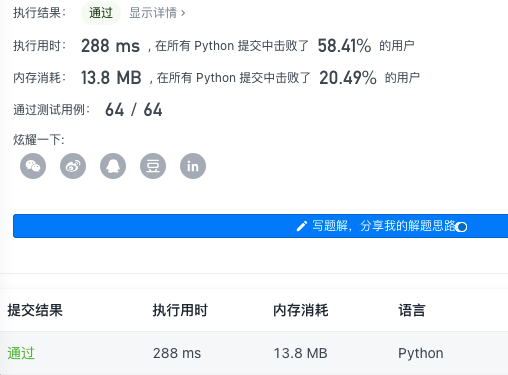
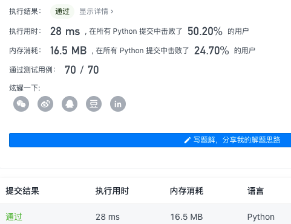
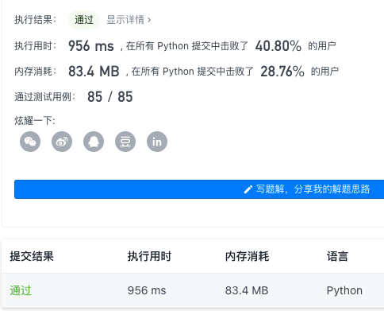
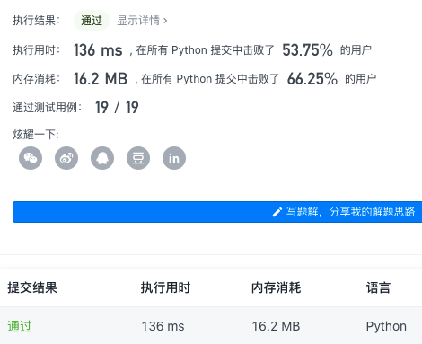

### Task 01：链表（4 天）

#### 01-01 链表基础知识（2 天）

- 第 01 ~ 02 天学习内容：
  - [链表基础知识](https://github.com/itcharge/LeetCode-Py/blob/main/Contents/02.Linked-List/01.Linked-List-Basic/01.Linked-List-Basic.md)
  
- 第 01 天课程题目列表：
  - [x] [0707. 设计链表](https://leetcode-cn.com/problems/design-linked-list/)
  
    ```
    class MyLinkedList(object):
    
        def __init__(self):
            self.size =  0
            self.head = ListNode(0)
    
    
        def get(self, index):
            """
            :type index: int
            :rtype: int
            """
            if index <0 or index >= self.size:
                return -1
            curr = self.head
            for _ in range(index +1):
                curr = curr.next
            return curr.val
    
        def addAtHead(self, val):
            """
            :type val: int
            :rtype: None
            """
            self.addAtIndex(0,val)
    
        def addAtTail(self, val):
            """
            :type val: int
            :rtype: None
            """
            self.addAtIndex(self.size, val)
     
    
        def addAtIndex(self, index, val):
            """
            :type index: int
            :type val: int
            :rtype: None
            """
            if index > self.size:
                return
            if index < 0:
                index = 0
            self.size += 1
            pred = self.head
            for _ in range(index):
                pred = pred.next
            to_add = ListNode(val)
            to_add.next = pred.next
            pred.next = to_add
    
        def deleteAtIndex(self, index):
            """
            :type index: int
            :rtype: None
            """
            if index <0 or index >= self.size:
                return 
            self.size -=1
            pred = self.head
            for _ in range(index):
                pred = pred.next
            pred.next = pred.next.next
    
      
     
    ```
  
    
  
  - [x] [0206. 反转链表](https://leetcode-cn.com/problems/reverse-linked-list/)
  
    ```
    class Solution(object):
    	def reverseList(self, head):
    		"""
    		:type head: ListNode
    		:rtype: ListNode
    		"""
    		# 申请两个节点，pre和 cur，pre指向None
    		pre = None
    		cur = head
    		while cur:
    			tmp = cur.next# 记录当前节点的下一个节点
    			cur.next = pre# 然后将当前节点指向pre
    			pre = cur# pre和cur节点都前进一位
    			cur = tmp
    		return pre
    ```
  
    
  
  - [x] [0203. 移除链表元素](https://leetcode-cn.com/problems/remove-linked-list-elements/)
  
    ```
    class Solution(object):
        def removeElements(self, head, val):
            """
            :type head: ListNode
            :type val: int
            :rtype: ListNode
            """
            while head and head.val == val:
                head = head.next
            pre, cur = head, head
            while cur:
                if cur.val == val:
                    pre.next = cur.next
                else:
                    pre = cur
                cur = cur.next
                
            return head
    ```
  
    
  
    
  
- 第 02 天课程题目列表：
  - [0328. 奇偶链表](https://leetcode-cn.com/problems/odd-even-linked-list/)
  
    ```
    class Solution(object):
        def oddEvenList(self, head):
            """
            :type head: ListNode
            :rtype: ListNode
            """
            if not head:
                return head
            evenHead = head.next
            odd,even = head,evenHead
            while even and even.next:
                odd.next = even.next
                odd = odd.next
    
                even.next = odd.next
                even = even.next
            odd.next = evenHead
            return head
    ```
  
    
  
  - [0234. 回文链表](https://leetcode-cn.com/problems/palindrome-linked-list/)
  
    ```
    class Solution(object):
        def isPalindrome(self, head):
            """
            :type head: ListNode
            :rtype: bool
            """
            vals = []
            current_node = head
            while current_node is not None:
                vals.append(current_node.val)
                current_node = current_node.next
            return vals == vals[::-1]
    ```
  
    
  
  - [0138. 复制带随机指针的链表](https://leetcode-cn.com/problems/copy-list-with-random-pointer/)
  
    ```
    class Solution(object):
        def copyRandomList(self, head):
            """
            :type head: Node
            :rtype: Node
            """
            if not head:
                return None
            p = head
            # 第一步，在每个原节点后面创建一个新节点
            # 1->1'->2->2'->3->3'
            while p:
                new_node = Node(p.val,None,None)
                new_node.next = p.next
                p.next = new_node
                p = new_node.next
            p = head
            # 第二步，设置新节点的随机节点
            while p:
                if p.random:
                    p.next.random = p.random.next
                p = p.next.next
            # 第三步，将两个链表分离
            p = head
            dummy = Node(-1,None,None)
            cur = dummy
            while p:
                cur.next = p.next
                cur = cur.next
                p.next = cur.next
                p = p.next
            return dummy.next
    ```
  
    
  
- [更多链表基础题目](https://github.com/itcharge/LeetCode-Py/blob/main/Contents/02.Linked-List/01.Linked-List-Basic/10.Linked-List-Basic-List.md)

#### 01-02 链表排序（1 天）

- 第 03 天学习内容：
  - [链表排序](https://github.com/itcharge/LeetCode-Py/blob/main/Contents/02.Linked-List/02.Linked-List-Sort/01.Linked-List-Sort.md)
  
- 第 03 天课程题目：
  - [0148. 排序链表](https://leetcode-cn.com/problems/sort-list/)
  
    ```python
    class Solution(object):
        def sortList(self, head):
            """
            :type head: ListNode
            :rtype: ListNode
            """
            return self.sortFunc(head, None)
    
        def merge(self,list1,list2):
            head = ListNode()
            last = head 
            while list1 and list2:
                if list1.val >list2.val:
                    last.next = list2
                    list2 = list2.next
                else:
                    last.next = list1
                    list1 = list1.next
                last = last.next
            last.next = list1 if list1 else list2
            return head.next 
    
        def sortFunc(self,head,tail):
            if not head:
                return head
            if head.next ==tail:
                head.next = None
                return head
            slow = fast = head
            while fast != tail:
                slow = slow.next
                fast = fast.next 
                if fast!= tail:
                    fast = fast.next
            mid = slow
    
            return self.merge(self.sortFunc(head,mid),self.sortFunc(mid,tail))
    ```
  
    
  
  - [0021. 合并两个有序链表](https://leetcode-cn.com/problems/merge-two-sorted-lists/)
  
    ```
    class Solution(object):
        def mergeTwoLists(self, list1, list2):
            """
            :type list1: Optional[ListNode]
            :type list2: Optional[ListNode]
            :rtype: Optional[ListNode]
            """
            head = ListNode()
            last = head
            while list1 and list2:
                if list1.val>list2.val:
                    last.next = list2
                    list2 = list2.next
                else:
                    last.next = list1
                    list1 = list1.next
                last = last.next
            last.next = list1 if list1 else list2
            return head.next
    ```
  
    
  
  - [0147. 对链表进行插入排序](https://leetcode-cn.com/problems/insertion-sort-list/)
  
    ```
    class Solution(object):
        def insertionSortList(self, head):
            """
            :type head: ListNode
            :rtype: ListNode
            """
     
            if not head:
                return head
            
            dummyHead = ListNode(0)
            dummyHead.next = head
            lastSorted = head
            curr = head.next
    
            while curr:
                if lastSorted.val <= curr.val:
                    lastSorted = lastSorted.next
                else:
                    prev = dummyHead
                    while prev.next.val <= curr.val:
                        prev = prev.next
                    lastSorted.next = curr.next
                    curr.next = prev.next
                    prev.next = curr
                curr = lastSorted.next
            
            return dummyHead.next
    ```
  
    
  
- [更多链表排序题目](https://github.com/itcharge/LeetCode-Py/blob/main/Contents/02.Linked-List/02.Linked-List-Sort/10.Linked-List-Sort-List.md)

#### 01-03 链表双指针（1 天）

- 第 04 天学习内容：
  - [链表双指针](https://github.com/itcharge/LeetCode-Py/blob/main/Contents/02.Linked-List/03.Linked-List-Two-Pointers/01.Linked-List-Two-Pointers.md)
- 第 04 天课程题目：
  - [0141. 环形链表](https://leetcode-cn.com/problems/linked-list-cycle/)
  - [0142. 环形链表 II](https://leetcode-cn.com/problems/linked-list-cycle-ii/)
  - [0019. 删除链表的倒数第 N 个结点](https://leetcode-cn.com/problems/remove-nth-node-from-end-of-list/)
- [更多链表双指针题目](https://github.com/itcharge/LeetCode-Py/blob/main/Contents/02.Linked-List/03.Linked-List-Two-Pointers/10.Linked-List-Two-Pointers-List.md)
