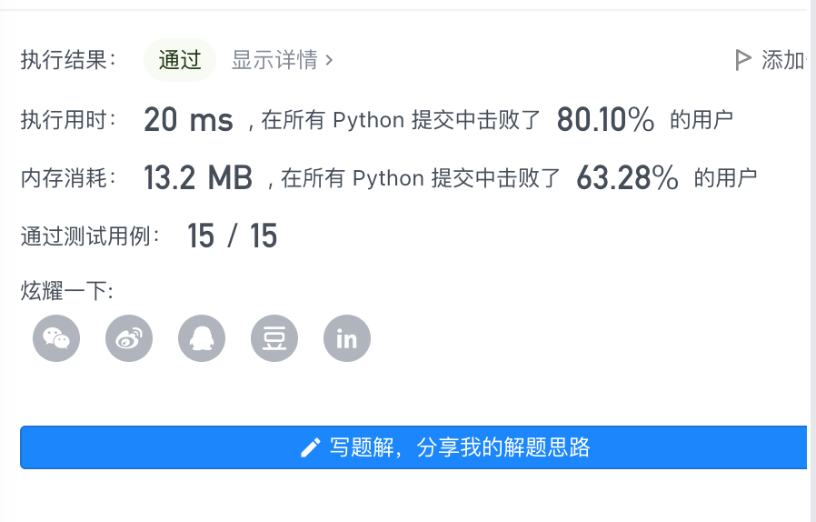

### Task 03 单调栈（1 天）

- 第 10 天学习内容：
  - [单调栈](https://github.com/itcharge/LeetCode-Py/blob/main/Contents/03.Stack/03.Monotone-Stack/01.Monotone-Stack.md)
  
- 第 10 天课程题目：
  - [0496. 下一个更大元素 I](https://leetcode-cn.com/problems/next-greater-element-i/)
  
    ```python
    class Solution(object):
        def nextGreaterElement(self, nums1, nums2):
            """
            :type nums1: List[int]
            :type nums2: List[int]
            :rtype: List[int]
            """
    
            res = {}
            stack = []
            for num in reversed(nums2):
                while stack and num >= stack[-1]:
                    stack.pop()
                res[num] = stack[-1] if stack else -1
                stack.append(num)
            return [res[num] for num in nums1]
    
    ```
  
    
  
  - [0739. 每日温度](https://leetcode-cn.com/problems/daily-temperatures/)
  
  - [0316. 去除重复字母](https://leetcode-cn.com/problems/remove-duplicate-letters/)
  
- [更多单调栈题目](https://github.com/itcharge/LeetCode-Py/blob/main/Contents/03.Stack/03.Monotone-Stack/10.Monotone-Stack-List.md)
