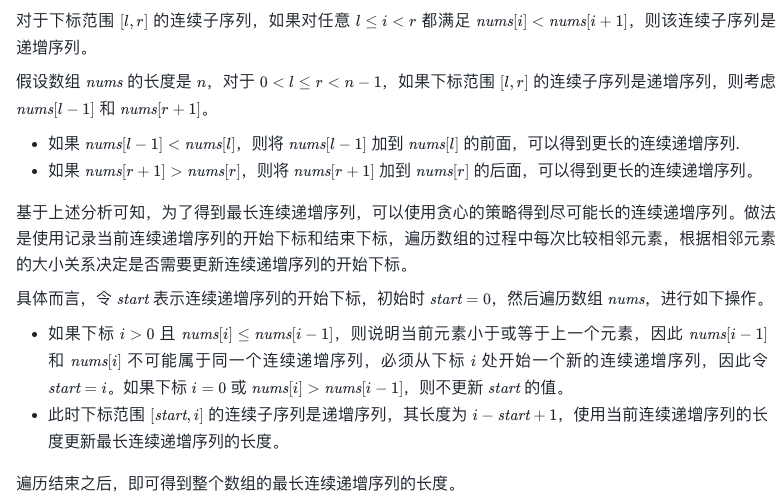

#### [128. 最长连续序列](https://leetcode-cn.com/problems/longest-consecutive-sequence/)

- 代码

    ```python
    class Solution:
        def longestConsecutive(self, nums: List[int]) -> int:
            res = 0
            hash_dict = dict()
            for num in nums:
                # 新进来哈希表一个数
                if num not in hash_dict:
                    # 获取当前数的最左边连续长度,没有的话就更新为0
                    left = hash_dict.get(num-1,0)
                    # 同理获取右边的数
                    right = hash_dict.get(num+1,0)
                    """不用担心左边和右边没有的情况
                    因为没有的话就是left或者right0
                    并不改变什么
                    """
                    # 把当前数加入哈希表，代表当前数字出现过
                    hash_dict[num] = 1
                    # 更新长度
                    length = left+1+right
                    res = max(res,length)
                    # 更新最左端点的值，如果left=n存在，那么证明当前数的前n个都存在哈希表中
                    hash_dict[num-left] = length
                    # 更新最右端点的值，如果right=n存在，那么证明当前数的后n个都存在哈希表中
                    hash_dict[num+right] = length
                    # 此时 【num-left，num-right】范围的值都连续存在哈希表中了
                    # 即使left或者right=0都不影响结果
            return res
    ```

#### [674. 最长连续递增子序列](https://leetcode-cn.com/problems/longest-continuous-increasing-subsequence/)

- 代码

  ```Python
  class Solution:
      def findLengthOfLCIS(self, nums: List[int]) -> int:
          ans = 0
          n = len(nums)
          start = 0
  
          for i in range(n):
              if i > 0 and nums[i] <= nums[i - 1]:
                  start = i
              ans = max(ans, i - start + 1)
          
          return ans
  ```

- 题解

  

  

#### [72. 编辑距离](https://leetcode-cn.com/problems/edit-distance/)

- 代码

  ```python
  class Solution:
      def minDistance(self, word1: str, word2: str) -> int:
          n = len(word1)
          m = len(word2)
          
          # 有一个字符串为空串
          if n * m == 0:
              return n + m
          
          # DP 数组
          D = [ [0] * (m + 1) for _ in range(n + 1)]
          
          # 边界状态初始化
          for i in range(n + 1):
              D[i][0] = i
          for j in range(m + 1):
              D[0][j] = j
          
          # 计算所有 DP 值
          for i in range(1, n + 1):
              for j in range(1, m + 1):
                  left = D[i - 1][j] + 1
                  down = D[i][j - 1] + 1
                  left_down = D[i - 1][j - 1] 
                  if word1[i - 1] != word2[j - 1]:
                      left_down += 1
                  D[i][j] = min(left, down, left_down)
          
          return D[n][m]
  
  ```

#### [121. 买卖股票的最佳时机](https://leetcode-cn.com/problems/best-time-to-buy-and-sell-stock/)

- 代码

  ```
  class Solution(object):
      def maxProfit(self, prices):
          size = len(prices)
          if size ==0:
              return 0
          min_price = prices[0]
          memo = [0]*size
          for i in range(1,size):
              min_price = min(min_price,prices[i])
              memo[i] = max(memo[i-1],
                  prices[i] - min_price)
          return memo[-1]
  ```

#### [122. 买卖股票的最佳时机 II](https://leetcode-cn.com/problems/best-time-to-buy-and-sell-stock-ii/)

- 代码

  ```python
  class Solution(object):
      def maxProfit(self, prices):
          """
          :type prices: List[int]
          :rtype: int
          """
          profit= 0 
          for i in range(1,len(prices)):
              tmp = prices[i] - prices[i-1]
              if tmp>0:
                  profit+=tmp 
          return profit
  ```

  

#### [188. 买卖股票的最佳时机 IV](https://leetcode-cn.com/problems/best-time-to-buy-and-sell-stock-iv/)

- 代码

  ```
  class Solution:
      def maxProfit(self, k: int, prices: List[int]) -> int:
          if not prices:
              return 0
  
          n = len(prices)
          k = min(k, n // 2)
          buy = [0] * (k + 1)
          sell = [0] * (k + 1)
  
          buy[0], sell[0] = -prices[0], 0
          for i in range(1, k + 1):
              buy[i] = sell[i] = float("-inf")
  
          for i in range(1, n):
              buy[0] = max(buy[0], sell[0] - prices[i])
              for j in range(1, k + 1):
                  buy[j] = max(buy[j], sell[j] - prices[i])
                  sell[j] = max(sell[j], buy[j - 1] + prices[i]); 
  
          return max(sell)
   
  ```

  

#### [309. 最佳买卖股票时机含冷冻期](https://leetcode-cn.com/problems/best-time-to-buy-and-sell-stock-with-cooldown/)

- 代码

  ```python
  class Solution(object):
      def maxProfit(self, prices):
          """
          :type prices: List[int]
          :rtype: int
          """
          if not prices:
              return 0
          # 三种状态
          # f[i][0]:手上持有股票的累计最大收益
          # f[i][1]:手上不持有股票，并且处于冷冻期的累计最大收益
          # f[i][2]:手上不持有股票，并且不处于冷冻期的累计最大收益
          size = len(prices)
          memo = [[-prices[0],0,0] ] + [[0]*3 for i in range(size -1)]
          for i in range(1,size):
              #  前一天持有股票,今天不操作  或者 前一天不持有股票  今天买进
              memo[i][0] = max(memo[i-1][0],memo[i-1][2]-prices[i])
              # 前一天持有股票  今天卖出
              memo[i][1] = memo[i-1][0]+prices[i] 
              # 前一天不持有股票 且处于冷冻期 或者前一天不持有股票 不处于冷冻期
              memo[i][2] = max(memo[i-1][1],memo[i-1][2])
          return max(memo[size-1][1],memo[size-1][2])
  
  
  ```

  
