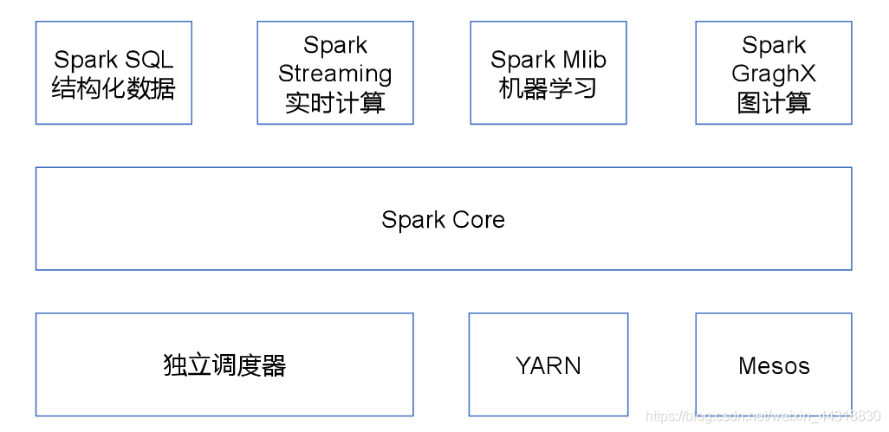

## Pyspark环境搭建

- **安装Java8**
- **下载解压spark**
- **下载解压spark**

## Pyspark的运行模式

- 通过pyspark进入pyspark单机交互式环境
- **通过spark-submit提交Spark任务到集群运行**
- 通过zepplin notebook交互式执行
- Python安装findspark和pyspark库

## Spark部署模式

- Local：本地运行模式，非分布式。

- Standalone：使用Spark自带集群管理器，部署后只能运行Spark任务。

- Yarn：Haoop集群管理器，部署后可以同时运行MapReduce，Spark，Storm，Hbase等各种任务。

- Mesos：与Yarn最大的不同是Mesos 的资源分配是二次的，Mesos负责分配一次，计算框架可以选择接受或者拒绝。

## PySpark如何在excutors中安装诸如pandas,numpy等包？

可以通过conda建立Python环境，然后将其压缩成zip文件上传到hdfs中，并在提交任务时指定环境。
当然，最简单直接的方案是把你想要的anaconda环境打包成zip上传到集群hdfs环境中。
注意，你打包的机器应当和集群的机器具有相同的linux操作系统。

## PySpark如何添加自己编写的其它Python脚本到excutors中的PYTHONPATH中？

答：可以用py-files参数设置，可以添加.py,.egg 或者压缩成.zip的Python脚本，在excutors中可以import它们。

## PySpark如何添加一些配置文件到各个excutors中的工作路径中？

答：可以用files参数设置，不同文件名之间以逗号分隔，在excutors中用SparkFiles.get(fileName)获取。

```bash
#提交python写的任务
spark-submit --master yarn \
--deploy-mode cluster \
--executor-memory 12G \
--driver-memory 12G \
--num-executors 100 \
--executor-cores 2 \
--conf spark.yarn.maxAppAttempts=2 \
--conf spark.default.parallelism=1600 \
--conf spark.sql.shuffle.partitions=1600 \
--conf spark.memory.offHeap.enabled=true \
--conf spark.memory.offHeap.size=2g\
--conf spark.task.maxFailures=10 \
--conf spark.stage.maxConsecutiveAttempts=10 \
--conf spark.yarn.appMasterEnv.PYSPARK_PYTHON=./anaconda3.zip/anaconda3/bin/python #指定excutors的Python环境
--conf spark.yarn.appMasterEnv.PYSPARK_DRIVER_PYTHON = ./anaconda3.zip/anaconda3/bin/python  #cluster模式时候设置
--archives viewfs:///user/hadoop-xxx/yyy/anaconda3.zip #上传到hdfs的Python环境
--files  data.csv,profile.txt
--py-files  pkg.py,tqdm.py
pyspark_demo.py 

```


## 你是怎么理解Spark，它的特点是什么？

 Spark是一个基于内存的，用于大规模数据处理（离线计算、实时计算、快速查询（交互式查询））的统一分析引擎。

​    它内部的组成模块，包含SparkCore，SparkSQL，SparkStreaming，SparkMLlib，SparkGraghx等...



## Spark的优势

- 高效性

  不同于MapReduce将中间计算结果放入磁盘中，Spark采用内存存储中间计算结果，减少了迭代运算的磁盘IO，并通过并行计算DAG图的优化，减少了不同任务之间的依赖，降低了延迟等待时间。内存计算下，Spark 比 MapReduce 快100倍。

- 易用性

  不同于MapReduce仅支持Map和Reduce两种编程算子，Spark提供了超过80种不同的Transformation和Action算子，如map,reduce,filter,groupByKey,sortByKey,foreach等，并且采用函数式编程风格，实现相同的功能需要的代码量极大缩小。

- 通用性

  Spark提供了统一的解决方案。Spark可以用于批处理、交互式查询（Spark SQL）、实时流处理（Spark Streaming）、机器学习（Spark MLlib）和图计算（GraphX）。

  这些不同类型的处理都可以在同一个应用中无缝使用。这对于企业应用来说，就可使用一个平台来进行不同的工程实现，减少了人力开发和平台部署成本。

- 兼容性

  Spark能够跟很多开源工程兼容使用。如Spark可以使用Hadoop的YARN和Apache Mesos作为它的资源管理和调度器，并且Spark可以读取多种数据源，如HDFS、HBase、MySQL等。

## Spark基本概念

- `RDD`：弹性分布式数据集（Resilient Distributed Dataset）的简称，是分布式内存的一个抽象概念，提供了一种高度受限的共享内存模型。

- `DAG`：`Directed Acyclic Graph`（有向无环图）的简称，反映RDD之间的依赖关系。

- `Driver Program`：控制程序，负责为`Application`构建DAG图。

- `Cluster Manager`：集群资源管理中心，负责分配计算资源。

- `Worker Node`：工作节点，负责完成具体计算。

- `Executor`：运行在工作节点`Worker Node`上的一个进程，负责运行`Task`，并为应用程序存储数据。

- `Application`：用户编写的Spark应用程序，一个`Application`包含多个`Job`。

- `Job`：作业，一个`Job`包含多个`RDD`及作用于相应`RDD`上的各种操作。

- `Stage`：阶段，是作业的基本调度单位，一个作业会分为多组任务，每组任务被称为“阶段”。

- `Task`：任务，运行在`Executor`上的工作单元，是`Executor`中的一个线程。

总结：`Application`由多个`Job`组成，`Job`由多个`Stage`组成，`Stage`由多个`Task`组成。`Stage`是作业调度的基本单位。

## Spark运行流程

- Application首先被Driver构建DAG图并分解成Stage。

- 然后Driver向Cluster Manager申请资源。

- Cluster Manager向某些Work Node发送征召信号。

- 被征召的Work Node启动Executor进程响应征召，并向Driver申请任务。

- Driver分配Task给Work Node。

- Executor以Stage为单位执行Task，期间Driver进行监控。

- Driver收到Executor任务完成的信号后向Cluster Manager发送注销信号。

- Cluster Manager向Work Node发送释放资源信号。

- Work Node对应Executor停止运行。

## RDD的Transformation操作和Action操作

Transformation操作是从已经存在的RDD创建一个新的RDD，而Action操作是在RDD上进行计算后返回结果到 Driver。

Transformation操作都具有 Lazy 特性，即 Spark 不会立刻进行实际的计算，只会记录执行的轨迹，只有触发Action操作的时候，它才会根据 DAG 图真正执行。

常见的Action算子：
`show,count,collect,describe,take,head,first`

常见的Transformation算子：

`map,flatMap,filter,groupByKey,reduceByKey,sortByKey,join,cogroup `

## RDD的依赖关系

- 窄依赖：父RDD的分区和子RDD的分区的关系是一对一或者多对一的关系。
- 宽依赖：父RDD的分区和自RDD的分区是一对多或者多对多的关系。

## RDD常用函数

- map:对每个元素进行一个映射转换
- flatMap:将每个元素生成一个Array后压平
- mapPartitions
- filter:应用过滤条件过滤掉一些数据
- count：查看RDD元素数量
- countByKey:对Pair RDD按key统计数量
- Collect: 将数据汇集到Driver,数据过大时有超内存风险
- reduce：递归地选择第一个和第二个元素进行操作，操作的结果作为一个元素用来替换这两个元素，注意，reduce返回的是一个Python可以识别的对象，非RDD对象。
- take：将前若干个数据汇集到Driver，相比collect安全
- saveAsTextFile:保存rdd成text文件到本地
- collect
- join
- union
- persist：对RDD进行cache缓存,常用的存储级别是MEMORY_ONLY和EMORY_AND_DISK
- repartition:按随机数进行shuffle，相同key不一定在同一个分区
- reduceByKey:reduceByKey对相同的key对应的values应用二元归并操作
- groupByKey:将相同的key对应的values收集成一个Iterator
- aggregateByKey:和aggregate类似，但是会对每个key分别进行操作
- Zip:按照拉链方式连接两个RDD，效果类似python的zip函数

spark面试题参考资料：

https://blog.csdn.net/a934079371/article/details/109376370

https://blog.csdn.net/Lwj879525930/article/details/82559596?spm=1001.2101.3001.6650.8&utm_medium=distribute.pc_relevant.none-task-blog-2%7Edefault%7EBlogCommendFromBaidu%7Edefault-8.no_search_link&depth_1-utm_source=distribute.pc_relevant.none-task-blog-2%7Edefault%7EBlogCommendFromBaidu%7Edefault-8.no_search_link&utm_relevant_index=13


