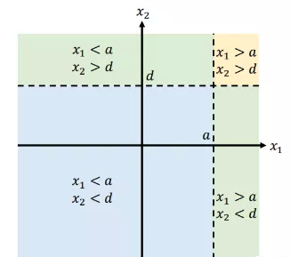
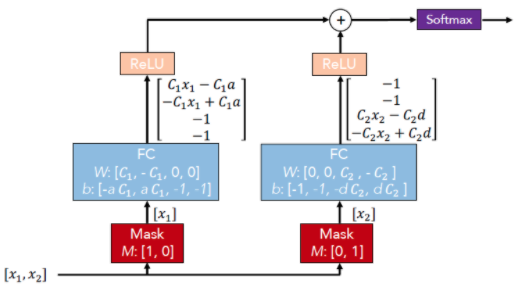
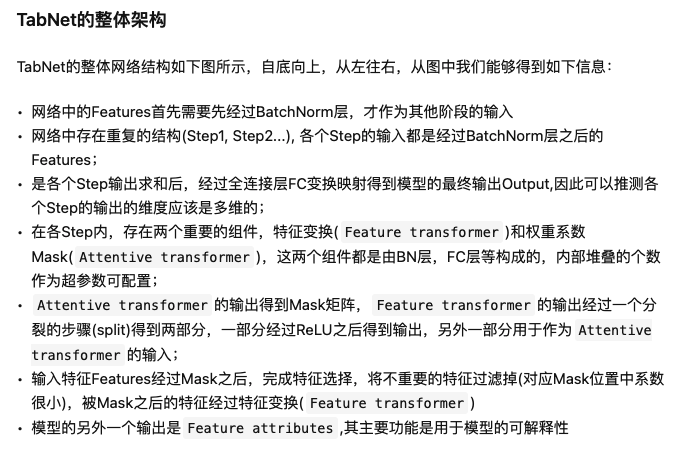
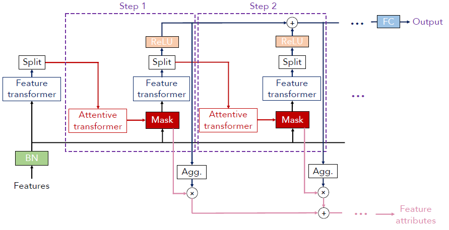
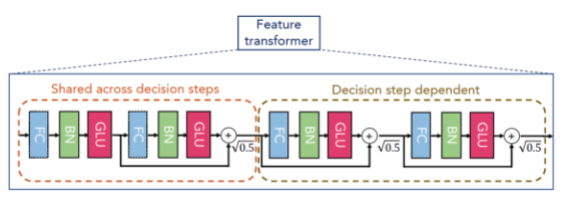
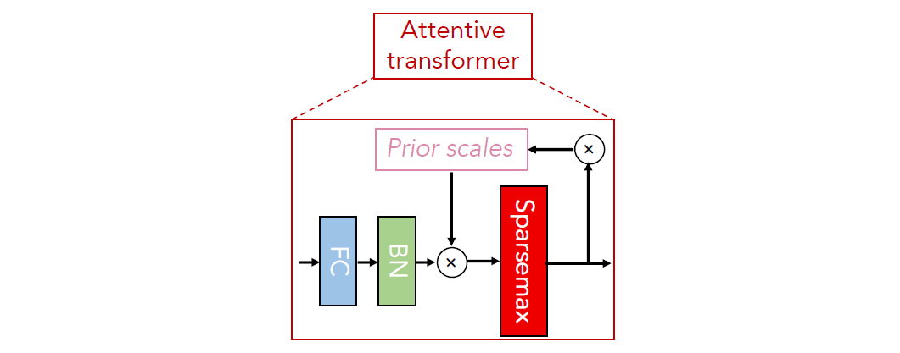

## TabNet的提出？

DNN在图像、文本和语音等类型的数据上都有了广泛的应用，

**TabNet在保留DNN的end-to-end和representation learning特点的基础上，还拥有了树模型的可解释性和稀疏特征选择的优点**

## TabNet有什么优点？

TabNet结合了树模型的特征选择机制和神经网络模型的优点

| **树模型 **                      | **神经网络模型 **  |
| -------------------------------- | ------------------ |
| 寻找最佳特征，对表格型数据很有效 | 减轻特征工程的需要 |
| 很容易获得模型可解释性           | 可以在线实时训练   |
| 训练速度快                       | 迁移学习           |

## TabNet如何模拟树模型的寻找最佳特征组合操作？

输入两个特征 $x_1$和 $x_2$，决策树分别以 $a$ 和 $d$为阈值来对他们进行划分，这样就得到了图中所示的决策流形

## 神经网络如何模拟决策树？

 这个神经网络其实可以看做一个**加性模型**（Additive Model），它是由两个Mask+FC+ReLU组合相加构成的，而一个组合其实就是一个基本决策树，两棵树分别挑选的 $x_1$ 和$x_2$ 作为划分特征，然后输出各自的结果，最后模型将两个结果加起来作为最终输出。这个输出向量可以理解成一个权重向量，它的每一维代表**某个条件判断的对最终决策影响的权重**；以图中的模型为例，对于输出向量$[0.1,0.4,0.2,0.3]^{T}$ ，则第1维就代表如果条件 $x_{1}>a$ 成立的话，它对于最终决策的影响占0.1权重，第3维就代表条件$x_{2}>d$成立占0.2权重，这一点与决策树有些不同，在决策树里，如果某个条件成立的话，那么它的权重就是1，所以对于决策树的加性模型，如果两个基本树的权重一样，若条件$x_{1}>a$ 和$x_{2}>a$成立，那么输出的向量就应该是$[0.5,0,0.5,0]^{T}$。因此，从这一点来看，图中的神经网络其实就是一个**软版本的决策树加性模型**。

## **TabNet框架**

### BN层

即batch normalization层

### Feature transformer层

其作用与之前的FC层类似，都是做**特征计算**

### Split层

该层比较简单，就是将Feature transformer层输出的向量切成两部分

### Attentive transformer层

该层的作用是根据上一个step的结果，计算出当前step的Mask层

## Feature transformer

BN层：即batch normalization层

GLU是gated linear unit

原始FC层的基础上再加上一个门控，其计算公式为:
$$
h(X)=(W * X+b) \otimes \sigma(V * X+c)
$$
