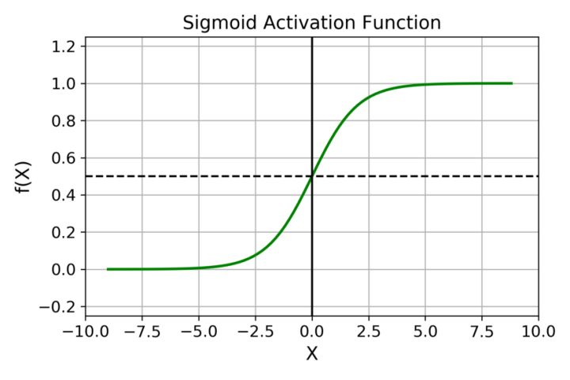
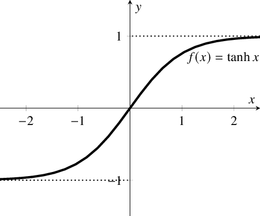
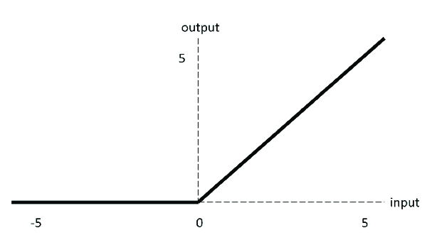
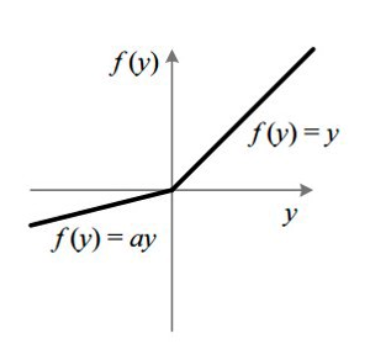
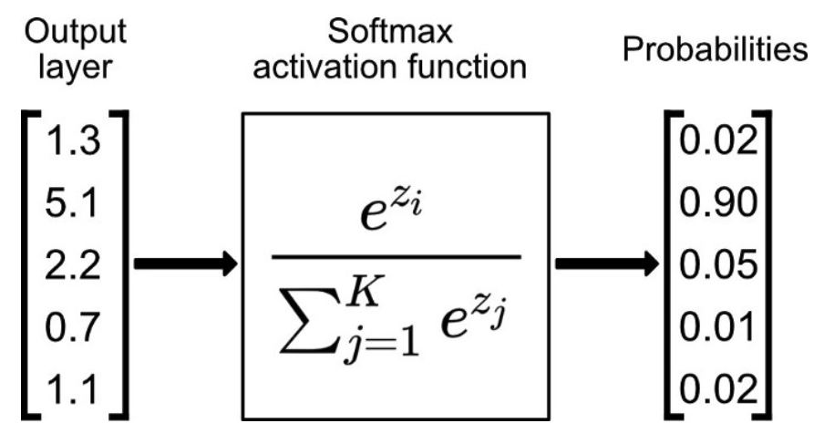
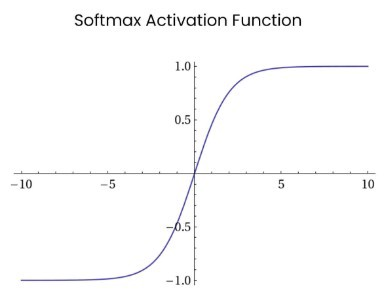
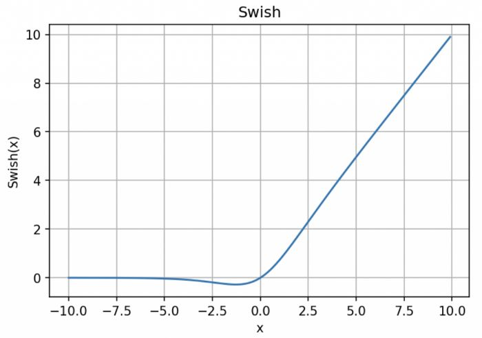

## **神经网络为什么需要激活函数?**

数据的分布绝大多数是非线性的，而一般神经网络的计算是线性的，引入激活函数，是在神经网络中引入非线性，强化网络的学习能力。所以激活函数的最大特点就是非线性。

## 在使用relu的网络中，是否还存在梯度消失的问题？

梯度衰减因子包括激活函数导数，此外，还有多个权重连乘也会影响。。。梯度消失只是表面说法，按照这样理解，底层使用非常大的学习率，或者人工添加梯度噪音，原则上也能回避，有不少论文这样试了，然而目前来看，有用，但没太大的用处。深层原因训练不好的本质难题可能不是衰减或者消失（残差网络论文也提到这一点），是啥目前数理派也搞不清楚，所以写了论文也顺势这样说开了。不然，贸贸然将开山鼻祖的观点否定了，是需要极大勇气和大量的实验，以及中二精神的。

##  Sigmoid

**Sigmoid公式及导数：**
$$
\sigma(z)=\frac{1}{1+e^{-z}} 
$$

 

Sigmoid缺点：

- 倾向于梯度消失；
- 函数输出不是以 0 为中心的，这会降低权重更新的效率；
- Sigmoid 函数执行指数运算，计算机运行得较慢。

Sigmoid应用：

- Sigmoid 函数的输出范围是 0 到 1。由于输出值限定在 0 到 1，因此它对每个神经元的输出进行了归一化；
- 用于将预测概率作为输出的模型。由于概率的取值范围是 0 到 1，因此 Sigmoid 函数非常合适；
- 梯度平滑，避免「跳跃」的输出值；
- 函数是可微的。这意味着可以找到任意两个点的 sigmoid 曲线的斜率；
- 明确的预测，即非常接近 1 或 0。

## **Tanh / 双曲正切激活函数**

$$
\tanh (x)=\frac{2}{1+e^{-2 x}}-1
$$

**tanh作为激活函数的特点：**

相比Sigmoid函数，tanh函数缺点：

1. tanh的输出范围时(-1, 1)，解决了Sigmoid函数的不是zero-centered输出问题；
2. 幂运算的问题仍然存在；
3. tanh导数范围在(0, 1)之间，相比sigmoid的(0, 0.25)，梯度消失（gradient vanishing）问题会得到缓解，但仍然还会存在。

tanh函数应用：

在一般的二元分类问题中，tanh 函数用于隐藏层，而 sigmoid 函数用于输出层，但这并不是固定的，需要根据特定问题进行调整。

## **ReLU激活函数**

$$
\sigma(x)=\left\{\begin{array}{cc}
\max (0, x) & , x>=0 \\
0 & , x<0
\end{array}\right.
$$

ReLu函数优缺点：

优点：

- 当输入为正时，不存在梯度饱和问题。
- 计算速度快得多。ReLU 函数中只存在线性关系，因此它的计算速度比 sigmoid 和 tanh 更快。

缺点：

- Dead ReLU 问题。当输入为负时，ReLU 完全失效，在正向传播过程中，这不是问题。有些区域很敏感，有些则不敏感。但是在反向传播过程中，如果输入负数，则梯度将完全为零，sigmoid 函数和 tanh 函数也具有相同的问题；
- 我们发现 ReLU 函数的输出为 0 或正数，这意味着 ReLU 函数不是以 0 为中心的函数。

##  **Leaky ReLU**

$$
f\left(y_{i}\right)=\left\{\begin{array}{ll}
y_{i}, & \text { if } y_{i}>0 \\
a_{i} y_{i}, & \text { if } y_{i} \leq 0
\end{array}\right.
$$

- Leaky ReLU 通过把 x 的非常小的线性分量给予负输入（0.01x）来调整负值的零梯度（zero gradients）问题；
- leak 有助于扩大 ReLU 函数的范围，通常 a 的值为 0.01 左右；
- Leaky ReLU 的函数范围是（负无穷到正无穷）。

## **ELU**

$$
\operatorname{ELU}(x)=\left\{\begin{aligned}
x, & x>0 \\
\alpha\left(\mathrm{e}^{x}-1\right), & x \leqslant 0
\end{aligned}\right.
$$

ELU优缺点：

ELU 具有 ReLU 的所有优点，并且：

- 没有 Dead ReLU 问题，输出的平均值接近 0，以 0 为中心；
- ELU 通过减少偏置偏移的影响，使正常梯度更接近于单位自然梯度，从而使均值向零加速学习；
- ELU 在较小的输入下会饱和至负值，从而减少前向传播的变异和信息。

一个小问题是它的计算强度更高。与 Leaky ReLU 类似，尽管理论上比 ReLU 要好，但目前在实践中没有充分的证据表明 ELU 总是比 ReLU 好。

## **Softmax**

Softmax激活函数的主要缺点是：

1. 在零点不可微；
2. 负输入的梯度为零，这意味着对于该区域的激活，权重不会在反向传播期间更新，因此会产生永不激活的死亡神经元。

## **Swish**

$$
y = x * sigmoid (x)
$$

Swish激活函数的主要优点如下：

- 「无界性」有助于防止慢速训练期间，梯度逐渐接近 0 并导致饱和；（同时，有界性也是有优势的，因为有界激活函数可以具有很强的正则化，并且较大的负输入问题也能解决）；
- 导数恒 > 0；
- 平滑度在优化和泛化中起了重要作用。

## 参考资料
激活函数总结 - 知乎 https://zhuanlan.zhihu.com/p/73214810

深度学习领域最常用的10个激活函数 机器之心的文章 - 知乎 https://zhuanlan.zhihu.com/p/352668984

