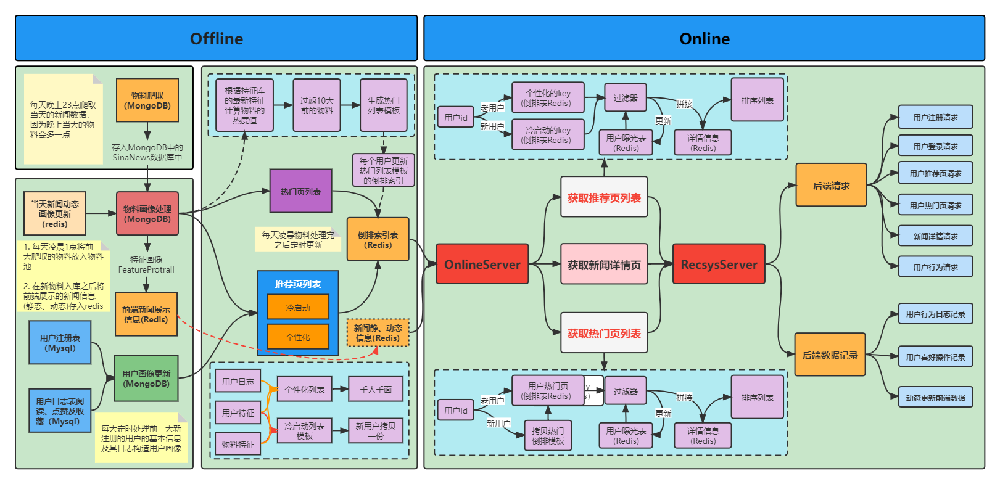

# Task3 离线物料系统的构建



offline部分主要是基于前面存储好的物料画像和用户画像进行离线计算， 为每个用户提供一个热门页列表和推荐页列表并进行缓存， 方便online服务的列表获取。 所以下面主要帮大家梳理这两个列表的生成以及缓存到redis的流程。

**离线物料系统的基本流程：**

- 爬取物料：使用`scrapy`框架，每天定时爬取新浪新闻数据，保存到`MongoDB`。
- 物料画像处理：处理最新爬取新闻的画像，存入特征库；更新新闻动态画像, 需要在`redis`数据库内容清空之前执行；生成前端展示的新闻画像，并在`mongodb`中备份一份
- 用户画像更新：用户`mysql`存储；用户曝光数据落`mysql`；更新用户画像
- 前端新闻展示：


## 新闻爬取逻辑

### 文件目录

```
├── news_scrapy
│   ├── monitor_news.py
│   ├── scrapy.cfg	# 项目配置文件
│   └── sinanews	# 项目python模块, 代码将从这里导入
│       ├── items.py	# 项目items文件
│       ├── middlewares.py	# 中间件，请求和响应都将经过他，可以配置请求头、代理、cookie、会话维持
│       ├── pipelines.py	# 项目管道文件，将爬取的数据进行持久化存储
│       ├── run.py	# 注意execute的参数类型为一个列表
│       ├── settings.py	# 项目配置文件，可以配置数据库等
│       └── spiders
│           └── sina.py # 爬取新浪新闻的具体逻辑，解析网页内容
```

### 爬取流程

1. `start_requests`函数返回不同类型内容`Request`迭代器

2. 使用`parse`函数将`Request`迭代器的内容解析成`json`

3. `item`进行规范化，使用`get`提取`json`中我们想要的字段

4. 使用`parse_content` 函数 对文章内容进行正则匹配

5. 函数`process_item`判断新闻是否是今天的，每天只保存当天产出的新闻，这样可以增量的添加新的新闻数据源，将当天的结果保存在MongoDB中

6. 配置存储`setting.py`

   ```
   
   # 如果需要使用itempipline来存储item的话需要将这段注释打开
   ITEM_PIPELINES = {
      'sinanews.pipelines.SinanewsPipeline': 300,
   }
   
   
   MONGO_HOST = mongo_hostname
   MONGO_PORT = mongo_port
   SINA_DB_NAME = sina_db_name
   COLLECTION_NAME_PRFIX = sina_collection_name_prefix
   ```

7. 注意

   ```
   # 方式一：注意execute的参数类型为一个列表
   cmdline.execute('scrapy crawl spidername'.split())
   # 方式二:注意execute的参数类型为一个列表
   cmdline.execute(['scrapy', 'crawl', 'spidername'])
   ```

   

## 物料画像的构建

### 文件目录

```
├── material_process
│   ├── log_process.py
│   ├── news_protrait.py
│   ├── news_to_redis.py
│   └── utils.py
├── process_material.py
└── update_redis.py

```

### 物料画像构建流程

运行`process_material.py`会自动构建物料画像然后存储到数据库中。

1. 将今天爬取的数据构造画像存入画像数据库(MongoDB)中，包含：`ews_id,title,raw_key_words,manual_key_words,ctime,content,cate,url,`
   `动态画像初始值(likes,collections,read_num,hot_value)`
2. 每天都需要将新闻详情更新到`redis`中，并且将前一天的`redis`数据删掉
3. 用`redis`的动态画像更新`mongodb`的画像，将`mongodb`中对应的动态画像更新 


## 用户画像数据构建

### 文件目录

```
├── process_user.py
├── update_redis.py
└── user_process
    ├── user_protrail.py
    └── user_to_mysql.py
```

### 用户画像数据构建流程

运行`process_user.py` 会自动将用户的曝光数据从`redis`落到`mysql`中，并且更新用户画像

1. 用户曝光数据`user_id,news_list`保存到`mongodb`
2. 每天都需要将当天注册的用户添加到用户画像池中
3. 获取用户历史行为的统计特征进行用户画像数据更新(弃用)

```
├── process_material.py
├── process_user.py
├── update_redis.py
└── user_process
    ├── user_protrail.py
    └── user_to_mysql.py
```

## 定时任务部署

每天0点爬取前一天的内容，爬取完数据再更新特征库，更新完特征库之后再更新用户的画像，然后将redis中所有数据都清空，将特征库中的前端展示信息存入redis

```
配置crontab命令，命令行输入crontab -e，然后将下面命令的输入到crontab命令行中
> 0 0 * * * $HOME/fun-rec/codes/news_recsys/news_rec_server/scheduler/crawl_news.sh >>  $HOME/fun-rec/codes/news_recsys/news_rec_server/logs/offline_material_process.log && $HOME/fun-rec/codes/news_recsys/news_rec_server/scheduler/offline_material_and_user_process.sh 
> 0 0 * * * $HOME/fun-rec/codes/news_recsys/news_rec_server/logs/material_and_user_process.log && $HOME/fun-rec/codes/news_recsys/news_rec_server/scheduler/run_offline.sh >> $HOME/fun-rec/codes/news_recsys/news_rec_server/logs/offline_rec_list_to_redis.log
```


